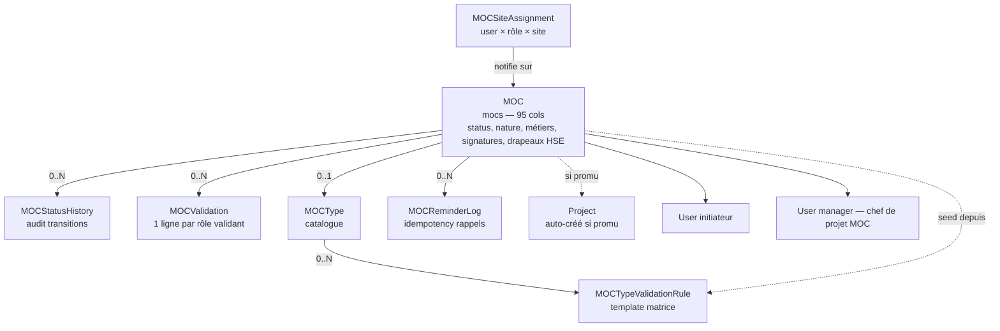
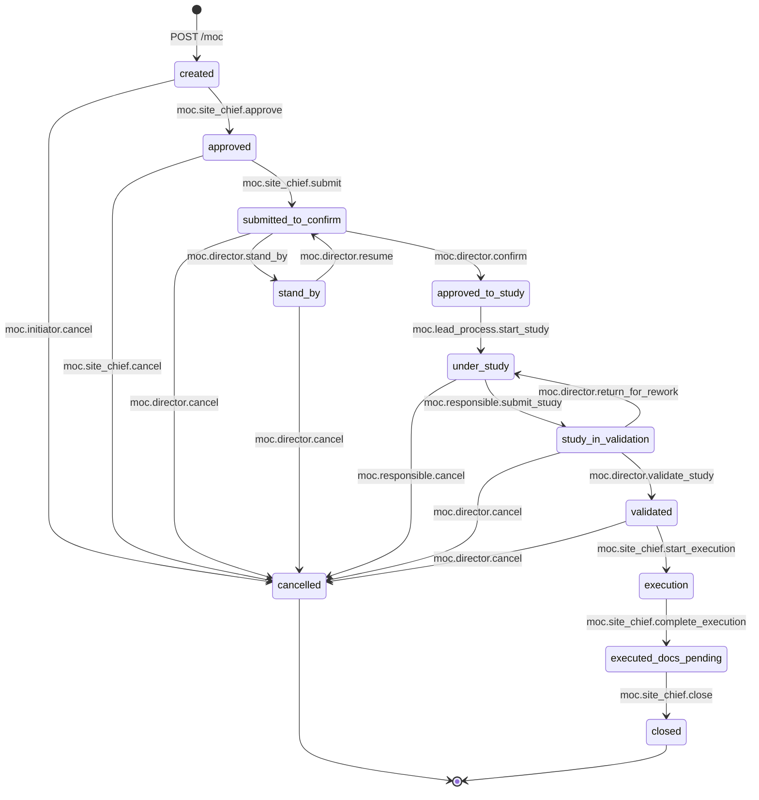

# MOC — Management of Change

!!! info "Source de cette page"

    Chaque affirmation est sourcée du code (chemin de fichier indiqué).
    La FSM, les permissions et les rôles sont extraits du `MANIFEST`
    et de `app/services/modules/moc_service.py`.

## Résumé en 30 secondes

MOC (**Management of Change**) gère le **circuit d'autorisation** d'une
modification opérationnelle ou de sécurité sur une installation
industrielle. Trois piliers :

- **Formulaire structuré** — objectifs, situation actuelle, modifications
  proposées, analyse d'impact, métiers concernés, type
  (permanent/temporaire), drapeaux HAZOP/HAZID/Environmental, pièces
  jointes typées (PID, ESD, photos, études)
- **Workflow 12 états** — du brouillon à la clôture, avec validations
  parallèles multi-rôles (HSE, Lead Process, Production Manager, Gas
  Manager, Maintenance Manager, Métier(s)) et 9 signatures électroniques
- **Promotion en projet** — un MOC validé peut devenir un Project lié,
  avec synchronisation automatique du progress

Reproduit fidèlement le formulaire Perenco rev. 06 (octobre 2025).

Stack : 7 modèles SQLAlchemy ([`app/models/moc.py`](https://github.com/hmunyeku/OPSFLUX/blob/main/app/models/moc.py)),
27 endpoints API ([`app/api/routes/modules/moc.py`](https://github.com/hmunyeku/OPSFLUX/blob/main/app/api/routes/modules/moc.py)),
14 permissions, 9 rôles, 12 événements émis, intégrations avec Projets
et Asset Registry.

---

## 1. À quoi ça sert

**Problème métier** : sur une installation industrielle (raffinerie,
plateforme, usine), toute modification — qu'elle soit pour optimiser un
process ou corriger un risque — doit suivre un **circuit de validation
formel** avant exécution. Le MOC trace ce circuit : qui demande, qui
approuve, qui valide, qui signe, et avec quel motif éventuel de renvoi.

Sans ce circuit :
- Risque de modification non documentée (HSE, audit, conformité)
- PID/ESD désynchronisés avec la réalité terrain
- Aucune traçabilité pour les inspections réglementaires
- Conflits sur la responsabilité (qui a validé quoi)

OpsFlux MOC dématérialise ce qui se faisait sur formulaire papier
multi-pages signé à la main, en gardant **tous les workflows et tous les
champs** identiques au formulaire d'origine — pour minimiser le choc
sur les équipes terrain.

**Pour qui** :

| Rôle | Permissions clés ([`app/modules/moc/__init__.py`](https://github.com/hmunyeku/OPSFLUX/blob/main/app/modules/moc/__init__.py)) |
|---|---|
| **Initiateur MOC** | `moc.create`, `moc.update`, `moc.initiator.cancel` — l'opérateur terrain ou le chef d'équipe qui détecte le besoin |
| **Chef de site (CDS / OM)** | `moc.site_chief.{approve, submit, cancel, start_execution, complete_execution, close}` — l'opérationnel qui pilote l'exécution |
| **Directeur (Production / Gaz)** | `moc.director.{confirm, cancel, stand_by, resume, validate_study, return_for_rework}` — donne le go/no-go métier, valide l'étude finale |
| **Lead Process** | `moc.lead_process.start_study` — démarre l'étude technique |
| **Process Engineer** | `moc.responsible.{submit_study, cancel, close}` — conduit l'étude, désigné après confirmation |
| **HSE** | `moc.hse.validate` — valide le volet sécurité (HAZOP/HAZID/Environmental) |
| **Production Manager** | `moc.production.validate` — valide la mise en étude (Daxium tab 3) |
| **Maintenance Manager** | `moc.maintenance.validate` — valide l'impact maintenance |
| **MOC Métier** | `moc.metier.validate` — valide son volet (élec, instru, méca, etc.) |
| **MOC Admin** | `moc.manage` + toutes les autres — gestion catalogue + override |

---

## 2. Concepts clés (vocabulaire)

| Terme | Modèle / Table | Description |
|---|---|---|
| **MOC** | `MOC` / `mocs` | Le dossier de modification. Référence `MOC_<NNN>_<PF>` (NNN séquentiel par entity, PF code plateforme). 95 colonnes au total — porte tous les champs du Daxium d'origine. |
| **MOCStatusHistory** | `MOCStatusHistory` / `moc_status_history` | Audit des transitions FSM : qui a fait passer de quel état à quel état, quand, avec quel commentaire. |
| **MOCValidation** | `MOCValidation` / `moc_validations` | 1 ligne par rôle/personne validant le MOC pendant l'étape de validation parallèle. Porte le commentaire, l'approval bool, la signature, la source (`matrix` / `invite` / `manual`). |
| **MOCSiteAssignment** | `MOCSiteAssignment` / `moc_site_assignments` | Mapping `user → rôle → site` qui pilote les notifications (le CDS de tel site reçoit les MOC concernant son site). |
| **MOCType** | `MOCType` / `moc_types` | Catalogue des types de MOC (configurable par admin). Chaque type a sa propre matrice de validation seedée. |
| **MOCTypeValidationRule** | `MOCTypeValidationRule` / `moc_type_validation_rules` | "Pour ce type de MOC, il faut tel rôle dans la matrice de validation." Définit le template par type. |
| **MOCReminderLog** | `MOCReminderLog` / `moc_reminder_log` | Historique des rappels envoyés (utile pour MOC temporaires avec dates limites). |
| **9 slots de signature** | colonnes sur `mocs` | `initiator_signature`, `hierarchy_reviewer_signature`, `site_chief_signature`, `production_signature`, `director_signature`, `process_engineer_signature`, `do_signature`, `dg_signature`, `close_signature` |

### Enums autoritaires (CHECK constraints SQL)

Source : [`app/models/moc.py:39-86`](https://github.com/hmunyeku/OPSFLUX/blob/main/app/models/moc.py#L39).

```
status (12) :  created, approved, submitted_to_confirm, cancelled,
               stand_by, approved_to_study, under_study,
               study_in_validation, validated, execution,
               executed_docs_pending, closed

modification_type (2) :  permanent | temporary
nature (2) :             OPTIMISATION | SECURITE
priority (3) :           1 (highest) | 2 (normal) | 3 (low)
cost_bucket (4) :        lt_20 | 20_to_50 | 50_to_100 | gt_100  (millions XAF)
validation_level (3) :   DO | DG | DO_AND_DG     (calculé selon cost_bucket)

validation_roles (7) :   hse, lead_process, production_manager, gas_manager,
                         maintenance_manager, process_engineer, metier

site_roles (7) :         site_chief, director, lead_process, hse,
                         production_manager, gas_manager, maintenance_manager
```

---

## 3. Architecture data



**Lecture rapide** :

- Un MOC porte **toute** son histoire dans la même table — pas de
  duplication. Les 9 signatures sont des colonnes (PNG en data URL),
  pas des lignes.
- La **matrice de validation parallèle** vit dans `moc_validations` :
  une ligne par (rôle, validateur) qui doit signer cet MOC. Seedée à
  la création depuis `MOCTypeValidationRule` selon le `moc_type_id`.
- Si un type expert n'est pas dans la matrice, on peut **inviter** un
  validateur ad-hoc via `POST /api/v1/moc/{id}/validations/invite`.
- Une fois validé + en exécution, le CDS peut **promouvoir** le MOC en
  Project (`POST .../promote-to-project`) — créant une row `projects`
  liée bidirectionnellement (`mocs.project_id` + `projects.external_ref="moc:<uuid>"`).

---

## 4. Workflow MOC — états et transitions

### États ([`app/models/moc.py:39-52`](https://github.com/hmunyeku/OPSFLUX/blob/main/app/models/moc.py#L39))

| Code | Label métier | Acteur typique |
|---|---|---|
| `created` | Créé (brouillon initiateur) | Initiateur MOC |
| `approved` | Approuvé (Chef de site / OM) | Chef de site (CDS) |
| `submitted_to_confirm` | Soumis à confirmer (Directeur) | CDS → Directeur |
| `stand_by` | Stand-by (en attente, non rejeté) | Directeur |
| `cancelled` | Annulé (terminal) | Initiateur / CDS / Directeur / Process Engineer |
| `approved_to_study` | Confirmé à étudier | Directeur |
| `under_study` | En étude Process | Lead Process → Process Engineer |
| `study_in_validation` | Étudié, en validation parallèle | Process Engineer |
| `validated` | Validé à exécuter | Directeur |
| `execution` | En exécution sur le terrain | CDS |
| `executed_docs_pending` | Exécuté, PID/ESD à jour | CDS |
| `closed` | Tous les documents à jour, dossier clos | CDS |

### Diagramme



### Source de vérité

La machine d'états vit dans
[`app/services/modules/moc_service.py:46-91`](https://github.com/hmunyeku/OPSFLUX/blob/main/app/services/modules/moc_service.py#L46) :

```python
FSM: dict[str, dict[str, str]] = {
    "created": {
        "approved": "moc.site_chief.approve",
        "cancelled": "moc.initiator.cancel",
    },
    "approved": {
        "submitted_to_confirm": "moc.site_chief.submit",
        "cancelled": "moc.site_chief.cancel",
    },
    # ... 16 transitions au total
}
```

Le tableau `from_status → { to_status: required_permission }` est la
**source unique** : la fonction `transition()` ([`moc_service.py:121`](https://github.com/hmunyeku/OPSFLUX/blob/main/app/services/modules/moc_service.py#L121))
refuse toute transition non listée. L'API expose la FSM via
`GET /api/v1/moc/fsm` ([`moc.py:595`](https://github.com/hmunyeku/OPSFLUX/blob/main/app/api/routes/modules/moc.py#L595))
pour que le frontend puisse griser les boutons impossibles.

### Préconditions par transition

Au-delà du contrôle FSM, certaines transitions exigent des **préconditions
métier** vérifiées par `transition()` :

| Transition | Précondition |
|---|---|
| `created → approved` | Signature `initiator_signature` présente |
| `approved → submitted_to_confirm` | Signature `site_chief_signature` + `hierarchy_reviewer_signature` |
| `submitted_to_confirm → approved_to_study` | `priority` renseigné + `director_signature` |
| `study_in_validation → validated` | Toutes les `MOCValidation` matricielles avec `approved=true` + `signature` non null + accord D.O et/ou D.G selon `cost_bucket` |
| `executed_docs_pending → closed` | `close_signature` présente |
| `* → cancelled` | Commentaire de `cancellation_reason` obligatoire |
| `study_in_validation → under_study` | Commentaire de `return_reason` obligatoire (rework explicite) |

> **Source** : `transition()` en `moc_service.py:121-300+` valide chaque
> précondition avant de muter `moc.status` et de loguer `MOCStatusHistory`.

---

## 5. Workflow validation parallèle

L'étape `study_in_validation` est **parallèle** : plusieurs rôles
valident en même temps, chacun signe sa ligne. Le MOC ne peut passer à
`validated` que quand toutes les lignes obligatoires sont approuvées.

```mermaid
graph LR
    PE[Process Engineer<br/>POST /transition<br/>under_study → study_in_validation]
    PE --> MAT[Matrice MOCValidation<br/>seedée depuis<br/>MOCTypeValidationRule]

    MAT --> H[HSE<br/>HAZOP / HAZID]
    MAT --> LP[Lead Process]
    MAT --> PM[Production Mgr]
    MAT --> GM[Gas Mgr]
    MAT --> MM[Maintenance Mgr]
    MAT --> ME[Métier(s)<br/>élec, instru, …]

    H --> APP[approved + signature]
    LP --> APP
    PM --> APP
    GM --> APP
    MM --> APP
    ME --> APP

    APP --> DIR{Directeur<br/>moc.director.validate_study}
    DIR -->|tout OK| VAL[validated]
    DIR -->|rework| RET[under_study<br/>+ return_reason]
```

**Champs sur `MOCValidation`** :

| Champ | Description |
|---|---|
| `role` | hse / lead_process / production_manager / gas_manager / maintenance_manager / process_engineer / metier |
| `validator_user_id` | Personne qui doit signer |
| `comment` | Commentaire libre |
| `approved` | bool — `null` tant que pas signé, `true` ou `false` après |
| `signature` | data URL PNG (≤ ~80 KB après compression) |
| `source` | `matrix` (seedée auto), `invite` (ad-hoc), `manual` (admin) |
| `invited_by` / `invited_at` | trace l'invitation |
| `return_requested` / `return_reason` | refus motivé → renvoi au PE |

### Inviter un validateur ad-hoc

Quand la matrice de base manque un expert (ex. un consultant externe
nécessaire pour ce MOC précis), un admin ou un Lead Process peut
ajouter une ligne :

```
POST /api/v1/moc/{moc_id}/validations/invite
{
  "user_id": "<uuid>",
  "role": "metier",
  "label": "Expert IRATA externe"
}
```

[Source `moc.py:1813`](https://github.com/hmunyeku/OPSFLUX/blob/main/app/api/routes/modules/moc.py#L1813).
La ligne créée a `source="invite"`. Permission : `moc.validator.invite`.

---

## 6. Step-by-step utilisateur

### 6.1 — Initiateur : créer un MOC

1. **`/moc`** → bouton **`+ Nouveau MOC`** (visible si `moc.create`)
2. Le formulaire **`CreateMocPanel`** ([`apps/main/src/pages/moc/`](https://github.com/hmunyeku/OPSFLUX/blob/main/apps/main/src/pages/moc))
   reproduit les 6 onglets Daxium :
   1. **Identification** — site, plateforme, type de MOC (drive la matrice de validation)
   2. **Description** — objectifs, situation actuelle, modifications proposées
   3. **Caractéristiques** — nature (`OPTIMISATION` / `SECURITE`), métiers concernés, modification_type (permanent/temporaire + dates si temporaire)
   4. **Analyse d'impact** — drapeaux HAZOP, HAZID, Environmental, MAJ PID, MAJ ESD
   5. **Pièces jointes** — typées : PID initial/modifié, ESD initial/modifié, photos, études, autre
   6. **Signature** — `<SignaturePad>` capture votre paraphe → injecté dans `initiator_signature`
3. **Enregistrer** → MOC créé en `status=created`, référence générée
   automatiquement (`MOC_001_RDR1`).
4. À ce stade, le MOC est **invisible des autres rôles** (sauf admins).
   Vérifier les éléments + signature, puis appeler le CDS.

### 6.2 — Chef de site (CDS / OM) : approuver et soumettre

Reçoit une notification email + dashboard quand un MOC concernant son
site (via `moc_site_assignments`) passe en `created` et a la signature
initiateur.

1. **`/moc`** → onglet de liste, filtre par défaut "MOC sur mes sites"
2. Ouvrir le MOC → vérifier que c'est bien un MOC (pas un simple
   travail courant), validation de principe
3. Bouton **`Approuver`** → exige `site_chief_signature`. Statut passe
   à `approved`.
4. Si pas conforme → bouton **`Renvoyer à modifier`** ou **`Annuler`**
   (avec motif obligatoire).
5. Une fois approuvé, soumettre au directeur → bouton **`Soumettre à
   confirmation`**. Statut → `submitted_to_confirm`.

### 6.3 — Directeur : confirmer ou stand-by

1. **`/moc`** → onglet "À confirmer" (ADS en `submitted_to_confirm`)
2. Trois options selon le contexte stratégique :
   - **`Confirmer à étudier`** → MOC accède à `approved_to_study`,
     l'étude technique peut démarrer. Exige `priority` (1/2/3) +
     `director_signature`.
   - **`Stand-by`** → ni rejet ni acceptation, mis en veille (pas
     prioritaire). Peut être ré-activé via `Resume`.
   - **`Annuler`** → terminal, motif obligatoire.

### 6.4 — Lead Process → Process Engineer : étude technique

1. Une fois en `approved_to_study`, le **Lead Process** désigne le
   Process Engineer responsable et clique **`Démarrer l'étude`** →
   `under_study`.
2. Le **Process Engineer** travaille sur la fiche : remplit
   `study_conclusion`, ajoute drapeaux HAZOP/HAZID/Environmental
   actualisés, calcule le coût (qui détermine le `cost_bucket`, qui
   détermine `validation_level` D.O/D.G/D.O+D.G), attache pièces
   complémentaires, signe (`process_engineer_signature`).
3. Bouton **`Soumettre l'étude`** → `study_in_validation`. La matrice
   de validation parallèle est notifiée.

### 6.5 — Validateurs parallèles (HSE / Lead / Production / Gaz / Maint / Métier)

Chaque validateur reçoit une notif + voit le MOC dans son onglet
"À valider" :

1. Ouvrir le MOC → onglet "Matrice de validation"
2. Voir les autres lignes (qui a déjà signé, qui n'a pas)
3. Ajouter son **commentaire**, choisir **Approuvé / Refusé**, signer
4. Si refusé : motif obligatoire, le MOC peut être renvoyé en `under_study`
   par le directeur (rework).

### 6.6 — Directeur : validation finale

Quand toutes les lignes matricielles sont signées :

1. Onglet "Validations finales" → bouton **`Valider l'étude`**
2. Selon `cost_bucket` :
   - `lt_20` → D.O suffit
   - `20_to_50` ou `50_to_100` → D.O ou D.G
   - `gt_100` → D.O **ET** D.G obligatoires
3. Chaque directeur signe sa case (`do_signature`, `dg_signature`)
4. Le MOC passe à `validated` → exécution autorisée.
5. Si rework nécessaire : **`Renvoyer pour rework`** → `under_study`
   avec motif.

### 6.7 — CDS : exécution + clôture

1. **`Démarrer l'exécution`** → `execution`. Travaux sur le terrain.
2. Une fois terminés sur le terrain : **`Marquer exécuté (docs en cours)`**
   → `executed_docs_pending`. Le PID/ESD doit être mis à jour avant
   clôture formelle.
3. Quand tous les documents sont à jour : **`Clôturer`** → `closed`
   avec `close_signature`. Terminal.

### 6.8 — Promouvoir un MOC en Project (optionnel)

À partir de `validated`, `execution` ou `executed_docs_pending` :

```
POST /api/v1/moc/{id}/promote-to-project
```

[Source `moc.py:1722`](https://github.com/hmunyeku/OPSFLUX/blob/main/app/api/routes/modules/moc.py#L1722).
Crée une row `projects` :
- `code = MOC_NNN_PF` (même réf que le MOC)
- `manager_id = moc.manager_id` ou caller
- `asset_id = moc.installation_id`
- `priority` mappé depuis `moc.priority` (1→high, 2→medium, 3→low)
- `external_ref = moc:<uuid>`

**Synchronisation continue Project → MOC** ([`app/services/modules/moc_sync.py`](https://github.com/hmunyeku/OPSFLUX/blob/main/app/services/modules/moc_sync.py)) :

- `project.progress` → `moc.metadata_['execution_progress']` (visualisable
  sur la fiche MOC sans navigation)
- `project.status == 'completed'` AND `moc.status == 'execution'` →
  auto-avancement à `executed_docs_pending`
- `project.status == 'cancelled'` → log d'avertissement, **pas
  d'action automatique** (annuler un MOC nécessite un acte explicite)

---

## 7. Permissions matrix

14 permissions définies dans le `MANIFEST`
([`app/modules/moc/__init__.py:16-69`](https://github.com/hmunyeku/OPSFLUX/blob/main/app/modules/moc/__init__.py#L16)).

### Granulaires (gating routes)

| Permission | Route gatée |
|---|---|
| `moc.read` | GET liste, détail, PDF, FSM, stats, site-assignments |
| `moc.create` | POST création |
| `moc.update` | PATCH, signature, return |
| `moc.delete` | DELETE soft |
| `moc.transition` | POST /transition (le FSM applique la perm spécifique de la transition) |
| `moc.validate` | POST /validations (upsert ligne matricielle) |
| `moc.validator.invite` | POST /validations/invite (ad-hoc) |
| `moc.production.validate` | POST /production-validation |
| `moc.promote` | POST /promote-to-project |
| `moc.signature.view` | Voir le PNG des signatures (sinon `__REDACTED__`) |
| `moc.manage` | Catalogue types, site-assignments, override admin |

### Permissions de transition FSM

Une permission **par transition** dans le `MANIFEST` :

```
moc.initiator.cancel
moc.site_chief.{approve, submit, cancel, start_execution, complete_execution, close}
moc.director.{confirm, cancel, stand_by, resume, validate_study, return_for_rework}
moc.lead_process.start_study
moc.responsible.{submit_study, cancel, close}
moc.{hse, maintenance, metier}.validate
```

Le FSM ([`moc_service.py:46-91`](https://github.com/hmunyeku/OPSFLUX/blob/main/app/services/modules/moc_service.py#L46))
encode la permission requise par transition. Le frontend appelle
`GET /api/v1/moc/fsm` pour afficher uniquement les boutons disponibles
au user courant.

### Rôles système ([`__init__.py:70-196`](https://github.com/hmunyeku/OPSFLUX/blob/main/app/modules/moc/__init__.py#L70))

| Code | Permissions |
|---|---|
| `MOC_INITIATOR` | read + create + update + initiator.cancel |
| `SITE_CHIEF` | read + update + transition + site_chief.* + signature.view + promote + validator.invite |
| `DIRECTOR` | read + update + transition + stats.read + director.* + signature.view + promote + validator.invite |
| `LEAD_PROCESS` | read + update + transition + lead_process.start_study + validate + metier.validate + signature.view + validator.invite |
| `PROCESS_ENGINEER` | read + update + transition + responsible.* + signature.view |
| `PRODUCTION_MANAGER` | read + validate + production.validate + signature.view |
| `HSE` | read + validate + hse.validate + signature.view |
| `MAINTENANCE_MANAGER` | read + validate + maintenance.validate + signature.view |
| `MOC_METIER` | read + validate + metier.validate |
| `MOC_ADMIN` | toutes les perms du module |

> Le rôle `SITE_CHIEF` est **système** (pas `MOC_*`) parce que d'autres
> modules (PaxLog, TravelWiz) le réutilisent. Idem `DIRECTOR`,
> `LEAD_PROCESS`, `HSE`, `MAINTENANCE_MANAGER`. C'est volontaire.

---

## 8. Signatures électroniques

9 slots fixes sur la fiche MOC + 1 slot par ligne de validation.

### Capture côté front

Le composant `<SignaturePad>` (canvas multi-touch + stylet + souris)
retourne une **data URL base64 PNG** stockée dans la colonne
correspondante.

### Protection à l'affichage

`<ProtectedSignature>` rend le PNG via `background-image` (pas ``,
pas crawlable), désactive context-menu / drag / copy, applique un
filigrane 3 couches :
- texte rotation +22° / -22° (`email_viewer + timestamp + ref`)
- grille diagonale
- auto-flou quand la fenêtre perd le focus

> **Pas une signature cryptographique autoritaire** — elle reproduit la
> signature papier pour la complétude du PDF Perenco. Un screenshot OS
> reste techniquement impossible à bloquer depuis un navigateur web ;
> la défense repose sur le **filigrane traçable** qui permet de
> remonter à l'origine d'une fuite.

### Redaction backend

`_redact_signatures()` dans
[`app/api/routes/modules/moc.py`](https://github.com/hmunyeku/OPSFLUX/blob/main/app/api/routes/modules/moc.py)
remplace les data URL par le sentinel `__REDACTED__` pour les users sans
`moc.signature.view` ni `moc.manage` — sauf auto-service (le signataire
voit toujours sa propre signature).

### Le PDF MOC

`GET /api/v1/moc/{id}/pdf` ([`moc.py:1110`](https://github.com/hmunyeku/OPSFLUX/blob/main/app/api/routes/modules/moc.py#L1110))
exporte la fiche au format **Perenco rev. 06** : bandes teal `#11A09E`,
cases à cocher fidèles, filigrane anti-extraction sur les signatures
imprimées (réplique du filigrane web).

---

## 9. Endpoints (résumé)

27 endpoints dans
[`app/api/routes/modules/moc.py`](https://github.com/hmunyeku/OPSFLUX/blob/main/app/api/routes/modules/moc.py).

| Action | Endpoint | Source |
|---|---|---|
| Lister | `GET /api/v1/moc` | [218](https://github.com/hmunyeku/OPSFLUX/blob/main/app/api/routes/modules/moc.py#L218) |
| Créer | `POST /api/v1/moc` | [313](https://github.com/hmunyeku/OPSFLUX/blob/main/app/api/routes/modules/moc.py#L313) |
| Stats dashboard | `GET /api/v1/moc/stats` | [497](https://github.com/hmunyeku/OPSFLUX/blob/main/app/api/routes/modules/moc.py#L497) |
| Description FSM | `GET /api/v1/moc/fsm` | [595](https://github.com/hmunyeku/OPSFLUX/blob/main/app/api/routes/modules/moc.py#L595) |
| Détail | `GET /api/v1/moc/{id}` | [871](https://github.com/hmunyeku/OPSFLUX/blob/main/app/api/routes/modules/moc.py#L871) |
| Update | `PATCH /api/v1/moc/{id}` | [945](https://github.com/hmunyeku/OPSFLUX/blob/main/app/api/routes/modules/moc.py#L945) |
| Soft delete | `DELETE /api/v1/moc/{id}` | [1001](https://github.com/hmunyeku/OPSFLUX/blob/main/app/api/routes/modules/moc.py#L1001) |
| Transition FSM | `POST /api/v1/moc/{id}/transition` | [1032](https://github.com/hmunyeku/OPSFLUX/blob/main/app/api/routes/modules/moc.py#L1032) |
| Upsert validation | `POST /api/v1/moc/{id}/validations` | [1062](https://github.com/hmunyeku/OPSFLUX/blob/main/app/api/routes/modules/moc.py#L1062) |
| Inviter validateur | `POST /api/v1/moc/{id}/validations/invite` | [1813](https://github.com/hmunyeku/OPSFLUX/blob/main/app/api/routes/modules/moc.py#L1813) |
| Renvoi motivé | `POST /api/v1/moc/{id}/return` | [1509](https://github.com/hmunyeku/OPSFLUX/blob/main/app/api/routes/modules/moc.py#L1509) |
| Validation production | `POST /api/v1/moc/{id}/production-validation` | [1621](https://github.com/hmunyeku/OPSFLUX/blob/main/app/api/routes/modules/moc.py#L1621) |
| Signature (slot) | `POST /api/v1/moc/{id}/signature` | [1673](https://github.com/hmunyeku/OPSFLUX/blob/main/app/api/routes/modules/moc.py#L1673) |
| Accord D.O / D.G | `POST /api/v1/moc/{id}/execution-accord` | [1895](https://github.com/hmunyeku/OPSFLUX/blob/main/app/api/routes/modules/moc.py#L1895) |
| Promotion en projet | `POST /api/v1/moc/{id}/promote-to-project` | [1722](https://github.com/hmunyeku/OPSFLUX/blob/main/app/api/routes/modules/moc.py#L1722) |
| PDF Perenco | `GET /api/v1/moc/{id}/pdf` | [1110](https://github.com/hmunyeku/OPSFLUX/blob/main/app/api/routes/modules/moc.py#L1110) |
| Catalogue types (CRUD) | `/api/v1/moc/types` | [631-757](https://github.com/hmunyeku/OPSFLUX/blob/main/app/api/routes/modules/moc.py#L631) |
| Règles de matrice (CRUD) | `/api/v1/moc/types/{type_id}/rules` | [759-869](https://github.com/hmunyeku/OPSFLUX/blob/main/app/api/routes/modules/moc.py#L759) |
| Site assignments (CRUD) | `/api/v1/moc/site-assignments` | [1982-2080](https://github.com/hmunyeku/OPSFLUX/blob/main/app/api/routes/modules/moc.py#L1982) |

---

## 10. Événements émis

12 événements déclarés dans
[`__init__.py:197-210`](https://github.com/hmunyeku/OPSFLUX/blob/main/app/modules/moc/__init__.py#L197) :

```
moc.created, moc.approved, moc.submitted_to_confirm,
moc.cancelled, moc.stand_by, moc.approved_to_study,
moc.under_study, moc.study_in_validation, moc.validated,
moc.execution, moc.executed_docs_pending, moc.closed
```

Un événement par **transition d'état**. Émis depuis `transition()`
([`moc_service.py`](https://github.com/hmunyeku/OPSFLUX/blob/main/app/services/modules/moc_service.py))
après commit DB. Consommés notamment par :

- **Notifications** — emails aux assignés `moc_site_assignments` du site
- **Module Projets** — `moc.validated` peut déclencher une suggestion
  de promotion (UI hint)
- **Audit log** — toutes transitions sont aussi loguées dans
  `MOCStatusHistory` (table dédiée, persistante même après suppression
  du MOC source)

---

## 11. Pièges & FAQ

### J'ai changé d'avis pendant l'étude — comment annuler propre ?

Selon ton rôle et l'état :
- **`under_study`** → Process Engineer peut `responsible.cancel`
- **`submitted_to_confirm`** ou avant → Directeur peut `director.cancel`
- **`validated`** → seul Directeur peut encore annuler

Toutes ces routes exigent un **`cancellation_reason` obligatoire** —
le MOC garde sa trace, le motif est dans `MOCStatusHistory`.

### Pourquoi le bouton "Valider l'étude" est grisé même avec toutes les signatures matricielles ?

Vérifier que `cost_bucket` est renseigné — pas trivial. Le système
calcule automatiquement le `validation_level` (DO / DG / DO_AND_DG)
depuis le coût ; sans coût, pas de validation possible.
Si `cost_bucket = gt_100`, il faut **les deux** signatures D.O **ET** D.G.

### Une ligne de validation HSE est manquante alors qu'on a un type de MOC

Le `moc_type_id` détermine le seed initial de la matrice via
`MOCTypeValidationRule`. Si HSE n'a pas été défini comme rôle requis
dans les rules de ce type, la ligne n'est pas seedée.

**Workaround** : un admin ou Lead Process peut **inviter** HSE
manuellement via `POST /validations/invite` (`source="invite"`).

**Fix structurel** : éditer le catalogue types depuis Settings →
Catalogue MOC → Règles de validation, ajouter HSE comme rôle requis.
Effet sur les MOC futurs uniquement.

### Mon CDS de remplacement ne reçoit aucune notif MOC

`moc_site_assignments` n'a pas été mis à jour. Tableau de bord admin →
**Site assignments** → ajouter `(user, role=site_chief, site=...)`.
Effet immédiat sur les nouvelles transitions.

### Le PDF du MOC affiche `__REDACTED__` au lieu des signatures

Le user qui télécharge le PDF n'a pas `moc.signature.view`. Soit :
- Lui donner la perm si c'est légitime (typique : auditeur, manager)
- Ou demander au signataire de télécharger lui-même (auto-service)

### Promotion en project : "409 already promoted"

Le MOC a déjà `moc.project_id` non-null. Idempotent par design — pas
de double création. Pour ré-promouvoir : éditer `moc.project_id = NULL`
en SQL (ou supprimer le projet créé), puis relancer le POST. Très rare
en pratique.

### Mon MOC reste en `executed_docs_pending` indéfiniment

C'est l'étape "PID/ESD doivent être mis à jour avant clôture". Pas
d'auto-clôture — le CDS doit explicitement signer `close_signature` et
appeler `moc.site_chief.close`. C'est volontaire : la clôture est un
**acte managérial** (le CDS atteste que la doc est cohérente avec la
réalité terrain), pas un effet de bord.

### Comment un MOC temporaire revient-il en service "permanent" ?

Les MOC `modification_type=temporary` ont des dates limites. Quand la
date approche, des rappels sont envoyés (cron quotidien si
`moc.reminders.enabled=true` dans Settings). Pour rendre la modif
permanente : créer un **nouveau** MOC référençant l'ancien, ne pas
modifier l'existant (intégrité de la trace).

---

## 12. Liens

### Code

- [`app/modules/moc/__init__.py`](https://github.com/hmunyeku/OPSFLUX/blob/main/app/modules/moc/__init__.py) — manifest (14 perms, 9 rôles, 12 events)
- [`app/api/routes/modules/moc.py`](https://github.com/hmunyeku/OPSFLUX/blob/main/app/api/routes/modules/moc.py) — 27 endpoints (~2080 lignes)
- [`app/models/moc.py`](https://github.com/hmunyeku/OPSFLUX/blob/main/app/models/moc.py) — 7 modèles
- [`app/services/modules/moc_service.py`](https://github.com/hmunyeku/OPSFLUX/blob/main/app/services/modules/moc_service.py) — FSM + transitions + reference generation
- [`app/services/modules/moc_sync.py`](https://github.com/hmunyeku/OPSFLUX/blob/main/app/services/modules/moc_sync.py) — sync continue Project → MOC
- [`apps/main/src/pages/moc/`](https://github.com/hmunyeku/OPSFLUX/blob/main/apps/main/src/pages/moc) — UI

### Tests

```bash
# Smoke test couvrant les 13 étapes principales du workflow
TOKEN="$(your-login-flow)" ENTITY_ID="your-entity-uuid" \
  ./scripts/smoke_moc.sh https://api.opsflux.io
```

[Source `scripts/smoke_moc.sh`](https://github.com/hmunyeku/OPSFLUX/blob/main/scripts/smoke_moc.sh).

### Configuration entity (Settings → MOCtrack)

- `moc.reminders.enabled` (bool) — active le cron quotidien de rappels
- `moc.reminders.days_before` (list int) — seuils J-N (défaut `[30,14,7,1]`)
- Catalogue **Types de MOC** + matrices de validation template
