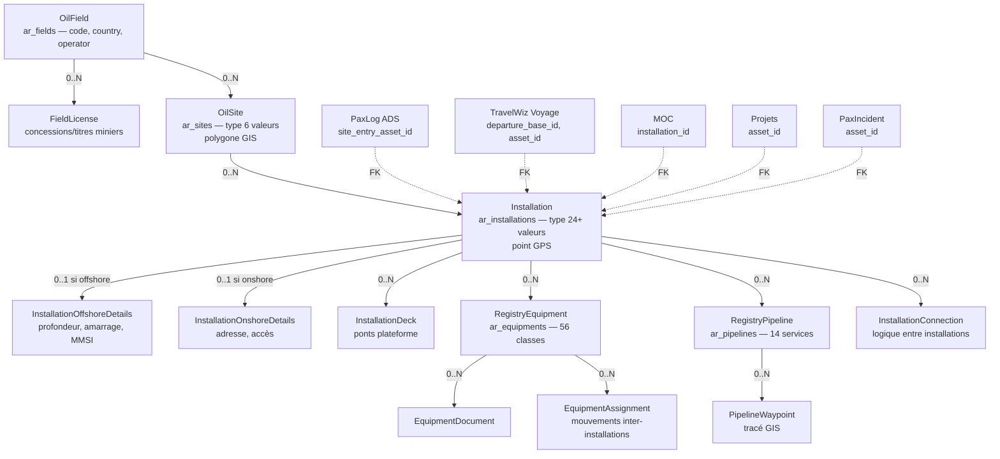
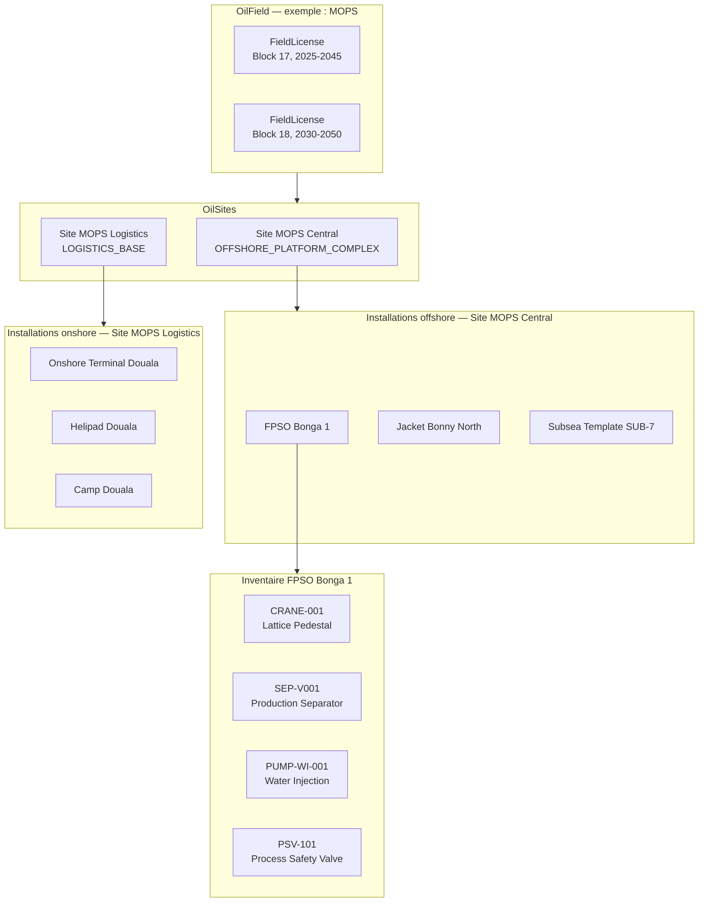
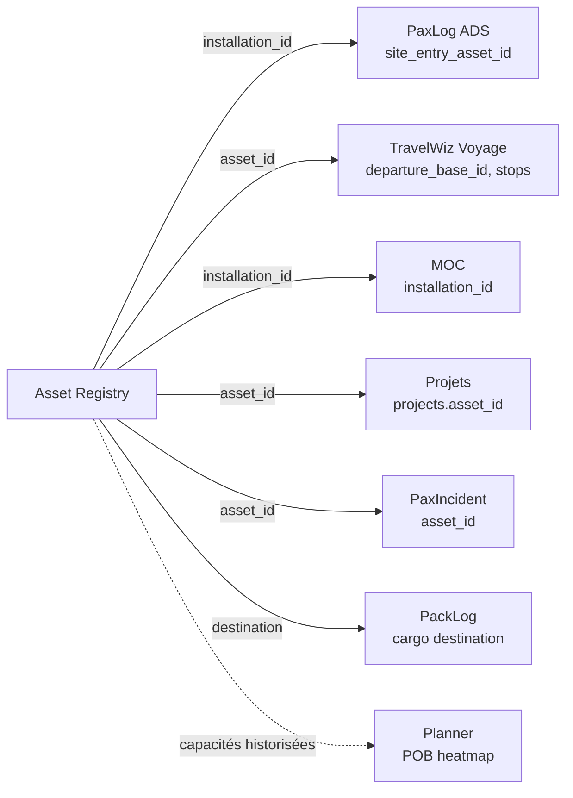

# Asset Registry

!!! info "Source de cette page"

    Chaque affirmation est sourcée du code (chemin de fichier indiqué).
    La hiérarchie et les enums viennent directement de
    `app/models/asset_registry.py`.

## Résumé en 30 secondes

Asset Registry est le **référentiel des actifs physiques** de
l'entreprise. Il modélise la hiérarchie réelle d'un opérateur oil &
gas / industrie :

```
OilField (champ)
  └─ OilSite (site géographique)
       └─ Installation (plateforme, FPSO, terminal, well pad…)
            ├─ InstallationDeck (ponts pour offshore)
            ├─ RegistryEquipment (~56 classes d'équipement)
            └─ RegistryPipeline (avec waypoints GIS)
```

Tous les modules métier (PaxLog, TravelWiz, MOC, Conformité, Projets)
référencent les **`Installation`** via la table `ar_installations` —
c'est là que les ADS pointent leur `site_entry_asset_id`, où les
voyages TravelWiz définissent leur `departure_base_id`, où les MOC
ciblent leur `installation_id`.

Particularités :
- **PostGIS natif** : champs géographiques (point, polygone, ligne)
- **Import KMZ** : importer des polygones de site et tracés de pipeline
  depuis Google Earth
- **56 classes d'équipement** : toutes les catégories O&G (CRANE,
  SEPARATOR, PUMP, GAS_TURBINE, FPSO, …) pré-définies
- **20+ types d'installation** offshore + onshore (FIXED_JACKET,
  SEMI_SUB, FPSO, JACK_UP, ONSHORE_TERMINAL, HELIPAD, …)
- **Capacités historiques** : changement de capacité d'une plateforme =
  nouvelle ligne (effective_date), pas un UPDATE → traçabilité totale

Stack : **20+ modèles** SQLAlchemy ([`app/models/asset_registry.py`](https://github.com/hmunyeku/OPSFLUX/blob/main/app/models/asset_registry.py)),
**81 endpoints** ([`app/api/routes/modules/asset_registry.py`](https://github.com/hmunyeku/OPSFLUX/blob/main/app/api/routes/modules/asset_registry.py)),
**8 permissions**.

---

## 1. À quoi ça sert

**Problème métier** : un opérateur a besoin de **localiser, identifier
et tracer** chaque actif physique de son périmètre :

- Où est le wellhead WH-001 du champ MOPS ? Sur quelle plateforme ? Sur
  quel pont ? Quelles sont ses certifications, son historique de
  maintenance, ses capacités ?
- Combien de PSV ai-je déclaré sur l'inventaire FPSO Bonny ? Combien
  sont en `OPERATIONAL`, combien en `STANDBY` ?
- Quel pipeline transporte du gaz entre la plateforme Erha et le
  terminal Bonny ? Quel est son tracé GIS ?
- Quand on assigne un PAX sur un site, est-ce qu'on parle de
  l'installation **A1** ou **A2** ? Du pont 1 ou 2 ?

Sans Asset Registry : Excel par filiale, KMZ Google Earth séparé,
inventaire SAP partiel — aucun référentiel commun. Les ADS pointent
vers des sites mal identifiés, les manifestes sont incohérents, les
MOC ne savent pas quoi modifier exactement.

OpsFlux Asset Registry crée la **source de vérité** géographique +
inventaire + capacités. Tout le reste pointe ici.

**Pour qui** :

| Rôle | Permissions clés ([`app/modules/asset_registry/__init__.py`](https://github.com/hmunyeku/OPSFLUX/blob/main/app/modules/asset_registry/__init__.py)) |
|---|---|
| **ASSET_ADMIN** | toutes (read, create, update, delete, capacity.manage, hse.manage, import, export) |
| **Lecteur référentiel** (tous les autres modules) | `asset.read` granted via leur rôle métier |
| **Gestionnaire capacités** | `asset.capacity.manage` (POB, weight limits) |
| **Gestionnaire HSE** | `asset.hse.manage` (zones de risque, certifications) |
| **Importateur KMZ** | `asset.import` |

---

## 2. Concepts clés (vocabulaire)

### Hiérarchie principale

| Terme | Modèle / Table | Description |
|---|---|---|
| **OilField** (Champ) | `OilField` / `ar_fields` | Top-level groupement géographique (ex. "MOPS Field", "Block 14"). Code unique, pays, opérateur, license fields. |
| **OilSite** (Site) | `OilSite` / `ar_sites` | Site géographique au sein d'un champ (ex. "MOPS Central", "Erha North"). Type : OFFSHORE_PLATFORM_COMPLEX, ONSHORE_TERMINAL, ONSHORE_FIELD_AREA, EXPORT_TERMINAL, LOGISTICS_BASE, SUBSEA_FIELD. |
| **Installation** | `Installation` / `ar_installations` | Plateforme, FPSO, terminal, well pad, jetty, héliport, base logistique. **C'est l'objet référencé par tous les autres modules** via `installation_id` ou `site_entry_asset_id`. |
| **InstallationDeck** | `InstallationDeck` / `ar_installation_decks` | Ponts d'une plateforme offshore (main deck, cellar deck, weather deck). Permet le placement précis. |

### Détails par environnement

| Terme | Modèle | Description |
|---|---|---|
| **InstallationOffshoreDetails** | détail offshore | Données spécifiques offshore : position, profondeur, type d'amarrage, MMSI, etc. |
| **InstallationOnshoreDetails** | détail onshore | Données onshore : adresse, accès route, raccordement réseau électrique, etc. |
| **FieldLicense** | licence champ | Concessions / titres miniers (numéro, date, périmètre KML) |

### Inventaire équipements

| Terme | Modèle / Table | Description |
|---|---|---|
| **RegistryEquipment** | `RegistryEquipment` / `ar_equipments` | Équipement individuel. **`equipment_class`** parmi 56 valeurs (CRANE, PUMP, GAS_TURBINE, SEPARATOR, …). Tag unique, position sur deck, status, capacités. |
| **EquipmentDocument** | `EquipmentDocument` / `ar_equipment_documents` | Manuels, certifications, dossiers techniques attachés à un équipement. |
| **EquipmentAssignment** | `EquipmentAssignment` / `ar_equipment_assignments` | Mouvement d'équipement entre installations (un compresseur portatif déplacé entre 2 plateformes). |

### Tuyauteries

| Terme | Modèle / Table | Description |
|---|---|---|
| **RegistryPipeline** | `RegistryPipeline` / `ar_pipelines` | Pipeline reliant 2 installations. Service type (EXPORT_OIL, GAS_LIFT, INJECTION_WATER, RISER, SUBSEA_UMBILICAL, …). Diamètre, longueur, pression. |
| **PipelineWaypoint** | `PipelineWaypoint` / `ar_pipeline_waypoints` | Points GIS d'un tracé de pipeline (importé depuis KMZ). |
| **InstallationConnection** | `InstallationConnection` / `ar_installation_connections` | Connexions logiques entre installations (par ex. plateforme A → terminal B), peut référencer un pipeline. |

### Statut opérationnel

`OperationalStatus` ([`asset_registry.py:34-40`](https://github.com/hmunyeku/OPSFLUX/blob/main/app/models/asset_registry.py#L34)) :

```
OPERATIONAL, STANDBY, UNDER_CONSTRUCTION,
SUSPENDED, DECOMMISSIONED, ABANDONED
```

Appliqué à OilSite, Installation, RegistryEquipment, RegistryPipeline.

### Environnement

`EnvironmentType` ([`asset_registry.py:43-49`](https://github.com/hmunyeku/OPSFLUX/blob/main/app/models/asset_registry.py#L43)) :

```
ONSHORE, OFFSHORE, SWAMP, SHALLOW_WATER, DEEPWATER, SUBSEA
```

### 56 classes d'équipement

`EquipmentClassEnum` ([`asset_registry.py:52-129`](https://github.com/hmunyeku/OPSFLUX/blob/main/app/models/asset_registry.py#L52)).
Catégories :

- **Levage** : CRANE, HOIST, DAVIT, LIFTING_ACCESSORY
- **Vessels / Séparation** : SEPARATOR, PRESSURE_VESSEL, PROCESS_COLUMN, STORAGE_TANK, FILTER
- **Machines rotatives** : PUMP, GAS_COMPRESSOR, AIR_COMPRESSOR, GAS_TURBINE, DIESEL_GENERATOR, STEAM_TURBINE, FAN_BLOWER, TURBOEXPANDER
- **Thermique** : HEAT_EXCHANGER, FIRED_HEATER
- **Safety** : PSV, RUPTURE_DISK, ESD_SYSTEM, FIRE_GAS_SYSTEM, FIRE_WATER_SYSTEM, FLARE_SYSTEM
- **Instrumentation** : INSTRUMENT, METERING_SKID
- **Process** : CHEMICAL_INJECTION, GAS_DEHYDRATION, WATER_TREATMENT, NITROGEN_UNIT, HPU
- **Utilities** : HVAC, UPS, TELECOM, POTABLE_WATER_SYSTEM, SEWAGE_SYSTEM, COOLING_WATER_SYSTEM, DRAINAGE_SYSTEM
- **Électrique** : TRANSFORMER, SWITCHGEAR, MCC
- **Tuyauterie** : PIPING_LINE, MANIFOLD, PIG_STATION
- **Puits** : WELLHEAD, DOWNHOLE_COMPLETION
- **Subsea** : SUBSEA_XT, SUBSEA_UMBILICAL, SUBSEA_PLEM_PLET, RISER, SUBSEA_CONTROL_SYSTEM
- **Marine** : MARINE_LOADING_ARM, MOORING_SYSTEM, SURVIVAL_CRAFT
- **Civil** : BUILDING, STRUCTURAL_ELEMENT
- **CP** : CATHODIC_PROTECTION
- **Divers** : VEHICLE, PORTABLE_EQUIPMENT

### 20+ types d'installation

`InstallationType` ([`asset_registry.py:141-172`](https://github.com/hmunyeku/OPSFLUX/blob/main/app/models/asset_registry.py#L141)).

**Offshore** : FIXED_JACKET_PLATFORM, FIXED_CONCRETE_PLATFORM,
SEMI_SUBMERSIBLE, FPSO, FSO, SPAR, TLP, JACK_UP, WELLHEAD_BUOY,
SUBSEA_TEMPLATE, FLARE_TOWER_OFFSHORE, RISER_PLATFORM

**Onshore** : ONSHORE_WELL_PAD, ONSHORE_GATHERING_STATION, ONSHORE_CPF,
ONSHORE_TERMINAL, ONSHORE_PUMPING_STATION, ONSHORE_COMPRESSION_STATION,
ONSHORE_METERING_STATION, ONSHORE_PIG_STATION, ONSHORE_STORAGE_TANK_FARM,
ONSHORE_FLARE_SYSTEM, ONSHORE_WATER_TREATMENT, ONSHORE_POWER_PLANT,
LOGISTICS_BASE, CAMP, HELIPAD, JETTY_PIER

### 24 types de grue

`CraneTypeEnum` ([`asset_registry.py:174-198`](https://github.com/hmunyeku/OPSFLUX/blob/main/app/models/asset_registry.py#L174)) — du LATTICE_PEDESTAL au FLOATING_CRANE en passant par TOWER_LUFFING.

### 14 types de service pipeline

`PipelineServiceType` ([`asset_registry.py:201-215`](https://github.com/hmunyeku/OPSFLUX/blob/main/app/models/asset_registry.py#L201)) :

```
EXPORT_OIL, EXPORT_GAS,
INJECTION_WATER, INJECTION_GAS, GAS_LIFT,
INFIELD_FLOWLINE, INFIELD_TRUNKLINE, INTERFIELD_TRUNK,
FUEL_GAS, PRODUCED_WATER, CHEMICAL_LINE, UTILITY_LINE,
SUBSEA_UMBILICAL, RISER
```

---

## 3. Architecture data



**Lecture rapide** :

- `ar_installations.id` est la **clé universelle** : tous les modules
  référencent une installation par cet UUID.
- L'**environnement** (offshore/onshore) détermine quel sous-modèle
  de détail est rempli.
- Un équipement peut être **déplacé** entre installations via
  `EquipmentAssignment` — son `installation_id` actuel reflète sa
  position courante.
- Les **pipelines** ont des **waypoints GIS** importables depuis KMZ
  Google Earth.

---

## 4. Hiérarchie + import KMZ

### La hiérarchie en 4 niveaux



### Import KMZ Google Earth

Workflow décrit dans [`docs/developer/adr/003-kmz-import-workflow.md`](../../developer/adr/003-kmz-import-workflow.md)
*(auth requise)*. Résumé :

1. Un opérateur dessine ses sites + pipelines dans Google Earth
2. Export KMZ
3. Upload via `POST /api/v1/asset-registry/import/kmz` (permission `asset.import`)
4. Le système parse le KML, identifie les `<Polygon>` (sites) et
   `<LineString>` (pipelines)
5. Création/update des `OilSite.geo_polygon` et `RegistryPipeline.tracé`
   + `PipelineWaypoint` pour chaque vertex
6. Tag d'extID pour permettre le re-sync incrémental

Permet de modéliser un champ entier en quelques minutes vs des heures
de saisie manuelle.

---

## 5. Capacités historiques (point critique)

### Le problème

Une plateforme FPSO a une **POB** (People On Board) qui peut changer
dans le temps :
- Mars 2024 : POB 80 (capacité d'origine)
- Juillet 2024 : extension cabines → POB 100
- Janvier 2025 : retrait module → POB 90

Si on **UPDATE** la POB de l'installation, on perd l'historique. Une
ADS approuvée en avril 2024 (avec POB 80) devient incohérente quand
on relit la donnée.

### La solution

**Pas d'UPDATE sur les capacités** — règle architecturale stricte
([`docs/CLAUDE.md`](https://github.com/hmunyeku/OPSFLUX/blob/main/docs/CLAUDE.md)
section "Règles absolues") :

```
❌ UPDATE asset_capacities → INSERT nouvel enregistrement
   (effective_date + reason)
```

Chaque changement de capacité = **nouvelle ligne** avec :
- `effective_date` (à partir de quand ?)
- `reason` (extension, retrait, refit, …)
- `value` (la nouvelle valeur)

**Lecture** : pour connaître la capacité à une date donnée, on prend
la dernière ligne dont `effective_date <= date_query`.

Ce pattern s'applique à toutes les **capacités quantifiables** :
POB, weight limits, deck space, helideck capacity, fuel storage,
power output. Permet l'audit total et la cohérence rétroactive.

---

## 6. Step-by-step utilisateur

### 6.1 — ASSET_ADMIN : créer la hiérarchie initiale

#### Étape 1 — Créer un OilField

1. **`/asset-registry`** ([`AssetRegistryPage.tsx`](https://github.com/hmunyeku/OPSFLUX/blob/main/apps/main/src/pages/asset-registry/AssetRegistryPage.tsx))
2. Onglet **Fields** → **`+ Nouveau champ`**
3. Renseigner :
   - **Code** unique (ex. `MOPS`, `BLK17`)
   - **Nom** (ex. "MOPS Field — Block 17/18")
   - **Pays** (code ISO 3 chars : CMR, NGA, AGO, …)
   - Coordonnées GPS du centre du champ (optionnel)
4. Ajouter les **FieldLicense** (concessions) si besoin

#### Étape 2 — Créer un OilSite

1. Onglet **Sites** → **`+ Nouveau site`**
2. Lier au **field** parent
3. Choisir le **type** :
   - `OFFSHORE_PLATFORM_COMPLEX` — plusieurs plateformes au même endroit
   - `ONSHORE_FIELD_AREA` — zone de wells onshore
   - `ONSHORE_TERMINAL` — terminal stockage / export
   - `EXPORT_TERMINAL` — terminal d'expédition (mer)
   - `LOGISTICS_BASE` — base logistique (héliport + entrepôt)
   - `SUBSEA_FIELD` — champ subsea
4. Si import KMZ : uploader le polygone du site

#### Étape 3 — Créer une Installation

1. Onglet **Installations** → **`+ Nouvelle installation`**
2. Lier au **site** parent
3. Choisir le **type d'installation** (24+ choix offshore + onshore)
4. **Environnement** : auto-déduit du type (FPSO → OFFSHORE,
   ONSHORE_TERMINAL → ONSHORE, …)
5. **Position GPS** : point unique
6. **Status** : OPERATIONAL au début
7. Selon environnement :
   - Offshore → `InstallationOffshoreDetails` (profondeur eau,
     amarrage, MMSI si tracking AIS)
   - Onshore → `InstallationOnshoreDetails` (adresse, accès)
8. Ajouter les **decks** (ponts) si offshore — main_deck, cellar_deck,
   weather_deck, etc.

### 6.2 — Inventaire équipements

#### Création manuelle

1. Onglet **Equipments** → **`+ Nouvel équipement`**
2. Lier à l'**installation** parent (et optionnellement au **deck**)
3. Choisir la **classe** parmi les 56 valeurs (CRANE, PUMP, …)
4. **Tag** : code interne unique (ex. `CRN-001`, `PSV-101`)
5. Selon la classe, les **champs contextuels** apparaissent
   ([`EquipmentContextualFields.tsx`](https://github.com/hmunyeku/OPSFLUX/blob/main/apps/main/src/pages/asset-registry/EquipmentContextualFields.tsx)) :
   - CRANE → CraneType (24 valeurs), capacité, rayon, …
   - PUMP → débit, pression, type de pompe
   - GAS_TURBINE → puissance, fabricant
   - PSV → pression de tarage
   - … 56 panneaux contextuels distincts
6. **Documents** : manuel constructeur, certifs en pièces jointes
7. **Status** : OPERATIONAL / STANDBY / UNDER_CONSTRUCTION / …

#### Mouvements d'équipement

Quand un équipement portatif (compresseur, pompe d'appoint) est
déplacé :

```
POST /api/v1/asset-registry/equipments/{id}/move
{ "to_installation_id": "<uuid>", "reason": "...", "moved_at": "..." }
```

Crée une `EquipmentAssignment` + met à jour `installation_id` courant.
Historique préservé.

### 6.3 — Pipelines et waypoints

1. Onglet **Pipelines** → **`+ Nouveau pipeline`**
2. **From / To** : 2 installations parents (origine / destination)
3. **Service type** parmi 14 (EXPORT_OIL, GAS_LIFT, RISER, …)
4. Caractéristiques : diamètre, longueur, pression de service,
   matériau (carbone, inox, composite, …)
5. **Waypoints** : importer depuis KMZ ou tracer manuellement
6. Status : OPERATIONAL / SUSPENDED / DECOMMISSIONED

### 6.4 — Capacités d'une installation (POB, weight)

1. Ouvrir l'installation → onglet **Capacités**
2. Pour chaque capacité (POB, max_weight_kg, helideck_max_load, …) :
   voir l'historique horodaté
3. **Pas d'édition de l'existant**. Bouton **`+ Nouvelle capacité`**
4. Saisir :
   - **Type de capacité** (POB, etc.)
   - **Valeur** (ex. 100)
   - **Effective date** (à partir de quand)
   - **Reason** (extension cabines, retrait module, refit annuel, …)
5. La nouvelle ligne devient la valeur "courante" pour les ADS
   créées après cette date.

### 6.5 — Carte GIS (`MapsTab`)

[`apps/main/src/pages/asset-registry/MapsTab.tsx`](https://github.com/hmunyeku/OPSFLUX/blob/main/apps/main/src/pages/asset-registry/MapsTab.tsx)
affiche une carte interactive avec :
- Polygones de sites (couleur par type)
- Points d'installations (icône par type)
- Tracés de pipelines (couleur par service)
- Filtres : par champ, par status, par environnement

Provider de carte configurable dans Settings → Intégrations
(OpenStreetMap par défaut, Google Maps ou Mapbox sur clé API).

### 6.6 — Hiérarchie arborescente

[`AssetHierarchyTree.tsx`](https://github.com/hmunyeku/OPSFLUX/blob/main/apps/main/src/pages/asset-registry/AssetHierarchyTree.tsx)
expose la hiérarchie en arbre dépliable :

```
└─ MOPS Field
   ├─ MOPS Central [OFFSHORE_PLATFORM_COMPLEX]
   │  ├─ FPSO Bonga 1 [FPSO]
   │  │  ├─ Main Deck
   │  │  │  ├─ CRN-001 [CRANE]
   │  │  │  └─ ...
   │  │  └─ Cellar Deck
   │  │     ├─ SEP-V001 [SEPARATOR]
   │  │     └─ ...
   │  ├─ Jacket Bonny North [FIXED_JACKET_PLATFORM]
   │  └─ Subsea Template SUB-7 [SUBSEA_TEMPLATE]
   └─ MOPS Logistics [LOGISTICS_BASE]
      ├─ Onshore Terminal Douala
      ├─ Helipad Douala
      └─ Camp Douala
```

Cliquer un nœud ouvre la fiche détail. Drag-and-drop pour réorganiser
(ex. déplacer un équipement portatif).

---

## 7. Permissions matrix

8 permissions définies dans le `MANIFEST`
([`asset_registry/__init__.py:9-17`](https://github.com/hmunyeku/OPSFLUX/blob/main/app/modules/asset_registry/__init__.py#L9)) :

| Permission | Effet |
|---|---|
| `asset.read` | Lister/voir tous les actifs (granted aux modules consommateurs) |
| `asset.create` | Créer fields, sites, installations, equipment, pipeline |
| `asset.update` | Modifier les actifs |
| `asset.delete` | Soft delete |
| `asset.capacity.manage` | Ajouter une nouvelle capacité historisée (POB, weight, …) |
| `asset.hse.manage` | Gérer les zones HSE, zones de risque |
| `asset.import` | Import KMZ, CSV bulk |
| `asset.export` | Export GeoJSON, CSV, KMZ |

Le rôle système **`ASSET_ADMIN`** porte les 8 perms.

Tous les autres modules ont **`asset.read`** granted via leurs propres
rôles métier (PaxLog, TravelWiz, MOC, Projets en ont besoin pour les
pickers d'installations).

---

## 8. Endpoints (résumé)

**81 endpoints** dans
[`asset_registry.py`](https://github.com/hmunyeku/OPSFLUX/blob/main/app/api/routes/modules/asset_registry.py)
+ 3 dans [`assets.py`](https://github.com/hmunyeku/OPSFLUX/blob/main/app/api/routes/modules/assets.py)
(le 2e fichier expose des routes consolidées multi-types).

Groupes principaux :

| Groupe | Préfixe | Nombre |
|---|---|---|
| Fields (champs) | `/api/v1/asset-registry/fields` | ~7 |
| Sites | `/api/v1/asset-registry/sites` | ~7 |
| Installations | `/api/v1/asset-registry/installations` | ~12 |
| Decks (ponts) | `/api/v1/asset-registry/installations/{id}/decks` | ~5 |
| Equipments | `/api/v1/asset-registry/equipments` | ~15 |
| Equipment documents | `/api/v1/asset-registry/equipments/{id}/documents` | ~4 |
| Equipment assignments | `/api/v1/asset-registry/equipments/{id}/assignments` | ~4 |
| Pipelines | `/api/v1/asset-registry/pipelines` | ~10 |
| Pipeline waypoints | `/api/v1/asset-registry/pipelines/{id}/waypoints` | ~5 |
| Connections | `/api/v1/asset-registry/connections` | ~4 |
| Field licenses | `/api/v1/asset-registry/fields/{id}/licenses` | ~4 |
| Import / export | `/api/v1/asset-registry/import` + `/export` | ~4 |

Les détails par endpoint sont dans le code, naviguer via
`grep -nE "@router\." app/api/routes/modules/asset_registry.py`.

---

## 9. Intégrations cross-modules



**Effet en cascade** :

- ADS PaxLog avec `site_entry_asset_id` pointant vers une installation
  `DECOMMISSIONED` → 400 `INSTALLATION_INACTIVE`
- TravelWiz voyage avec `departure_base_id` non-OPERATIONAL → warning
- Modification de capacité POB → recalcul automatique du Planner
  forecast pour la période concernée

---

## 10. Pièges & FAQ

### Comment renommer une installation ?

`name` est libre, modifiable. Mais **le `code` est unique et immutable
en pratique** — tous les autres modules le référencent. Pour "renommer"
proprement : modifier seulement `name`, garder le code.

### Suppression d'une installation = je perds toutes ses ADS ?

Non. `Installation` utilise `SoftDeleteMixin` — `DELETE` met
`deleted_at`, ne supprime pas physiquement. Les FK des autres modules
(ADS, voyages, MOC) restent valides ; les modules choisissent comment
afficher (typiquement avec un badge "archivée").

Pour supprimer **définitivement** : intervention SQL directe avec
audit trail. Très rare.

### Les coordonnées GPS apparaissent au mauvais endroit sur la carte

Vérifier le système de coordonnées. OpsFlux stocke en **WGS84
(EPSG:4326)** — la projection standard GPS. Les imports KMZ Google
Earth sont déjà en WGS84.

Si import depuis Lambert / autre projection : convertir avant import.

### J'ai 2 plateformes A1 et A2 sur le même site, comment les distinguer ?

Le `code` doit être unique au niveau **entity** : `code='A1'` et
`code='A2'`. C'est la pratique recommandée.

Sur l'UI, les filtres par site permettent de scoper.

### Un équipement a changé de site, comment le tracer ?

C'est exactement le cas d'usage de `EquipmentAssignment`. À chaque
mouvement, créer une nouvelle ligne avec dates. La fiche équipement
montre la timeline de ses mouvements.

### Pourquoi 56 classes d'équipement et pas un champ libre ?

Décision architecturale : un enum strict permet :
1. Filtres performants (`WHERE equipment_class = 'PUMP'`)
2. Champs contextuels par classe (panneau spécifique CRANE vs PUMP)
3. Stats agrégées cohérentes (combien de PSV au total ?)
4. Ne pas finir avec "pump", "Pump", "PUMP", "pompe", "p" en base

Si une classe manque : étendre l'enum + migration SQL pour le `CHECK`.
PR avec justification métier.

### Import KMZ échoue silencieusement

Vérifier les logs backend. Causes fréquentes :
1. KMZ corrompu — extraire avec `unzip` et vérifier le `doc.kml`
2. Polygones non-fermés (Google Earth permet les LinearRing ouvertes)
3. Coordonnées 3D au lieu de 2D (extraire altitude)
4. Encodage non-UTF-8 (rare, Google Earth est correct par défaut)

### POB d'une installation : laquelle est utilisée pour la validation ADS ?

La capacité **effective à la `start_date` de l'ADS**. Concrètement :
prendre la dernière ligne de `asset_capacities` avec `type='POB'`,
`installation_id=...`, `effective_date <= ads.start_date`. C'est
historique consistent — une ADS validée avant un changement de
capacité reste cohérente.

---

## 11. Liens

### Code

- [`app/modules/asset_registry/__init__.py`](https://github.com/hmunyeku/OPSFLUX/blob/main/app/modules/asset_registry/__init__.py) — manifest (8 perms, 1 rôle, 2 widgets)
- [`app/api/routes/modules/asset_registry.py`](https://github.com/hmunyeku/OPSFLUX/blob/main/app/api/routes/modules/asset_registry.py) — 81 endpoints
- [`app/api/routes/modules/assets.py`](https://github.com/hmunyeku/OPSFLUX/blob/main/app/api/routes/modules/assets.py) — routes consolidées multi-types
- [`app/models/asset_registry.py`](https://github.com/hmunyeku/OPSFLUX/blob/main/app/models/asset_registry.py) — 20+ modèles, 7 enums (1300+ lignes)
- [`apps/main/src/pages/asset-registry/`](https://github.com/hmunyeku/OPSFLUX/blob/main/apps/main/src/pages/asset-registry) — UI + map + tree

### Voir aussi

- [PaxLog](paxlog.md) — référence `installation` pour `site_entry_asset_id`
- [TravelWiz](travelwiz.md) — référence pour `departure_base_id`, voyage stops
- [Tiers](tiers.md) — l'autre fondation, sociétés tierces
- [ADR 003 — KMZ import workflow](../../developer/adr/003-kmz-import-workflow.md) *(auth requise)*
- Spec architecturale : [Spec Asset Registry](../../developer/modules-spec/ASSET_REGISTRY.md) *(auth requise)*
