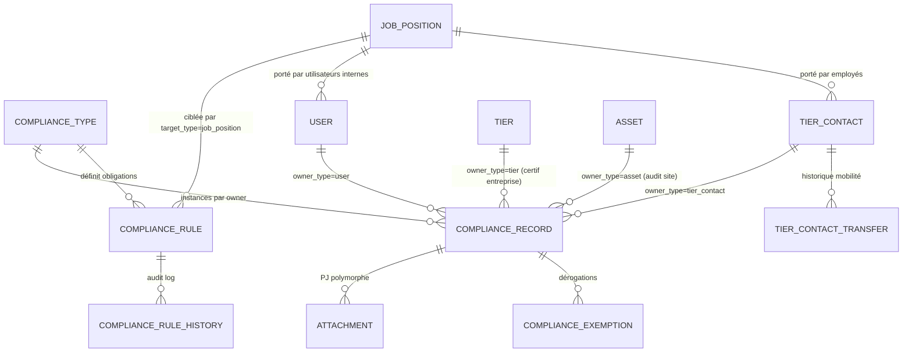
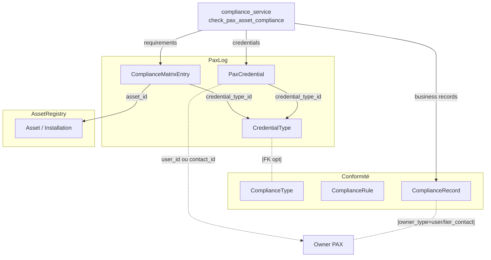
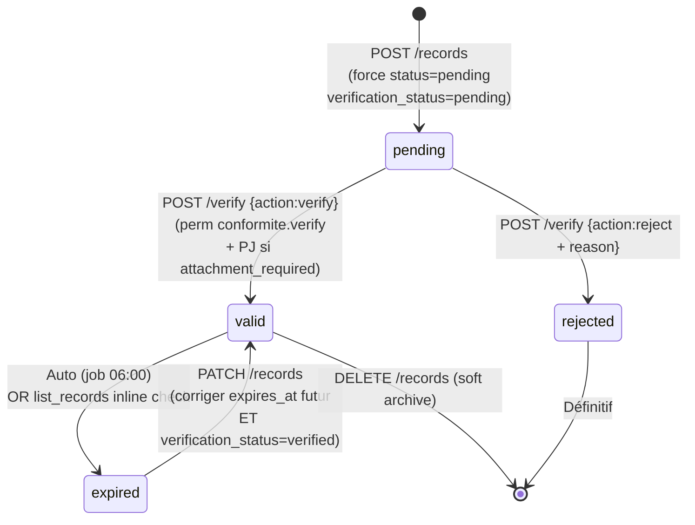
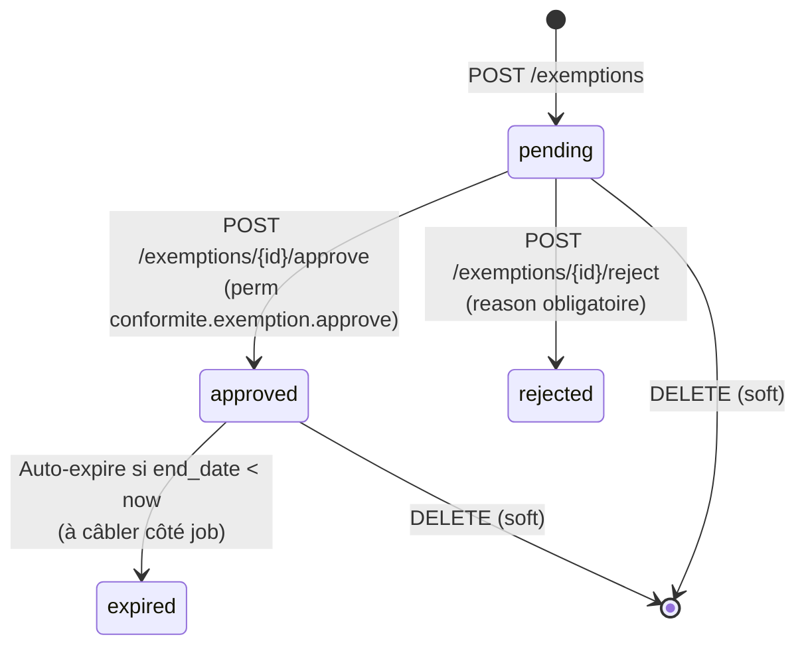
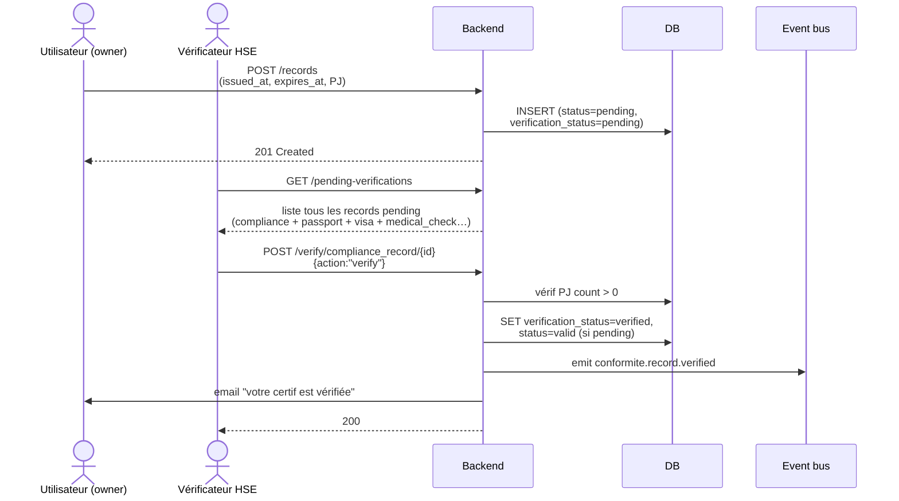
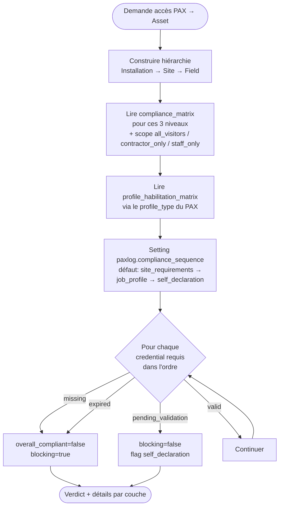

# Conformité

!!! info "Source"
    Manifeste : [`app/modules/conformite/__init__.py`](https://github.com/hmunyeku/OPSFLUX/blob/main/app/modules/conformite/__init__.py) — 26 permissions, 2 rôles
    Routes : [`app/api/routes/modules/conformite.py`](https://github.com/hmunyeku/OPSFLUX/blob/main/app/api/routes/modules/conformite.py) — 2350 lignes, ~35 endpoints
    Modèles : [`app/models/common.py:1434-1611`](https://github.com/hmunyeku/OPSFLUX/blob/main/app/models/common.py#L1434) — 7 tables
    Service décision : [`app/services/modules/compliance_service.py`](https://github.com/hmunyeku/OPSFLUX/blob/main/app/services/modules/compliance_service.py) — 788 lignes
    Job expiration : [`app/tasks/jobs/compliance_expiry.py`](https://github.com/hmunyeku/OPSFLUX/blob/main/app/tasks/jobs/compliance_expiry.py) — quotidien 06:00
    UI : [`apps/main/src/pages/conformite/`](https://github.com/hmunyeku/OPSFLUX/tree/main/apps/main/src/pages/conformite) — 9 onglets

## Résumé en 30 secondes

**Conformité** est le moteur de décision « ce PAX/tiers/asset est-il en règle ? »
de toute la plateforme. Il porte cinq objets :

1. **Types** (`compliance_types`) — le **catalogue** : H2S, GWO BST, visite
   médicale, DT-DICT, certif NDT… 6 catégories : *formation*, *certification*,
   *habilitation*, *audit*, *medical*, *epi*.
2. **Règles** (`compliance_rules`) — qui doit avoir quoi : *tout le monde*,
   *un type de tiers*, *un asset*, *un département*, *une fiche de poste*.
   Versionnées avec historique d'audit.
3. **Enregistrements** (`compliance_records`) — l'instance : « Jean Dupont a
   son H2S valable jusqu'au 2026-09-12 ». Lié à un *owner_type* (user, tier,
   tier_contact, asset).
4. **Exemptions** (`compliance_exemptions`) — dérogations temporaires sur un
   enregistrement non conforme (cert expirée le temps du renouvellement).
   Workflow d'approbation 3 états.
5. **Fiches de poste** (`job_positions`) — référentiel HSE : assigner
   « Mécanicien topside » à un employé impose automatiquement les habilitations
   du poste.

Le service [`compliance_service.check_owner_compliance()`](https://github.com/hmunyeku/OPSFLUX/blob/main/app/services/modules/compliance_service.py#L386)
calcule un **verdict** unique consommé par PaxLog (validation ADS), AVM
(check site d'arrivée) et les dashboards. PaxLog n'invente jamais sa propre
règle : il appelle Conformité.

Trois mécanismes différencient ce module d'un simple CRUD de certifs :

- **Vérification à 2 phases** : à la création, un enregistrement passe en
  `pending` + `verification_status='pending'`. Le statut `valid` n'est posé que
  par un utilisateur ayant `conformite.verify` (workflow 4-yeux). Une PJ est
  exigée par défaut (paramétrable par règle).
- **Auto-expiration** : un job APScheduler tourne tous les jours à 06:00 et
  passe en `expired` tous les enregistrements dont `expires_at < now()`. Émet
  les events `conformite.record.expired`, `expiring_soon` (avant échéance) et
  `past_grace` (au-delà de la période de grâce de la règle).
- **Matrice multi-couche pour les PAX** : pour un PAX qui demande accès à un
  asset, le verdict consulte **3 couches** dans cet ordre paramétrable :
  *site_requirements* (matrice Asset Registry × CredentialType) → *job_profile*
  (habilitations liées au profil) → *self_declaration*. Couvert dans
  [`check_pax_asset_compliance()`](https://github.com/hmunyeku/OPSFLUX/blob/main/app/services/modules/compliance_service.py#L178).

## Le problème métier

> *« On ne peut pas envoyer Pierre sur la plateforme demain : sa visite médicale
> a expiré il y a 3 jours. Combien d'autres comme lui ? Quelles certifs vont
> sauter dans 30 jours ? Le sous-traitant DRILL-CO a tous ses techniciens
> habilités H2S ? »*

Sur un site industriel multi-sous-traitants, le respect des exigences HSE,
réglementaires et contractuelles est **un sujet de production** :

- **Loi** : un PAX sans habilitation valide qui a un accident, c'est l'opérateur
  qui répond pénalement (article L4121-1 Code du travail FR).
- **Insurance** : assureurs imposent une matrice de credentials par type
  d'activité. Pas de matrice → pas de couverture.
- **Contrats** : les majors imposent à leurs sous-traitants une revue de
  conformité avant chaque mobilisation. Le sous-traitant doit prouver
  *en continu* (pas juste à la signature) que son personnel est en règle.

Sans outil :

- Tableurs Excel par site, désynchronisés. Vérification au cas par cas la veille
  d'une mob, panique le jour J.
- Doublons : la même certif scannée 5 fois par le même contractant pour 5 mobs
  différentes.
- **Auto-déclarations non vérifiées** : le sous-traitant déclare avoir un
  certif, l'opérateur n'a pas la PJ. En cas d'audit, c'est un
  *finding bloquant*.

Conformité résout ça en **un référentiel unique partagé** + **un workflow de
vérification** + **des règles automatiques par poste/site/asset** + **un
verdict canonique** que tous les autres modules consomment.

## Concepts clés

### `ComplianceType` — le catalogue
Le **type** est l'unité de vocabulaire HSE :
[`app/models/common.py:1434`](https://github.com/hmunyeku/OPSFLUX/blob/main/app/models/common.py#L1434).

| Champ | Sens |
|---|---|
| `category` | `formation`, `certification`, `habilitation`, `audit`, `medical`, `epi` |
| `code` | Code court unique : `H2S_BASIC`, `GWO_BST_2024` |
| `name` | Libellé clair : « Formation H2S de base » |
| `validity_days` | Durée de validité en jours. `null` = permanent |
| `is_mandatory` | Marqueur informatif (la vraie obligation passe par les règles) |
| `compliance_source` | `opsflux` (saisi à la main), `external` (synchronisé via connecteur), `both` |
| `external_provider` | `riseup`, `intranet_medical`… (utilisé si source = external) |
| `external_mapping` | JSON : config du connecteur — `{"certificate_id": "42"}` |

### `ComplianceRule` — qui doit avoir quoi
La **règle** lie un `ComplianceType` à un public cible :
[`app/models/common.py:1461`](https://github.com/hmunyeku/OPSFLUX/blob/main/app/models/common.py#L1461).

| `target_type` | `target_value` | Sens |
|---|---|---|
| `all` | `null` | Tous les owners de l'entité |
| `tier_type` | `client`, `subcontractor` | Tous les contacts d'un type de tiers |
| `asset` | `<asset_id>` | Tous les visiteurs d'un asset spécifique |
| `department` | `Operations` | Tout employé d'un département |
| `job_position` | `<jp_id_csv>` | Toute personne avec une de ces fiches de poste (liste CSV) |

Une règle est **versionnée** (`version`, `superseded_by`) avec un historique
([`ComplianceRuleHistory`](https://github.com/hmunyeku/OPSFLUX/blob/main/app/models/common.py#L1499)) :
chaque modification écrit un snapshot JSON de l'état précédent. Permet de
prouver à l'audit que telle règle s'appliquait bien à telle date.

Champs de **politique de la règle** (override du type) :

- `override_validity_days` — durcir/assouplir la durée (cf. règle locale plus
  stricte que le standard groupe)
- `grace_period_days` — combien de jours après expiration on accepte encore
  une PJ rétroactive
- `renewal_reminder_days` — combien de jours avant échéance on émet l'event
  `conformite.record.expiring_soon` (utilisé par le notification engine)
- `attachment_required` — si `true`, on **refuse** la vérification sans PJ
- `priority` — `high`/`normal`/`low` (UI uniquement, pas de logique)
- `applicability` — `permanent` (toujours vérifié) ou `contextual` (vérifié
  uniquement si `include_contextual=true`)
- `condition_json` — conditions structurées (`{"all": [{"field": "...", "op":
  "gte", "value": ...}]}`) — utilisé par PackLog pour les règles de cargo

### `ComplianceRecord` — l'instance
L'**enregistrement** matérialise « cet owner détient ce type » :
[`app/models/common.py:1518`](https://github.com/hmunyeku/OPSFLUX/blob/main/app/models/common.py#L1518).

```
owner_type   ∈ { user, tier, tier_contact, asset }
status       ∈ { pending, valid, expired, rejected }      ← état métier
verification_status ∈ { pending, verified, rejected }     ← état du contrôle 4-yeux
```

Deux statuts orthogonaux ! Un record peut être `status=valid` mais
`verification_status=pending` (en attente de double-check). Le verdict de
conformité ne le compte alors **pas** comme valide.

À la création, le backend **force** :

- `status = pending`
- `verification_status = pending`

Seul le workflow de vérification (cf. plus bas) promeut en `valid`.

### `ComplianceExemption` — la dérogation
Une **exemption** est une autorisation temporaire de considérer un record
non-conforme comme conforme : [`app/models/common.py:1544`](https://github.com/hmunyeku/OPSFLUX/blob/main/app/models/common.py#L1544).

```
status: pending → approved | rejected | expired
```

Avec `start_date`/`end_date` : pendant cette fenêtre et si `status=approved`,
le service de check considère le record comme valide. Approbation par un user
avec `conformite.exemption.approve`. Rejet exige une raison écrite.

### `JobPosition` — la fiche de poste
Référentiel des postes : [`app/models/common.py:1573`](https://github.com/hmunyeku/OPSFLUX/blob/main/app/models/common.py#L1573).

Champs minimaux : `code`, `name`, `description`, `department`. C'est le **lien**
entre un employé (User ou TierContact a `job_position_id`) et les règles
ciblées par `target_type='job_position'`.

Workflow : on assigne « Mécanicien topside » à un nouvel embauché → toutes les
règles ayant ce job_position dans leur `target_value` deviennent applicables
automatiquement. Pas besoin de copier les habilitations à la main.

### `TierContactTransfer` — le transfert d'employé
Quand un employé change de sous-traitant (DRILL-CO → SERVICE-CO), on logge
le transfert : [`app/models/common.py:1592`](https://github.com/hmunyeku/OPSFLUX/blob/main/app/models/common.py#L1592).
**Effet** : `tier_contact.tier_id` est updaté **et** un row d'historique est
écrit. Permet de tracer qui possédait le contrat de qui à quelle date — sujet
sensible en cas d'incident.

## Architecture data



### Le pont avec PaxLog



PaxLog porte **deux** notions parallèles :

- **`CredentialType` + `PaxCredential`** ([`app/models/paxlog.py:79-122`](https://github.com/hmunyeku/OPSFLUX/blob/main/app/models/paxlog.py#L79)) — le terrain « PAX » : credentials physiques liés au module.
- **`ComplianceMatrixEntry`** ([`app/models/paxlog.py:126`](https://github.com/hmunyeku/OPSFLUX/blob/main/app/models/paxlog.py#L126)) — la matrice « ce site/installation impose cette CredentialType à ces personnes ».

Conformité côté business porte les **records** transverses (audit qualité, ISO,
contrats fournisseur — pas seulement PAX). Le service [`check_owner_compliance`](https://github.com/hmunyeku/OPSFLUX/blob/main/app/services/modules/compliance_service.py#L386)
fait la **synthèse** des deux mondes pour répondre à : *« cet owner est-il en
règle pour rentrer sur cet asset ? »*.

## Workflows

### Workflow d'un enregistrement



**Points clés** :

- À la création, **impossible** d'arriver directement en `valid`. Le backend
  réécrit `status='pending'` même si l'API reçoit autre chose : ligne
  [`app/api/routes/modules/conformite.py:778`](https://github.com/hmunyeku/OPSFLUX/blob/main/app/api/routes/modules/conformite.py#L778).
- Pré-validation à la création : on **refuse** un record déjà expiré à la
  soumission, ou un record dont `issued_at + validity_days + grace_period <
  now` (cf. lignes 736-775).
- À la vérification, si la règle a `attachment_required=true` (défaut) et qu'il
  n'y a aucune PJ (ni dans `attachments` polymorphes ni dans le legacy
  `document_url`), HTTP 422 (lignes 2048-2055).
- Si on corrige `expires_at` vers une date future sur un record `expired`, le
  status revient à `valid` automatiquement (à condition que
  `verification_status=verified`) — lignes 829-834.

### Workflow d'une exemption



Une exemption ne peut être approuvée qu'une fois (les transitions
`approved→pending` ou `rejected→pending` sont bloquées par les guards lignes
1491-1499 et 1542-1550).

### Workflow de vérification (4-yeux)



L'endpoint `/verify` couvre **7 types** de records (lignes 1992-2000) :

| `record_type` | Modèle | Origine |
|---|---|---|
| `compliance_record` | `ComplianceRecord` | Conformité |
| `passport` | `UserPassport` | Core User |
| `visa` | `UserVisa` | Core User |
| `social_security` | `SocialSecurity` | Core User |
| `vaccine` | `UserVaccine` | Core User |
| `driving_license` | `DrivingLicense` | Core User |
| `medical_check` | `MedicalCheck` | Core (polymorphe) |

Le vérificateur HSE travaille donc à un seul endroit pour valider tous les
documents qui entrent dans le verdict de conformité d'une personne.

### Vérification PAX × Asset (le 3-couches)

Le check le plus complexe : pour décider si un PAX peut rentrer sur un asset.
Implémenté dans [`check_pax_asset_compliance()`](https://github.com/hmunyeku/OPSFLUX/blob/main/app/services/modules/compliance_service.py#L178)
(lignes 178-383).



**Pourquoi 3 couches** ?

1. **`site_requirements`** : la matrice imposée par le HSE central pour cet
   asset (cf. PaxLog `ComplianceMatrixEntry`). Bloquant.
2. **`job_profile`** : exigences liées au profil du PAX (mécanicien
   topside ≠ technicien bureau). Bloquant.
3. **`self_declaration`** : credentials que le PAX a déclaré mais qui
   restent en `pending_validation` côté HSE. Non bloquant → on flag le
   PAX comme « à surveiller ».

L'ordre est paramétrable par un Setting `paxlog.compliance_sequence`
au scope `entity` ([`get_compliance_verification_sequence`](https://github.com/hmunyeku/OPSFLUX/blob/main/app/services/modules/compliance_service.py#L102)).

## Step-by-step utilisateur

### Profil 1 — Responsable conformité

**Permissions** : tout ce qui commence par `conformite.*` + `conformite.verify`
+ `conformite.exemption.approve`.

#### Créer un type de conformité

1. Page **Conformité** → onglet **Référentiel**
2. Bouton **+ Type de conformité**
3. Renseigner :
   - Catégorie (drop-down 6 valeurs)
   - Code unique (ex. `GWO_BST_2024`)
   - Nom complet
   - Durée de validité en jours (laisser vide = permanent)
   - Source : `OpsFlux` (saisi manuellement) ou `External` (sync via connecteur)
4. Si **External** : choisir le provider et configurer le mapping JSON

#### Créer une règle

1. Onglet **Règles** (vue matrice)
2. Cliquer une cellule vide pour pré-remplir le type + la cible
3. Configurer :
   - **Cible** (`target_type`) : qui est concerné
   - **Override validité** : durcir la durée pour cette règle
   - **Grâce** : tolérance après expiration
   - **PJ requise** : décocher uniquement pour les déclarations de bonne foi
   - **Reminder** : nb de jours avant échéance pour notifier
   - **Applicabilité** : `permanent` (toujours vérifiée) ou `contextual`
     (vérifiée seulement quand le module appelant le demande, ex. règle qui
     s'active uniquement le jour J de la mob)
4. **Raison du changement** : obligatoire si on modifie une règle existante
   (alimente `ComplianceRuleHistory`)

#### Vérifier un enregistrement

1. Onglet **Vérifications** → liste de tous les pending tous types confondus
2. Cliquer une ligne → panel de détail
3. Vérifier la PJ ouverte côté droit
4. Décision :
   - **Vérifier** : promotion vers `verified` + (si compliance_record en
     `pending`) → `valid`
   - **Rejeter** : raison obligatoire, écrite dans `rejection_reason`
5. Email auto à l'owner ([`render_and_send_email` slug `record_verified`](https://github.com/hmunyeku/OPSFLUX/blob/main/app/api/routes/modules/conformite.py#L2142))

#### Approuver une exemption

1. Onglet **Exemptions** → filtrer status = `pending`
2. Lire le motif (`reason`), la fenêtre `start_date` → `end_date`
3. Bouton **Approuver** ou **Rejeter** (raison obligatoire si rejet)
4. Event émis : `conformite.exemption.approved`/`rejected` (consommé par
   notifications)

### Profil 2 — Opérateur conformité

**Permissions** : `conformite.record.*` (sauf delete), `conformite.check`,
`conformite.exemption.create`, **pas** `conformite.verify` ni `approve`.

#### Saisir un nouveau certificat

1. Page **Conformité** → onglet **Enregistrements** → **+ Nouveau**
2. Owner : choisir user / tier_contact / tier / asset
3. Type : sélectionner dans le catalogue
4. `issued_at` (date d'émission) — le backend pré-remplit `expires_at` si
   `validity_days` est défini sur le type
5. Émetteur, numéro de référence, notes
6. **Drag & drop la PJ** dans la zone d'attachment
7. Soumettre — le record entre en `pending`. Notification au responsable HSE
   (event `conformite.record.created` consommé par le worker)

#### Demander une exemption

1. Ouvrir le record concerné (en `expired` ou en `pending` qu'on n'arrive pas
   à faire vérifier à temps)
2. Bouton **Demander exemption**
3. Renseigner motif, dates, conditions éventuelles (« remplacé par escorte
   permanente jusqu'au 2026-05-15 »)
4. Soumettre — l'exemption part en `pending`. Le responsable la voit dans son
   onglet Exemptions.

### Profil 3 — Manager qui consulte

**Permissions** : `conformite.record.read`, `conformite.check`.

#### Vérifier la conformité d'un employé

1. Page **Tiers** ou **Utilisateurs** → ouvrir la fiche
2. Onglet **Conformité** (qui agrège tous les records du contact)
3. Le badge global est calculé via `GET /api/v1/conformite/check/{owner_type}/{id}`

#### Liste des certifs qui expirent

1. Page **Conformité** → onglet **Dashboard** → KPIs
2. « Expirations à venir (30j) » — clic pour drill-down
3. Onglet **Enregistrements** + filtre `status=valid` + tri par
   `expires_at` ASC

### Profil 4 — Sous-traitant externe

**Permissions** : `conformite.record.read`, `conformite.record.create` (limité
aux tier_contacts de ses propres tiers via `UserTierLink`).

Le code applique automatiquement un **scope filter**
([`_apply_external_record_scope`](https://github.com/hmunyeku/OPSFLUX/blob/main/app/api/routes/modules/conformite.py#L153)) :
un user `external` ne voit que les records des contacts de ses propres tiers,
plus ses records personnels (`owner_type=user`).

Ce profil **ne peut pas** :

- Vérifier ses propres records (le 4-yeux est garanti)
- Voir les records des contacts d'un autre sous-traitant
- Approuver des exemptions

## Permissions matrix

| Action | `RESPONSABLE_CONFORMITE` | `OPERATEUR_CONFORMITE` | Autres rôles ayant la perm |
|---|---|---|---|
| Lire types | ✅ | ✅ | tout owner ayant `conformite.type.read` |
| CRUD types | ✅ | ❌ | — |
| Lire règles | ✅ | ✅ | — |
| CRUD règles | ✅ | ❌ | — |
| Lire records | ✅ | ✅ | — |
| Créer record | ✅ | ✅ | sous-traitants externes (scope tiers) |
| Update record `verified` | ✅ (`verify`) | ❌ | bloqué par `check_verified_lock` |
| Vérifier (verify/reject) | ✅ | ❌ | — |
| Lire exemptions | ✅ | ✅ | — |
| Créer exemption | ✅ | ✅ | — |
| Approuver exemption | ✅ | ❌ | — |
| Lire fiches de poste | ✅ | ✅ | — |
| CRUD fiches de poste | ✅ | ❌ | — |
| Transferts (lecture) | ✅ | ✅ | — |
| Transférer un contact | ✅ | ❌ | — |
| Import / Export | ✅ | ❌ (lecture uniquement via export) | — |

Le `check_verified_lock` ([`app/api/deps.py`](https://github.com/hmunyeku/OPSFLUX/blob/main/app/api/deps.py)) bloque toute modification d'un record `verified` sauf si l'utilisateur a `conformite.verify`. Cela évite qu'un opérateur trafique discrètement une certif déjà validée.

## Endpoints HTTP

Préfixe `/api/v1/conformite`. Lecture en pagination standard
(`?page=&page_size=`).

### Dashboard
| Méthode | Endpoint | Sens |
|---|---|---|
| GET | `/dashboard-kpis` | KPIs agrégés : total/valid/expired/pending, taux conformité, expirations 30j, breakdown par catégorie |

### Référentiel — Types
| Méthode | Endpoint | Sens |
|---|---|---|
| GET | `/types` | Liste paginée (filtres `category`, `search`) |
| POST | `/types` | Créer |
| PATCH | `/types/{id}` | Modifier |
| DELETE | `/types/{id}` | Soft-archive |

### Règles
| Méthode | Endpoint | Sens |
|---|---|---|
| GET | `/rules?compliance_type_id=` | Liste (non paginée, max 200) |
| POST | `/rules` | Créer (écrit history v1 « created ») |
| PATCH | `/rules/{id}` | Modifier (écrit history snapshot précédent + `change_reason` requis) |
| DELETE | `/rules/{id}?force=` | Hard-delete si `version=1` ou `force=true`, sinon soft selon la delete policy |
| GET | `/rules/{id}/history` | Audit trail JSON |

### Enregistrements
| Méthode | Endpoint | Sens |
|---|---|---|
| GET | `/records` | Filtres `owner_type`, `owner_id`, `compliance_type_id`, `status`, `category`, `search`. Auto-expire inline les records dont `expires_at < now` |
| POST | `/records` | Créer (force `status=pending`, valide pré-soumission) |
| PATCH | `/records/{id}` | Modifier (bloqué sur verified sans perm verify) |
| DELETE | `/records/{id}` | Soft-archive |
| GET | `/expiring?days=30` | Records valides expirant dans N jours, émet `pax.credential.expiring` |
| GET | `/non-compliant` | Records expirés (overdue first) |
| GET | `/check/{owner_type}/{owner_id}?include_contextual=&asset_id=` | **Verdict canonique** consommé par PaxLog |
| GET | `/matrix?owner_type=&category=&expiring_within_days=30&limit=50&offset=0` | Vue matrice owner × type, cellule encodée `valid/expiring/expired/missing/pending/rejected` |

### Exemptions
| Méthode | Endpoint | Sens |
|---|---|---|
| GET | `/exemptions` | Liste paginée (filtres `status`, `compliance_type_id`, `search`) |
| POST | `/exemptions` | Créer (`status=pending`) |
| PATCH | `/exemptions/{id}` | Modifier |
| POST | `/exemptions/{id}/approve` | Approuver (perm `exemption.approve`) |
| POST | `/exemptions/{id}/reject` | Rejeter (raison obligatoire) |
| DELETE | `/exemptions/{id}` | Soft-archive |

### Fiches de poste
| Méthode | Endpoint | Sens |
|---|---|---|
| GET | `/job-positions` | Liste paginée |
| POST | `/job-positions` | Créer (génère un code via `generate_reference("JBP", ...)` si vide) |
| PATCH | `/job-positions/{id}` | Modifier |
| DELETE | `/job-positions/{id}` | Soft-archive |

### Transferts
| Méthode | Endpoint | Sens |
|---|---|---|
| GET | `/transfers` | Liste enrichie (noms tier source/cible) |
| POST | `/transfers` | Logger un transfert + déplacer le contact (`tier_contact.tier_id` muté) |

### Vérification
| Méthode | Endpoint | Sens |
|---|---|---|
| GET | `/pending-verifications` | Tous les records pending tous types (7 modèles : compliance_record, passport, visa, social_security, vaccine, driving_license, medical_check) |
| GET | `/verification-history` | Historique des verdicts (qui a vérifié quoi) |
| POST | `/verify/{record_type}/{record_id}` | `{action: "verify" \| "reject", rejection_reason?: str}` |

## Événements émis

Tous publiés sur le bus interne ([`app.core.events`](https://github.com/hmunyeku/OPSFLUX/blob/main/app/core/events.py)). Consommables par n'importe quel module via `@subscribe`.

| Event | Émis par | Payload clé | Consommateurs typiques |
|---|---|---|---|
| `conformite.rule.created` | `POST /rules` | `rule_id`, `entity_id`, `target_type`, `target_value`, `created_by` | Audit log, notif admin |
| `conformite.rule.updated` | `PATCH /rules/{id}` | idem + `updated_by` | Audit log |
| `conformite.record.expired` | Job `compliance_expiry` 06:00 + endpoints `list_records`, `list_expiring`, `list_non_compliant` | `record_id`, `compliance_type_id`, `owner_type`, `owner_id`, `entity_id`, `expired_at` | Notification engine, dashboards |
| `conformite.record.expiring_soon` | Job 06:00 (en respectant `renewal_reminder_days` de la règle) | `record_id`, `days_remaining`, `rule_id` | Email rappel à l'owner |
| `conformite.record.past_grace` | Job 06:00 (lecture `grace_period_days`) | `record_id`, `grace_days` | Escalade manager |
| `conformite.record.verified` | `POST /verify` action=verify | `record_type`, `record_id`, `verified_by` | Email confirmation à l'owner |
| `conformite.record.rejected` | `POST /verify` action=reject | + `reason` | Email rejet |
| `conformite.exemption.approved` | `POST /exemptions/{id}/approve` | `exemption_id`, `record_id`, `approved_by` | Notif owner + manager |
| `conformite.exemption.rejected` | `POST /exemptions/{id}/reject` | + `rejected_by` | Notif demandeur |
| `pax.credential.expiring` | `GET /expiring` (calc inline) | `record_id`, `days_remaining`, `type_name` | Worker PaxLog (rappel mob) |

## Pièges & FAQ

??? question "Pourquoi mon record reste en `pending` même après que j'ai uploadé la PJ ?"
    Le statut `pending` ne change qu'après **une action explicite** d'un user
    avec `conformite.verify`. Uploader la PJ ne déclenche **pas**
    automatiquement la vérification — c'est volontaire (4-yeux). Le record est
    visible dans `/pending-verifications` côté responsable HSE, qui doit
    cliquer **Vérifier**.

??? question "J'ai une certif valide et le verdict dit que je ne suis pas conforme"
    Trois pistes :

    1. **`verification_status` n'est pas `verified`** : un record peut avoir
       `status=valid` mais ne pas être vérifié — il est ignoré par le calcul.
       Vérifie dans le panel de détail le badge « Vérifié » (vert) vs
       « En attente » (orange).
    2. **Une règle plus stricte applique un override** : `override_validity_days`
       sur la règle peut faire expirer un record qui paraissait valide.
    3. **Pour un check PAX × Asset** : la matrice `compliance_matrix` est
       interrogée en plus. Un type requis par la matrice site mais absent du
       compte du PAX → non conforme. Voir l'onglet **Matrice** côté frontend.

??? question "Différence entre `compliance_records` et `pax_credentials` ?"
    - **`pax_credentials`** : couche bas-niveau du module **PaxLog**, attachée
      à un `CredentialType` PaxLog. Sert au scan badge / kiosque captain.
    - **`compliance_records`** : couche métier transverse, attachée à un
      `ComplianceType`. Sert aux audits, contrats, réglementaire.

    Les deux **peuvent** pointer vers les mêmes documents physiques, mais ce
    sont des objets distincts. Le `compliance_service.check_pax_asset_compliance`
    est ce qui les **réconcilie** quand on évalue un PAX vs un asset.

??? question "Comment supprimer une règle qui a déjà servi ?"
    Une règle avec `version > 1` ou un `change_reason` (= déjà publiée) ne peut
    pas être hard-delete sans `?force=true`. Sinon, soft-delete : la règle est
    marquée `active=false`, `effective_to=today`, et un snapshot est écrit
    dans `ComplianceRuleHistory`. Les records émis sous cette règle restent
    valides jusqu'à expiration. Pour un audit, on peut requêter `/rules/{id}/history`
    pour reconstituer la règle telle qu'elle s'appliquait à une date donnée.

??? question "Pourquoi mon exemption ne lève pas l'alerte sur le record ?"
    Trois conditions cumulatives ([`compliance_service.py` lignes 510-521](https://github.com/hmunyeku/OPSFLUX/blob/main/app/services/modules/compliance_service.py#L510)) :

    - `status = approved` (pas pending, pas rejected)
    - `active = true`
    - `start_date <= today <= end_date`

    Si l'exemption est en `pending`, elle ne couvre **rien** — c'est une
    demande, pas une autorisation. Vérifie l'onglet Exemptions, status colonne.

??? question "Le job d'expiration tourne-t-il vraiment tous les jours ?"
    Oui : APScheduler avec `cron 0 6 * * *`
    ([`app/tasks/scheduler.py`](https://github.com/hmunyeku/OPSFLUX/blob/main/app/tasks/scheduler.py)).
    En complément, **chaque appel à `GET /records`, `/expiring`, `/non-compliant`**
    auto-expire les records overdue de manière transactionnelle. Donc même si
    le job tombe en panne, les listes affichent l'état correct.

??? question "Les sous-traitants externes voient-ils mes règles internes ?"
    Non. Les règles sont entity-scopées. En revanche un sous-traitant **voit**
    les types et records de ses propres tiers. Le code applique
    `_apply_external_record_scope` à toutes les listes records/expiring/check.
    Il ne peut **rien** modifier sur une PAX d'un autre tiers (404
    `OWNER_NOT_FOUND` côté API si tentative).

??? question "Comment changer l'ordre des couches du check PAX × Asset ?"
    Setting `paxlog.compliance_sequence` au scope `entity`, value JSON
    `{"v": ["site_requirements", "self_declaration", "job_profile"]}`.
    Toute valeur invalide est ignorée et l'ordre par défaut est restauré
    ([`get_compliance_verification_sequence`](https://github.com/hmunyeku/OPSFLUX/blob/main/app/services/modules/compliance_service.py#L102)).
    Cette config est rarement modifiée : la séquence par défaut convient à 99%
    des cas oil & gas.

??? question "Que se passe-t-il si je supprime un type qui a des records ?"
    Soft-delete uniquement. Les records gardent leur `compliance_type_id`,
    le type est marqué `active=false`, il disparaît des dropdowns dans l'UI,
    mais les enregistrements existants restent consultables et leur lien
    fonctionne pour les requêtes historiques.

??? question "Cas pratique — comment HSE central peut imposer une obligation à tous les sites ?"
    1. Créer un `ComplianceType` (ex. « DUEK CSE 2026 ») avec `validity_days=365`.
    2. Créer une `ComplianceRule` `target_type='all'` `target_value=null`.
    3. Cocher `is_mandatory=true`, `attachment_required=true`,
       `renewal_reminder_days=60`, `grace_period_days=15`.
    4. Le job 06:00 émettra automatiquement les rappels et grace warnings sans
       autre intervention.

## Liens

- **Spec développeur** (auth requise) : [Conformité — modules-spec](../../developer/modules-spec/CONFORMITE.md)
- **Cross-module** :
    - [PaxLog](paxlog.md) — consommateur principal du verdict (validation ADS)
    - [Tiers](tiers.md) — owner_type=tier_contact pour les employés sous-traitants
    - [Asset Registry](asset-registry.md) — la matrice `compliance_matrix` par installation
- **Code source** :
    - [Manifest](https://github.com/hmunyeku/OPSFLUX/blob/main/app/modules/conformite/__init__.py)
    - [Routes](https://github.com/hmunyeku/OPSFLUX/blob/main/app/api/routes/modules/conformite.py)
    - [Modèles](https://github.com/hmunyeku/OPSFLUX/blob/main/app/models/common.py#L1434)
    - [Service décision](https://github.com/hmunyeku/OPSFLUX/blob/main/app/services/modules/compliance_service.py)
    - [Job expiration](https://github.com/hmunyeku/OPSFLUX/blob/main/app/tasks/jobs/compliance_expiry.py)
    - [UI page](https://github.com/hmunyeku/OPSFLUX/blob/main/apps/main/src/pages/conformite/ConformitePage.tsx)
