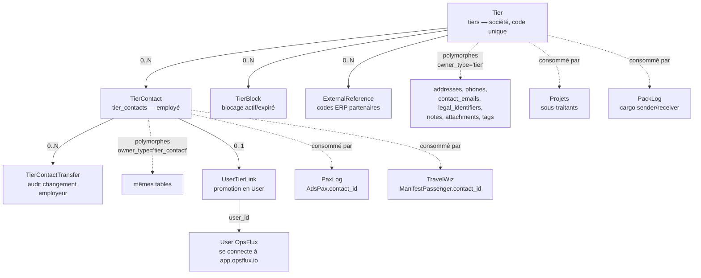
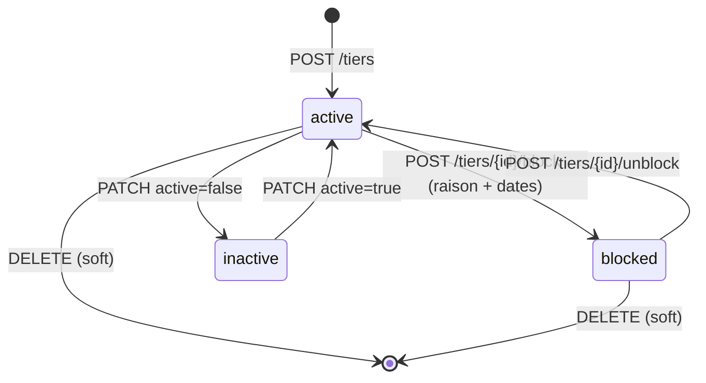
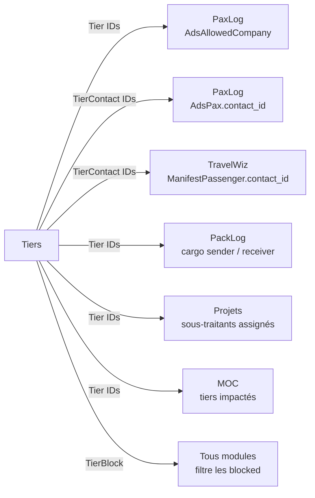

# Tiers

!!! info "Source de cette page"

    Chaque affirmation est sourcée du code (chemin de fichier indiqué).
    Le module Tiers est défini dans `app/modules/tiers/__init__.py`,
    les modèles dans `app/models/common.py` (factor commun avec d'autres
    modules), les routes dans `app/api/routes/modules/tiers.py`.

## Résumé en 30 secondes

Tiers gère **les sociétés tierces** (clients, fournisseurs,
sous-traitants, partenaires) et **leurs contacts internes**. C'est la
base de référence pour tous les modules qui consomment des entités
externes :

- **PaxLog** — un PAX peut être un `User` interne **ou** un
  `TierContact` externe (entrepreneur, visiteur)
- **TravelWiz** — passager d'un manifeste = `User` ou `TierContact`,
  société émettrice cargo = `Tier`
- **Projets** — sous-traitants assignés à un projet = `Tier`
- **Conformité** — habilitations contrôlées sur un PAX peuvent
  remonter au `Tier` employeur (ban collectif)

Trois piliers :

- **Tier** (la société) — code unique, infos légales (RCCM, NIU, TVA),
  industrie, devise, fuseau, blocage temporaire
- **TierContact** (la personne) — civilité, nom, fonction, contact
  info via composants polymorphes (phones, emails, addresses, notes)
- **Portail externe** — un TierContact peut être **promu User** pour
  accéder à `app.opsflux.io`, OU recevoir un lien magique signé pour
  `ext.opsflux.io` sans création de compte

Stack : 6 modèles SQLAlchemy ([`app/models/common.py`](https://github.com/hmunyeku/OPSFLUX/blob/main/app/models/common.py)),
18 endpoints API ([`app/api/routes/modules/tiers.py`](https://github.com/hmunyeku/OPSFLUX/blob/main/app/api/routes/modules/tiers.py)),
8 permissions, intégrations cross-modules.

---

## 1. À quoi ça sert

**Problème métier** : un opérateur industriel travaille avec des
**dizaines à centaines de sociétés tierces** — chaque chantier mobilise
des sous-traitants spécialisés (échafaudage, électricité, IRATA),
chaque flux logistique implique fournisseurs et transporteurs, chaque
projet a ses partenaires. Sans référentiel central :

- Saisie redondante de la même société dans chaque module métier
- Pas de cohérence sur le "code" (un sous-traitant a 3 noms différents
  selon les chantiers)
- Pas de traçabilité des contacts (qui appeler chez ce sous-traitant ?)
- Pas de moyen de **bloquer** une société temporairement (litige
  paiement, manquement HSE) → des ADS partent malgré tout
- Pas d'intégration ERP externe possible (pas d'identifiant légal
  exposé)

OpsFlux Tiers crée le référentiel unique. Tout autre module pointe ici
quand il a besoin de « société externe » ou « contact externe ».

**Pour qui** :

| Rôle | Permissions clés ([`app/modules/tiers/__init__.py`](https://github.com/hmunyeku/OPSFLUX/blob/main/app/modules/tiers/__init__.py)) |
|---|---|
| **Gestionnaire référentiel** (RH, achats, support) | `tier.read`, `tier.create`, `tier.update`, `tier.contact.manage` |
| **Admin Tiers** (TIER_ADMIN) | toutes les perms `tier.*` + `tier.delete` + `tier.portal.manage` |
| **Importateur** (one-shot lors de la mise en place) | `tier.import` (CSV/XLSX bulk), `tier.export` |

Tous les autres modules ont `tier.read` granted via leur propre rôle
quand pertinent.

---

## 2. Concepts clés

| Terme | Modèle / Table | Description |
|---|---|---|
| **Tier** | `Tier` / `tiers` | La société. **`code` unique** par instance (ex. `ECHAF-001`, `IRATA-FR-MARSEILLE`). Type : `client`, `supplier`, `subcontractor`, `partner`. |
| **TierContact** | `TierContact` / `tier_contacts` | La personne employée par un tier. Civilité, nom, fonction. Phones/emails/addresses gérés via composants polymorphes (pas de champ direct). |
| **TierBlock** | `TierBlock` / `tier_blocks` | Blocage actif/expiré d'un tier (litige, manquement HSE, conformité). Dates start/end + raison. Empêche les ADS / cargo / contrats. |
| **TierContactTransfer** | `TierContactTransfer` / `tier_contact_transfers` | Audit du déplacement d'un contact d'un tier à un autre (changement d'employeur). |
| **ExternalReference** | `ExternalReference` / `external_references` | Identifiants externes (ERP partenaire, code fournisseur SAP, etc.). Permet l'intégration sans changer le `code` interne. |
| **UserTierLink** | `UserTierLink` / `user_tier_links` | Lien `user_id ↔ tier_id` quand un TierContact est promu User OpsFlux. Permet à un externe de se connecter à `app.opsflux.io` avec son périmètre limité. |

### Composants polymorphes utilisés par Tier et TierContact

OpsFlux n'a **pas** de colonnes phone/email/address répétées sur
chaque modèle. Tier et TierContact utilisent les **tables polymorphes
core** ([`app/models/common.py`](https://github.com/hmunyeku/OPSFLUX/blob/main/app/models/common.py)) :

| Table polymorphe | Owner type | Description |
|---|---|---|
| `addresses` | `tier`, `tier_contact` | Adresses postales (legal, postal, livraison) |
| `phones` | `tier`, `tier_contact` | Téléphones (work, mobile, home, fax) |
| `contact_emails` | `tier`, `tier_contact` | Adresses email (work, personal, other) |
| `legal_identifiers` | `tier`, `tier_contact` | Identifiants légaux (RCCM, NIU, TVA, SIREN, passport, NIN, etc.) |
| `notes` | `tier`, `tier_contact` | Notes internes versionnées |
| `attachments` | `tier`, `tier_contact` | Fichiers attachés (contrat, KBIS, photo identité) |
| `tags` | `tier`, `tier_contact` | Tags libres pour catégorisation |

**Avantage** : un module a les mêmes APIs pour gérer phones/addresses
sur n'importe quel objet (User, Tier, TierContact, …). Pas de
duplication de code, pas de champ "phone1/phone2/phone3".

### Champs Tier importants

[`app/models/common.py:637-696`](https://github.com/hmunyeku/OPSFLUX/blob/main/app/models/common.py#L637) :

```
code (unique), name, alias, trade_name, logo_url
type (client | supplier | subcontractor | partner)
website
legal_form (SARL, SA, SAS, GIE, ...)
registration_number, tax_id, vat_number  -- aussi en legal_identifiers
capital, currency (XAF par défaut), fiscal_year_start
industry, founded_date, payment_terms, incoterm + incoterm_city
description, country, language, timezone
is_blocked (bool), scope (local | international)
metadata_ (JSONB libre)
social_networks (JSONB), opening_hours (JSONB)
```

> **Note legacy** : les colonnes directes `phone`, `email`, `fax`,
> `address_*` sur `tiers` sont conservées pour rétro-compat mais le
> code moderne **doit utiliser les tables polymorphes**. À terme ces
> colonnes seront retirées.

### Champs TierContact importants

[`app/models/common.py:698+`](https://github.com/hmunyeku/OPSFLUX/blob/main/app/models/common.py#L698) :

```
tier_id (FK), civility, first_name, last_name, title (poste)
-- AUCUN champ phone/email direct, tout via polymorphic
```

---

## 3. Architecture data



**Lecture rapide** :

- Une **Tier** contient 0..N TierContact, 0..N blocages, 0..N
  références externes
- Le **TierContact** est polymorphe XOR avec User : un PAX (paxlog) est
  user OU contact, jamais les deux
- Quand un externe doit accéder à `app.opsflux.io`, on **promeut** le
  TierContact en User via `POST /tiers/{tid}/contacts/{cid}/promote-user`
  ([`tiers.py:479`](https://github.com/hmunyeku/OPSFLUX/blob/main/app/api/routes/modules/tiers.py#L479))
- L'`UserTierLink` matérialise le lien — l'utilisateur garde sa
  société d'origine, hérite de ses permissions limitées

---

## 4. Workflow Tier — états (pas de FSM strict)

Tier n'a **pas de FSM** au sens PaxLog/MOC. Les "états" sont
combinatoires :

| Combinaison | Effet |
|---|---|
| `active=true, is_blocked=false` | Normalement utilisable partout |
| `active=true, is_blocked=true` | Visible mais **rejeté** par les modules consommateurs (ADS, cargo, manifestes) |
| `active=false` | Soft-désactivé — masqué des pickers, pas de nouvelle relation possible |
| `deleted_at IS NOT NULL` | Soft-deleted (mixin SoftDelete). Invisible. Restaurable. |

### Cycle de vie typique



### Endpoints blocage

| Action | Endpoint | Source |
|---|---|---|
| Lister blocages d'un tier | `GET /api/v1/tiers/{id}/blocks` | [560](https://github.com/hmunyeku/OPSFLUX/blob/main/app/api/routes/modules/tiers.py#L560) |
| Bloquer | `POST /api/v1/tiers/{id}/block` | [586](https://github.com/hmunyeku/OPSFLUX/blob/main/app/api/routes/modules/tiers.py#L586) |
| Débloquer | `POST /api/v1/tiers/{id}/unblock` | [626](https://github.com/hmunyeku/OPSFLUX/blob/main/app/api/routes/modules/tiers.py#L626) |

Un blocage actif est détecté par les modules consommateurs (PaxLog
`_check_pax_ban_status` consulte `tier_blocks` pour déterminer si le
tier d'un AdsPax externe est bloqué).

---

## 5. Step-by-step utilisateur

### 5.1 — Gestionnaire référentiel : créer une société + ses contacts

1. **`/tiers`** ([`apps/main/src/pages/tiers/TiersPage.tsx`](https://github.com/hmunyeku/OPSFLUX/blob/main/apps/main/src/pages/tiers/TiersPage.tsx))
2. **`+ Nouveau tier`** → panneau de création
3. Renseigner :
   - **Code** unique (convention conseillée : `<type>-<nom>` ex.
     `SUB-IRATA-FR`)
   - **Nom légal** + alias / trade name
   - **Type** : `client` / `supplier` / `subcontractor` / `partner`
   - **Pays**, **devise** (par défaut XAF), **timezone**, **langue**
4. Ajouter onglets latéraux :
   - **Adresses** (legal, postal, livraison) via `<AddressManager>`
   - **Téléphones** (work, mobile, fax) via `<PhoneManager>`
   - **Emails** via `<EmailManager>`
   - **Identifiants légaux** (RCCM, NIU, TVA, …) via composant dédié
   - **Notes**, **fichiers**, **tags** — composants polymorphes core
5. **Onglet Contacts** ([`TierContacts.tsx`](https://github.com/hmunyeku/OPSFLUX/blob/main/apps/main/src/pages/tiers/TierContacts.tsx)) :
   créer les TierContact (employés). Chaque contact reçoit ses
   propres polymorphic phones/emails/addresses.

### 5.2 — Bloquer un tier (litige, manquement HSE)

1. Ouvrir le tier → bouton **`Bloquer`**
2. Modale : **raison** obligatoire, **date début** (default = today),
   **date fin** (optionnelle — null = blocage permanent jusqu'à
   `unblock` explicite)
3. Le blocage est immédiatement effectif :
   - Les modules consommateurs vérifient via `_check_tier_block_status`
   - Tentatives de soumettre une ADS / un cargo avec ce tier
     retournent **400 + raison du block**
4. Pour débloquer : bouton **`Débloquer`** sur la fiche du tier
   (permission `tier.update`). Réactive immédiatement.

### 5.3 — Promouvoir un TierContact en User OpsFlux

Cas d'usage : un sous-traitant doit accéder à `app.opsflux.io` pour
soumettre ses propres ADS, voir ses missions, etc.

1. Onglet **Contacts** du tier → ouvrir le contact
2. Bouton **`Promouvoir en utilisateur`**
3. Le système :
   - Crée un `User` avec email du contact (récupéré depuis
     `contact_emails` polymorphe)
   - Génère un mot de passe initial + envoie email d'invitation
   - Crée un `UserTierLink(user_id, tier_id)`
   - Le user hérite des permissions du rôle assigné (typiquement
     `EXT_REQUESTER` avec `paxlog.ads.create`, etc.)
4. Endpoint : `POST /api/v1/tiers/{tid}/contacts/{cid}/promote-user`
   ([`tiers.py:479`](https://github.com/hmunyeku/OPSFLUX/blob/main/app/api/routes/modules/tiers.py#L479))
5. Permission requise : `tier.portal.manage`

### 5.4 — Transférer un contact (changement d'employeur)

Quand un employé change de société :

1. Sur la fiche contact → bouton **`Transférer vers autre société`**
2. Picker du nouveau tier
3. Le système :
   - Crée un `TierContactTransfer(contact_id, from_tier, to_tier, transfer_date, reason)`
   - Met à jour `contact.tier_id` vers le nouveau tier
   - Préserve toutes les relations existantes (ADS passées, manifestes,
     phones polymorphes restent attachés au contact)
4. Audit complet préservé via la table `tier_contact_transfers`

### 5.5 — Importer en bulk (mise en place initiale)

Endpoints `tier.import` / `tier.export` permettent l'import CSV/XLSX
en lot — utile pour la mise en place initiale d'OpsFlux quand on a
plusieurs centaines de sociétés à charger depuis un fichier Excel
existant. Format documenté dans Settings → Import/Export.

---

## 6. Permissions matrix

8 permissions définies dans le `MANIFEST`
([`app/modules/tiers/__init__.py:9-17`](https://github.com/hmunyeku/OPSFLUX/blob/main/app/modules/tiers/__init__.py#L9)) :

| Permission | Effet |
|---|---|
| `tier.read` | GET liste + détail tiers + contacts |
| `tier.create` | POST nouveau tier |
| `tier.update` | PATCH tier + block/unblock |
| `tier.delete` | DELETE soft tier |
| `tier.contact.manage` | CRUD complet sur TierContact |
| `tier.portal.manage` | Promotion contact → user, gestion accès portail externe |
| `tier.import` | Import CSV/XLSX bulk |
| `tier.export` | Export CSV/XLSX |

### Rôle système

Le seul rôle système déclaré est **`TIER_ADMIN`**. Pour les profils
opérationnels (achats, support, RH), composer les permissions par rôle
custom selon le périmètre :

```
Lecteur référentiel     : tier.read
Gestionnaire achats     : tier.read + tier.create + tier.update + tier.contact.manage
Admin tiers complet     : TIER_ADMIN (toutes)
```

---

## 7. Endpoints (résumé)

18 endpoints dans
[`app/api/routes/modules/tiers.py`](https://github.com/hmunyeku/OPSFLUX/blob/main/app/api/routes/modules/tiers.py).

| Action | Endpoint | Source |
|---|---|---|
| Lister tiers | `GET /api/v1/tiers` | (avant 205) |
| Créer | `POST /api/v1/tiers` | (avant 205) |
| Détail | `GET /api/v1/tiers/{id}` | [205](https://github.com/hmunyeku/OPSFLUX/blob/main/app/api/routes/modules/tiers.py#L205) |
| Update | `PATCH /api/v1/tiers/{id}` | [223](https://github.com/hmunyeku/OPSFLUX/blob/main/app/api/routes/modules/tiers.py#L223) |
| Soft delete | `DELETE /api/v1/tiers/{id}` | [239](https://github.com/hmunyeku/OPSFLUX/blob/main/app/api/routes/modules/tiers.py#L239) |
| **Tous contacts (cross-tier)** | `GET /api/v1/tiers/contacts/all` | [256](https://github.com/hmunyeku/OPSFLUX/blob/main/app/api/routes/modules/tiers.py#L256) |
| Détail contact (cross-tier) | `GET /api/v1/tiers/contacts/all/{cid}` | [298](https://github.com/hmunyeku/OPSFLUX/blob/main/app/api/routes/modules/tiers.py#L298) |
| Contacts d'un tier | `GET /api/v1/tiers/{id}/contacts` | [345](https://github.com/hmunyeku/OPSFLUX/blob/main/app/api/routes/modules/tiers.py#L345) |
| Compter contacts | `GET /api/v1/tiers/{id}/contacts/count` | [362](https://github.com/hmunyeku/OPSFLUX/blob/main/app/api/routes/modules/tiers.py#L362) |
| Détail contact | `GET /api/v1/tiers/{id}/contacts/{cid}` | [377](https://github.com/hmunyeku/OPSFLUX/blob/main/app/api/routes/modules/tiers.py#L377) |
| Créer contact | `POST /api/v1/tiers/{id}/contacts` | [389](https://github.com/hmunyeku/OPSFLUX/blob/main/app/api/routes/modules/tiers.py#L389) |
| Update contact | `PATCH /api/v1/tiers/{id}/contacts/{cid}` | [444](https://github.com/hmunyeku/OPSFLUX/blob/main/app/api/routes/modules/tiers.py#L444) |
| Supprimer contact | `DELETE /api/v1/tiers/{id}/contacts/{cid}` | [464](https://github.com/hmunyeku/OPSFLUX/blob/main/app/api/routes/modules/tiers.py#L464) |
| **Promouvoir en user** | `POST /api/v1/tiers/{id}/contacts/{cid}/promote-user` | [479](https://github.com/hmunyeku/OPSFLUX/blob/main/app/api/routes/modules/tiers.py#L479) |
| Lister blocages | `GET /api/v1/tiers/{id}/blocks` | [560](https://github.com/hmunyeku/OPSFLUX/blob/main/app/api/routes/modules/tiers.py#L560) |
| Bloquer | `POST /api/v1/tiers/{id}/block` | [586](https://github.com/hmunyeku/OPSFLUX/blob/main/app/api/routes/modules/tiers.py#L586) |
| Débloquer | `POST /api/v1/tiers/{id}/unblock` | [626](https://github.com/hmunyeku/OPSFLUX/blob/main/app/api/routes/modules/tiers.py#L626) |
| Lister refs externes | `GET /api/v1/tiers/{id}/external-refs` | [680](https://github.com/hmunyeku/OPSFLUX/blob/main/app/api/routes/modules/tiers.py#L680) |
| Créer ref externe | `POST /api/v1/tiers/{id}/external-refs` | [698](https://github.com/hmunyeku/OPSFLUX/blob/main/app/api/routes/modules/tiers.py#L698) |
| Supprimer ref externe | `DELETE /api/v1/tiers/{id}/external-refs/{rid}` | [725](https://github.com/hmunyeku/OPSFLUX/blob/main/app/api/routes/modules/tiers.py#L725) |

---

## 8. Intégrations cross-modules

Tous les modules métier consomment Tiers :



**Effet du `TierBlock`** :

- PaxLog : ADS soumise avec un PAX externe d'un tier blocked → **400
  `TIER_BLOCKED`** dès le compliance check.
- PackLog : cargo avec sender/receiver blocked → idem.
- Projets : impossible d'assigner un sous-traitant blocked.

Un block expiré (date_end < today) est automatiquement ignoré sans
intervention.

---

## 9. Pièges & FAQ

### Le `code` du tier est-il modifiable ?

**Non**, le code est `unique` au niveau base et utilisé comme clé
business dans tous les modules (références ADS, manifestes, etc.).
Pour "renommer" un tier sans changer son code, modifier `name`/`alias`
qui sont libres.

Si vraiment besoin de changer le code : créer un nouveau tier + migrer
les FK manuellement + soft-delete l'ancien. Aucun endpoint API ne le
fait automatiquement (volontaire).

### Pourquoi les phones/emails ne sont pas dans `tier_contacts` directement ?

Architecturalement, OpsFlux utilise des **composants polymorphes** —
les tables `phones`, `contact_emails`, `addresses` portent un
`(owner_type, owner_id)` qui peut pointer vers n'importe quel modèle.
Avantages :

- Mêmes APIs/UI pour gérer phones partout (User, Tier, TierContact, …)
- Aucune duplication de code
- Multiple phones par contact sans souci (work, mobile, home, fax)
- Auto-discoverable : ajouter un nouveau type d'owner = 0 migration

L'UI cache cette complexité — le composant `<PhoneManager>` reçoit
juste `(ownerType, ownerId)` et fait son CRUD.

### Un TierContact promu en User peut-il revenir TierContact uniquement ?

Pas directement. Le `User` créé existe, et les ADS/sessions associées
ne peuvent pas être ré-attribuées au TierContact. Ce qu'on peut faire :
désactiver le User (`active=false`), conserver le TierContact, le
TierContact reste utilisable pour ses fonctions externes.

### Comment gérer un sous-traitant qui change de raison sociale ?

Deux cas :

1. **Même entité juridique, juste rebranding** → modifier `name` et
   `alias`/`trade_name`, garder code et historique.
2. **Nouvelle entité juridique** (rachat, fusion, redressement) →
   créer un **nouveau tier** + transférer les contacts via
   `TierContactTransfer`. Les anciennes ADS/manifestes pointent
   toujours sur l'ancien tier (intégrité historique).

### Le tableau `Tous contacts` est lent

L'endpoint `/contacts/all` paginate par défaut. Vérifier qu'on
appelle bien avec `?page=1&limit=50`. Index dispo :
`idx_tier_contacts_tier`. Si filtre custom hors index → `EXPLAIN`
pour vérifier.

### Identifiants légaux (RCCM, TVA) — dans `tiers` ou `legal_identifiers` ?

Les colonnes `registration_number`, `tax_id`, `vat_number` sur `tiers`
sont **legacy** (créées avant la table polymorphe `legal_identifiers`).
Le code moderne utilise `legal_identifiers` qui supporte plusieurs
identifiants par tier (RCCM Cameroun, NIU, SIREN France si filiale,
etc.).

À terme les colonnes legacy seront migrées vers
`legal_identifiers` puis supprimées.

### ExternalReference vs `code` du tier

- **`code`** : identifiant interne OpsFlux, unique, utilisé dans toutes
  les références (URLs, références ADS, etc.)
- **`ExternalReference`** : identifiant **chez un partenaire externe**
  (code SAP du fournisseur, ID dans l'ERP du client). Permet de mapper
  les flux d'intégration sans changer l'identifiant interne.

Exemple : un même fournisseur peut avoir `code=SUB-IRATA-FR` chez nous,
`ExternalReference(provider='SAP', value='V12345')` côté SAP du client,
et `ExternalReference(provider='ARIBA', value='8765432')` côté Ariba.
Sync ERP → on lookup par ExternalReference.

---

## 10. Liens

### Code

- [`app/modules/tiers/__init__.py`](https://github.com/hmunyeku/OPSFLUX/blob/main/app/modules/tiers/__init__.py) — manifest (8 perms, 1 rôle)
- [`app/api/routes/modules/tiers.py`](https://github.com/hmunyeku/OPSFLUX/blob/main/app/api/routes/modules/tiers.py) — 18 endpoints (~955 lignes)
- [`app/models/common.py:637-816`](https://github.com/hmunyeku/OPSFLUX/blob/main/app/models/common.py#L637) — Tier, TierContact, TierBlock
- [`app/models/common.py:1592`](https://github.com/hmunyeku/OPSFLUX/blob/main/app/models/common.py#L1592) — TierContactTransfer
- [`app/models/common.py:2286`](https://github.com/hmunyeku/OPSFLUX/blob/main/app/models/common.py#L2286) — ExternalReference
- [`app/models/common.py:468`](https://github.com/hmunyeku/OPSFLUX/blob/main/app/models/common.py#L468) — UserTierLink
- [`apps/main/src/pages/tiers/`](https://github.com/hmunyeku/OPSFLUX/blob/main/apps/main/src/pages/tiers) — UI

### Voir aussi

- [PaxLog](paxlog.md) — consomme TierContact pour les PAX externes
- [TravelWiz](travelwiz.md) — consomme TierContact pour les passagers externes
- Spec architecturale : [Spec Tiers](../../developer/modules-spec/TIERS.md) *(auth requise)*
