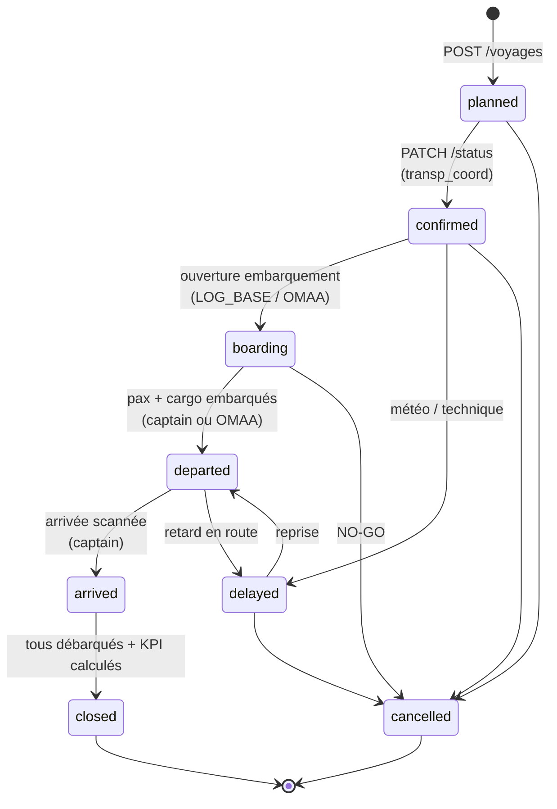
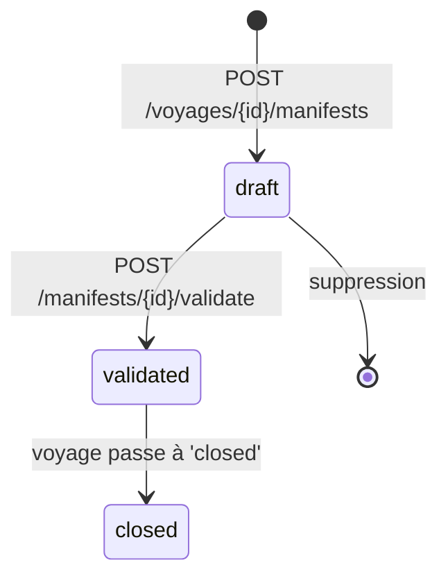
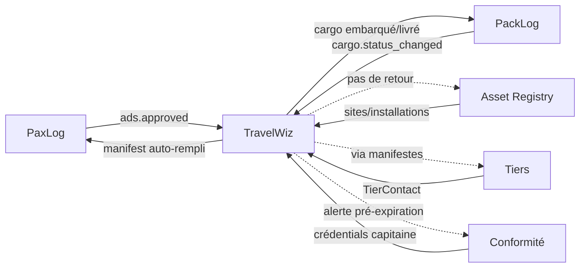

# TravelWiz

!!! info "Source de cette page"

    Chaque affirmation est sourcée du code (chemin de fichier indiqué).
    Les workflows reflètent l'état post-fixes de l'audit `2026-04-29`
    (commit [`11a978c4`](https://github.com/hmunyeku/OPSFLUX/commit/11a978c4)).

## Résumé en 30 secondes

TravelWiz orchestre la **logistique transport** pour amener les
personnes et le matériel vers les sites opérationnels :

- **Vecteurs** — flotte (hélicoptères, navires, surfers, bus, vols
  commerciaux, camions, barges) avec capacités passagers/poids/volume,
  zones de pont (deck plan dessiné dans Draw.io), certifications
- **Rotations** — schémas répétitifs (ex. hélicoptère lundi/mercredi/
  vendredi sur le triangle Douala → Bonny → Erha)
- **Voyages** — instances concrètes d'un transport, statut FSM
  (planned → confirmed → boarding → departed → arrived → closed)
- **Manifestes** — listes passagers (`pax`) et cargo (`cargo`) par
  voyage, validés avant départ
- **Pickup rounds** — tournées de ramassage terrestre (bus/véhicules)
  qui agrègent des passagers sur plusieurs points avant l'embarquement
- **Captain portal** — UI dédiée commandant : embarquement scanné,
  log de bord (météo, technique, carburant, incidents), tracking
  position, déclaration d'urgence

C'est l'aval logistique de **PaxLog** — quand une ADS PaxLog est
approuvée, ses passagers sont automatiquement ajoutés au manifeste du
voyage couvrant les bonnes dates.

Stack : 18 modèles SQLAlchemy ([`app/models/travelwiz.py`](https://github.com/hmunyeku/OPSFLUX/blob/main/app/models/travelwiz.py)),
107 endpoints API ([`app/api/routes/modules/travelwiz.py`](https://github.com/hmunyeku/OPSFLUX/blob/main/app/api/routes/modules/travelwiz.py)),
9 onglets frontend, 4 rôles dédiés, intégrations PaxLog / PackLog /
Asset Registry / Conformité.

---

## 1. À quoi ça sert

**Problème métier** : un opérateur doit déplacer 30 personnes et
2 tonnes de matériel sur un FPSO offshore demain matin. Tâches à
orchestrer :

- Identifier le bon **vecteur** (hélicoptère 12 pax × 3 rotations ?
  ou navire 50 pax + cargo ?), vérifier qu'il a ses certifications
  à jour, sa capacité disponible, qu'il n'est pas en panne
- Construire le **manifeste passagers** — qui embarque, où va-t-on
  les déposer (multi-stops possibles), qui est en standby
- Construire le **manifeste cargo** — quoi, combien, où dans la cale
  (deck plan)
- **Récupérer** les passagers depuis leur point de départ (pickup
  round bus + minivans) et les amener à l'héliport/quai
- **Vérifier la météo** avant départ — décision GO / NO-GO du commandant
- **Embarquer** physiquement (scan QR de chaque passager + colis,
  pesée si requise)
- **Suivre** la position du véhicule en route (AIS pour navires, GPS
  pour camions)
- **Logger** les événements de bord (météo, incident, conso fioul)
- **Clôturer** à l'arrivée + débarquement
- **Émettre** les PDF officiels : manifeste pax, manifeste cargo

Sans TravelWiz : Excel + WhatsApp + appels téléphoniques + papier +
zéro audit. Avec TravelWiz : un workflow unifié, traçable, multi-rôles
(coord transport, capitaine, OMAA agent terrain).

**Pour qui** :

| Rôle ([`app/modules/travelwiz/__init__.py:46-105`](https://github.com/hmunyeku/OPSFLUX/blob/main/app/modules/travelwiz/__init__.py#L46)) | Description |
|---|---|
| **LOG_BASE** (Logistique Base) | Full transport — gère vecteurs, voyages, manifestes, embarquement, deck planning, pickup, météo. Plus accès cargo (PackLog). |
| **TRANSP_COORD** (Coordinateur Transport) | Quasi identique à LOG_BASE mais sans les permissions cargo PackLog. Profil "planificateur transport" pur. |
| **CAPITAINE** | Read-only voyage + manifest. Peut gérer l'embarquement, déclarer urgence, mettre à jour position et météo. C'est le profil utilisé sur le **captain portal** dédié. |
| **OMAA** (Agent terrain) | Read-only voyage + manifest, peut recevoir le cargo (`packlog.cargo.receive`), gérer embarquement, déclarer urgence, update position. |

---

## 2. Concepts clés

| Terme | Modèle / Table | Description |
|---|---|---|
| **TransportVector** | `TransportVector` / `transport_vectors` | Un véhicule de la flotte. Type : helicopter, ship, bus, surfer, barge, commercial_flight, vehicle. Mode : air/sea/road. Capacités pax + poids + volume. **Deck plan** (XML mxGraph + SVG cache) dessiné dans Draw.io. |
| **TransportVectorZone** | `TransportVectorZone` / `transport_vector_zones` | Zones de pont d'un vecteur (main_deck, rear_deck, hold, cabin). Poids max, dimensions, zones d'exclusion JSONB pour le placement cargo. |
| **VehicleCertification** | `VehicleCertification` / `vehicle_certifications` | Certifications réglementaires d'un vecteur (sécurité, navigabilité). Date de validité, alerte pré-expiration. |
| **TransportRotation** | `TransportRotation` / `transport_rotations` | Schéma de voyage répétitif (jours de semaine, fréquence). Génère des Voyages individuels en cascade selon le calendrier. |
| **Voyage** | `Voyage` / `voyages` | Instance concrète d'un transport. Code `VYG-YYYY-NNNNN`. Statut FSM 8 états. |
| **VoyageStop** | `VoyageStop` / `voyage_stops` | Multi-stops support — un voyage peut faire le triangle base → site A → site B → retour avec ordre, ETA, ETA réelle. |
| **VoyageManifest** | `VoyageManifest` / `voyage_manifests` | 1..N par voyage. `manifest_type` = pax OR cargo. Statut : draft → validated → closed. |
| **ManifestPassenger** | `ManifestPassenger` / `manifest_passengers` | Passagers du manifest pax. Lien vers `User` OU `TierContact`. `boarding_status`: pending / boarded / no_show / offloaded. Lien vers `AdsPax` (intégration PaxLog). |
| **CaptainLog** | `CaptainLog` / `captain_logs` | Log de bord du capitaine. event_type : departure, arrival, weather, technical, fuel, safety, incident. Saisie depuis le captain portal. |
| **VectorPosition** | `VectorPosition` / `vector_positions` | Position GPS/AIS d'un vecteur. Source: ais (navires via MMSI), gps (camions/bus), manual (saisie capitaine). |
| **PickupRound** | `PickupRound` / `pickup_rounds` | Tournée de ramassage. Date, vecteur, statut, départ + arrivée prévus. |
| **PickupStop** | `PickupStop` / `pickup_stops` | Arrêts d'une pickup round (point GPS, ETA). |
| **PickupStopAssignment** | `PickupStopAssignment` / `pickup_stop_assignments` | Quel passager est ramassé à quel arrêt — préparation embarquement. |
| **WeatherData** | `WeatherData` / `weather_data` | Conditions météo enregistrées (vent, vague, visibilité, état mer). Saisie capitaine + import IoT possible. Critère de décision GO/NO-GO. |
| **TripCodeAccess** | `TripCodeAccess` / `trip_code_accesses` | Codes signés permettant à un passager externe de consulter son suivi via le portail public ext.opsflux.io ou l'API publique. |
| **VoyageEventType** | `VoyageEventType` / `voyage_event_types` | Catalogue des types d'événements de voyage (système). |
| **VoyageEvent** | `VoyageEvent` / `voyage_events` | Événements horodatés sur un voyage (changement statut, retard, météo). |
| **TripKPI** | `TripKPI` / `trip_kpis` | KPI agrégés par voyage : pax effectifs / capacité, durée vs prévu, conso, etc. |

### Enums autoritaires

```
voyage.status (8) :  planned, confirmed, boarding, departed, arrived,
                     closed, delayed, cancelled

manifest.type (2) :  pax | cargo
manifest.status (3) : draft | validated | closed

passenger.boarding_status (4) :
                     pending | boarded | no_show | offloaded

vector.type (7) :    helicopter, ship, bus, surfer, barge,
                     commercial_flight, vehicle
vector.mode (3) :    air | sea | road

zone.zone_type (4) : main_deck | rear_deck | hold | cabin

caplog.event_type (7) :
                     departure, arrival, weather, technical, fuel,
                     safety, incident

position.source (3) : ais | gps | manual
```

---

## 3. Architecture data

```mermaid
graph TD
    VEC[TransportVector<br/>flotte — type, mode, capacités]
    VEC -->|0..N| ZONE[VectorZone<br/>deck zones]
    VEC -->|0..N| CERT[VehicleCertification]
    VEC -->|0..N| POS[VectorPosition<br/>tracking AIS/GPS/manual]
    VEC -.->|0..1 deck plan| DRAWIO[(Draw.io XML/SVG)]

    ROT[TransportRotation<br/>schéma répétitif]
    VEC --> ROT
    ROT -->|génère| VOY[Voyage<br/>VYG-YYYY-NNNNN<br/>FSM 8 états]

    VOY -->|1..N| STOP[VoyageStop<br/>multi-stops]
    VOY -->|1..N| MAN[VoyageManifest<br/>pax | cargo]
    VOY -->|0..N| LOG[CaptainLog<br/>departure/arrival/weather/<br/>technical/fuel/safety/incident]
    VOY -->|0..N| EVT[VoyageEvent]
    VOY -->|0..1| KPI[TripKPI]

    MAN -->|si pax| PAX[ManifestPassenger<br/>user XOR contact]
    MAN -->|si cargo| CARGO[CargoItem<br/>dans PackLog]

    PAX -.->|lien optionnel| ADSPAX[AdsPax<br/>PaxLog]

    PR[PickupRound<br/>tournée de ramassage]
    PR -->|0..N| PS[PickupStop]
    PS -->|0..N| PSA[PickupStopAssignment]
    PSA -.->|amène| PAX

    WEATHER[WeatherData<br/>vent/vague/vis]
    WEATHER -.->|décision| VOY

    TCA[TripCodeAccess<br/>codes signés public]
    TCA -.->|expose| VOY
```

**Lecture rapide** :

- Un **vecteur** est l'unité de flotte. Sa **zone** stocke où on peut
  déposer du cargo (poids max, dimensions, zones d'exclusion).
- Une **rotation** est un schéma type "tous les lundis 10h Douala →
  Bonny" qui crée automatiquement des **voyages** instances.
- Un **voyage** porte 1..N **manifestes** (au moins 1 pax si transport
  passagers, optionnellement 1 cargo). Le manifest est le snapshot
  validé pour ce départ.
- Un **passager** dans le manifeste peut être un user OpsFlux interne
  ou un TierContact externe. Si lié à une `AdsPax` PaxLog, la
  cohérence est forcée (la promotion ADS → manifest est automatique).
- Le **captain log** trace tout ce que le commandant note de bord :
  météo, panne, conso fioul, incident.
- Les **pickup rounds** organisent l'amont — comment les passagers
  arrivent au point d'embarquement.

---

## 4. Workflow Voyage — états et transitions

### États ([`app/models/travelwiz.py:139-141`](https://github.com/hmunyeku/OPSFLUX/blob/main/app/models/travelwiz.py#L139))

```
planned, confirmed, boarding, departed, arrived, closed, delayed, cancelled
```

### Diagramme



### Endpoints qui pilotent les transitions

| Action | Endpoint | Source |
|---|---|---|
| Lister voyages | `GET /api/v1/travelwiz/voyages` | [voyages:1446](https://github.com/hmunyeku/OPSFLUX/blob/main/app/api/routes/modules/travelwiz.py#L1446) |
| Créer | `POST /api/v1/travelwiz/voyages` | [voyages:1547](https://github.com/hmunyeku/OPSFLUX/blob/main/app/api/routes/modules/travelwiz.py#L1547) |
| Détail | `GET /api/v1/travelwiz/voyages/{id}` | [voyages:1592](https://github.com/hmunyeku/OPSFLUX/blob/main/app/api/routes/modules/travelwiz.py#L1592) |
| Update champs | `PATCH /api/v1/travelwiz/voyages/{id}` | [voyages:1639](https://github.com/hmunyeku/OPSFLUX/blob/main/app/api/routes/modules/travelwiz.py#L1639) |
| **Changer statut** | `PATCH /api/v1/travelwiz/voyages/{id}/status` | [voyages:1662](https://github.com/hmunyeku/OPSFLUX/blob/main/app/api/routes/modules/travelwiz.py#L1662) |
| Soft delete | `DELETE /api/v1/travelwiz/voyages/{id}` | [voyages:1856](https://github.com/hmunyeku/OPSFLUX/blob/main/app/api/routes/modules/travelwiz.py#L1856) |
| PDF manifeste pax | `GET /api/v1/travelwiz/voyages/{id}/pdf/pax-manifest` | [voyages:1870](https://github.com/hmunyeku/OPSFLUX/blob/main/app/api/routes/modules/travelwiz.py#L1870) |
| PDF manifeste cargo | `GET /api/v1/travelwiz/voyages/{id}/pdf/cargo-manifest` | [voyages:1917](https://github.com/hmunyeku/OPSFLUX/blob/main/app/api/routes/modules/travelwiz.py#L1917) |

> Le statut est piloté par `PATCH /status` — pas une route par
> transition. Le handler vérifie la légitimité de la transition selon
> le statut actuel + permission.

---

## 5. Workflow Manifeste

### États ([`app/models/travelwiz.py:209-211`](https://github.com/hmunyeku/OPSFLUX/blob/main/app/models/travelwiz.py#L209))

```
draft → validated → closed
```

### Diagramme



- **draft** : ajout/retrait passagers, modification capacité, calcul
  POB. Tant que draft, modifiable.
- **validated** : le manifeste est figé. Permission `travelwiz.manifest.validate`.
- **closed** : automatique quand le voyage parent passe à `closed`.

### Endpoints

| Action | Endpoint | Source |
|---|---|---|
| Tous manifestes (cross-voyage) | `GET /api/v1/travelwiz/manifests` | [2054](https://github.com/hmunyeku/OPSFLUX/blob/main/app/api/routes/modules/travelwiz.py#L2054) |
| Manifestes d'un voyage | `GET /api/v1/travelwiz/voyages/{id}/manifests` | [2101](https://github.com/hmunyeku/OPSFLUX/blob/main/app/api/routes/modules/travelwiz.py#L2101) |
| Créer | `POST /api/v1/travelwiz/voyages/{id}/manifests` | [2159](https://github.com/hmunyeku/OPSFLUX/blob/main/app/api/routes/modules/travelwiz.py#L2159) |
| Valider | `POST /api/v1/travelwiz/voyages/{id}/manifests/{mid}/validate` | [2179](https://github.com/hmunyeku/OPSFLUX/blob/main/app/api/routes/modules/travelwiz.py#L2179) |
| Liste passagers | `GET /api/v1/travelwiz/voyages/{id}/manifests/{mid}/passengers` | [2301](https://github.com/hmunyeku/OPSFLUX/blob/main/app/api/routes/modules/travelwiz.py#L2301) |
| Ajouter passager | `POST /api/v1/travelwiz/voyages/{id}/manifests/{mid}/passengers` | [2319](https://github.com/hmunyeku/OPSFLUX/blob/main/app/api/routes/modules/travelwiz.py#L2319) |
| Update passager | `PATCH .../passengers/{pid}` | [2363](https://github.com/hmunyeku/OPSFLUX/blob/main/app/api/routes/modules/travelwiz.py#L2363) |
| Retirer passager | `DELETE .../passengers/{pid}` | [2403](https://github.com/hmunyeku/OPSFLUX/blob/main/app/api/routes/modules/travelwiz.py#L2403) |

### Statut passager (boarding)

`ManifestPassenger.boarding_status` ([`travelwiz.py:251-253`](https://github.com/hmunyeku/OPSFLUX/blob/main/app/models/travelwiz.py#L251)) :

| Statut | Quand |
|---|---|
| `pending` | Passager listé, pas encore embarqué |
| `boarded` | Scanné à l'embarquement (QR ou manuel) — `boarded_at` mis à jour |
| `no_show` | Pas présent au moment du départ |
| `offloaded` | Débarqué (refus dernière minute, surcharge, …) |

Le `priority_score` + `standby` permettent de gérer les listes
d'attente quand la capacité est dépassée.

---

## 6. Step-by-step utilisateur

### 6.1 — Coordinateur transport : créer un vecteur + sa rotation

#### Vecteur

1. **`/travelwiz`** → onglet **`Vecteurs`** ([`tabs/VecteursTab.tsx`](https://github.com/hmunyeku/OPSFLUX/blob/main/apps/main/src/pages/travelwiz/tabs/VecteursTab.tsx))
2. **`+ Nouveau vecteur`** → `VectorCreatePanel`
3. Renseigner :
   - **Immatriculation** + **nom** (ex. `9Q-CRM01` / "EC135 Crew Boat 01")
   - **Type** + **Mode** (automatique selon type : helicopter→air, ship→sea, bus→road)
   - **Capacités** : pax (places assises), poids max kg, volume max m³
   - **Base d'origine** (asset registry — un héliport, un quai)
   - **MMSI** si navire (tracking AIS automatique)
   - **`requires_weighing`** : oblige la pesée des pax/cargo à
     l'embarquement (typique hélicoptère)
4. **Onglet Zones** : créer les `TransportVectorZone` (main_deck, hold,
   etc.) avec dimensions et exclusion zones.
5. **Onglet Deck Plan** : ouvrir l'éditeur Draw.io embarqué pour dessiner
   le plan du vecteur ([`VectorDeckPlanTab.tsx`](https://github.com/hmunyeku/OPSFLUX/blob/main/apps/main/src/pages/travelwiz/panels/VectorDeckPlanTab.tsx)).
   Le plan est utilisé comme fond visuel pour le placement cargo.
6. **Onglet Certifications** : ajouter les certifs (sécurité, navigabilité)
   avec dates de validité — alertes pré-expiration générées
   automatiquement.

#### Rotation (schéma répétitif)

1. Onglet **`Rotations`** → `RotationCreatePanel`
2. Choisir vecteur, base de départ, schéma temporel via `CronScheduleBuilder`
   (composant dédié — UI au-dessus d'une expression cron)
3. Définir la rotation type : "Lundi/Mercredi/Vendredi 08h, Douala → Bonny → retour"
4. Le système génère automatiquement les `Voyage` correspondants pour
   les N prochaines occurrences

### 6.2 — Coordinateur : créer un voyage individuel (hors rotation)

1. Onglet **`Voyages`** → **`+ Nouveau voyage`** → `VoyageCreatePanel`
2. Vecteur, base de départ, date/heure prévue, base d'arrivée
3. Si multi-stops : ajouter `VoyageStop` dans l'ordre
4. Statut initial : `planned`
5. Quand on est sûr du voyage : passer à `confirmed` (prêt à recevoir
   manifeste passagers)

### 6.3 — Coordinateur : construire le manifeste

1. Ouvrir le voyage → `VoyageDetailPanel`
2. Onglet **`Manifeste pax`** → **`+ Créer manifeste`** (statut `draft`)
3. Ajouter passagers :
   - **Manuellement** : picker user OU contact externe, destination_stop,
     poids déclaré
   - **Via ADS PaxLog** : si une ADS approuvée couvre la plage de dates
     du voyage et le site cible, ses passagers sont **automatiquement
     ajoutés** par le handler [`travelwiz_handlers.on_ads_approved`](https://github.com/hmunyeku/OPSFLUX/blob/main/app/event_handlers/travelwiz_handlers.py)
4. Capacité dépassée : passagers basculés en `standby=true`
5. Quand prêt : **Valider le manifeste** → statut `validated`, plus
   d'ajout/retrait possible sans annulation
6. PDF manifeste pax : `GET /voyages/{id}/pdf/pax-manifest` — template
   officiel PDF utilisable pour les contrôles douaniers / immigration

### 6.4 — Capitaine : préparer le départ (captain portal)

Le captain portal est une UI séparée (`/captain` ou via lien magique
signé) pour les commandants. Profil rôle `CAPITAINE`.

Source : [`apps/main/src/pages/travelwiz/CaptainPortalPage.tsx`](https://github.com/hmunyeku/OPSFLUX/blob/main/apps/main/src/pages/travelwiz/CaptainPortalPage.tsx)

1. Connexion → liste des voyages assignés
2. **Avant départ** :
   - Vérifier le manifeste pax (validé)
   - Saisir la **météo** : `WeatherData` avec vent, vague, visibilité
     → décision **GO / NO-GO**
   - Si NO-GO : statut voyage → `cancelled` ou `delayed`
   - Si GO : passer à **`boarding`**
3. **Embarquement** :
   - Scanner les QR codes des passagers (ou saisie manuelle)
   - `ManifestPassenger.boarding_status` = `boarded`, `boarded_at`
     horodaté
   - Si pesée requise : capturer `actual_weight_kg`
4. **Départ** :
   - Quand tous les pax sont `boarded` (ou `no_show`/`offloaded`),
     statut voyage → `departed`
   - `actual_departure` horodaté

### 6.5 — Capitaine : en route + arrivée

1. **En route** :
   - Saisir position périodique : `POST /voyages/{id}/captain-log`
     event_type `weather`, ou import IoT auto via `VectorPosition`
   - Logger événements : météo qui change, panne, incident
   - Si retard > seuil : passer à `delayed`
2. **Arrivée** :
   - Statut → `arrived`
   - Débarquement scanné par OMAA (agent terrain)
   - Cargo réceptionné (`packlog.cargo.receive`)
3. **Clôture** :
   - Tous pax débarqués + cargo livré → statut `closed`
   - KPI calculés automatiquement (`TripKPI`) : pax-effectif/capacité,
     durée vs prévu, etc.

### 6.6 — OMAA (agent terrain) : pickup round + réception cargo

1. **`/travelwiz`** → onglet **`Pickup`** ([`tabs/PickupTab.tsx`](https://github.com/hmunyeku/OPSFLUX/blob/main/apps/main/src/pages/travelwiz/tabs/PickupTab.tsx))
2. Voir les pickup rounds du jour assignées à son site
3. Pour chaque arrêt : valider la présence des passagers attendus
4. Cargo entrant : scanner les colis arrivés (`packlog.cargo.receive`)
5. Embarquement coordination avec capitaine

### 6.7 — Urgence : déclarer un incident

Tout rôle avec `travelwiz.emergency.declare` (LOG_BASE, TRANSP_COORD,
CAPITAINE, OMAA) peut déclencher une procédure d'urgence :

1. Bouton **`Déclarer urgence`** sur le voyage
2. Type : safety / technical / weather / medical
3. Notifications immédiates : capitaine + base + direction
4. `CaptainLog` event_type `safety` ou `incident` ajouté avec marqueur
   urgence

---

## 7. Permissions matrix

24 permissions définies dans le `MANIFEST`
([`app/modules/travelwiz/__init__.py:10-43`](https://github.com/hmunyeku/OPSFLUX/blob/main/app/modules/travelwiz/__init__.py#L10)).

### Visibilité onglets

[`apps/main/src/pages/travelwiz/`](https://github.com/hmunyeku/OPSFLUX/blob/main/apps/main/src/pages/travelwiz)
expose 9 onglets :

| Onglet | Permission |
|---|---|
| Dashboard | tous (read sur voyage) |
| Vecteurs | `travelwiz.vector.read` |
| Voyages | `travelwiz.voyage.read` (avec scoping) |
| Rotations | `travelwiz.voyage.read` |
| Manifestes | `travelwiz.manifest.read` |
| Cargo | `packlog.cargo.read` (cross-module) |
| Pickup | `travelwiz.pickup.read` |
| Météo | `travelwiz.weather.read` |
| Fleet Map | `travelwiz.tracking.read` |

### Distinction `read` vs `read_all`

- `travelwiz.voyage.read` → l'utilisateur voit les voyages où il est
  capitaine, OMAA assigné, ou passager (via `manifest_passengers`)
- `travelwiz.voyage.read_all` → toute la flotte de l'entity (LOG_BASE,
  TRANSP_COORD)

### Liste des permissions

```
travelwiz.vector.{read,create,update,delete}
travelwiz.voyage.{read,read_all,create,update,delete,validate}
travelwiz.manifest.{read,create,validate}
travelwiz.boarding.manage
travelwiz.deck.manage
travelwiz.emergency.declare
travelwiz.pickup.{read,manage,create,update}
travelwiz.tracking.{read,update}
travelwiz.weather.{read,create}
```

---

## 8. Événements émis et consommés

### Émis

Listés via grep `event_type=` dans
[`app/api/routes/modules/travelwiz.py`](https://github.com/hmunyeku/OPSFLUX/blob/main/app/api/routes/modules/travelwiz.py) +
[`app/event_handlers/travelwiz_handlers.py`](https://github.com/hmunyeku/OPSFLUX/blob/main/app/event_handlers/travelwiz_handlers.py).

| Événement | Quand |
|---|---|
| `voyage.created` | Création d'un voyage |
| `voyage.confirmed` | Passage à `confirmed` |
| `voyage.boarding_open` | Passage à `boarding` |
| `voyage.departed` | Passage à `departed` |
| `voyage.arrived` | Passage à `arrived` |
| `voyage.delayed` | Retard déclaré |
| `voyage.cancelled` | Annulation |
| `voyage.closed` | Clôture finale |
| `manifest.created` | Création d'un manifeste |
| `manifest.validated` | Validation manifeste |
| `cargo.status_changed` | Statut cargo modifié (cross-module PackLog) |
| `weather.updated` | Météo saisie / mise à jour |
| `vector.position_updated` | Tracking position |

### Consommés

[`app/event_handlers/travelwiz_handlers.py`](https://github.com/hmunyeku/OPSFLUX/blob/main/app/event_handlers/travelwiz_handlers.py)
souscrit notamment à :

- **`ads.approved`** ET **`paxlog.ads.approved`** — double subscribe
  depuis le fix de l'audit 2026-04-29. Quand une ADS PaxLog est
  approuvée, le handler `on_ads_approved` ajoute automatiquement les
  passagers de l'ADS au manifest du voyage couvrant la plage de dates
  + site cible. Création d'un manifest si aucun n'existe encore.

> **Bug historique fixé** : avant le commit
> [`11a978c4`](https://github.com/hmunyeku/OPSFLUX/commit/11a978c4),
> la souscription matchait seulement `paxlog.ads.approved`, alors que
> la route ADS émettait `ads.approved`. Aucun manifest auto n'était
> créé. Fix : double subscribe sur les 2 noms.

---

## 9. Intégrations cross-modules



- **PaxLog** : ADS approuvée → manifest pax auto. Voyage clôturé →
  ADS PaxLog passe à `completed` (cascade par `module_handlers.py`).
- **PackLog** : cargo embarqué dans manifest cargo → statut cargo mis
  à jour. Voyage arrivé → cargo `delivered`.
- **Asset Registry** : tous les `*_id` sites/bases/installations
  pointent vers `ar_installations`.
- **Tiers** : passagers externes = `TierContact`, sociétés émettrices
  cargo = `Tier`.
- **Conformité** : certifications vecteurs (`VehicleCertification`)
  alimentent la matrice de conformité — alerte pré-expiration via
  cron.

---

## 10. Pièges & FAQ

### Mes ADS approuvées n'ajoutent pas les passagers au manifeste

**Bug fixé** dans le commit [`11a978c4`](https://github.com/hmunyeku/OPSFLUX/commit/11a978c4) du
2026-04-29. Si tu vois encore le problème :

1. Vérifier que le voyage couvrant la plage de dates de l'ADS existe
   et est en statut `planned` ou `confirmed` (pas plus avancé)
2. Vérifier le site cible — l'ADS doit pointer sur la même `site_entry_asset_id`
   que la base d'arrivée du voyage
3. Logs backend : `grep "on_ads_approved" /var/log/opsflux-backend`
   doit montrer le handler exécuté

### Le voyage refuse de passer à `departed` même avec tous les pax `boarded`

Vérifier que le manifeste est en statut `validated` (pas `draft`).
Un voyage ne peut partir que avec un manifest figé.

### Les positions GPS du vecteur ne s'affichent pas sur la Fleet Map

Trois causes possibles :
1. Le vecteur n'a pas de `mmsi_number` (pour navires AIS) ni d'integration GPS configurée
2. Aucune `VectorPosition` enregistrée — l'IoT n'envoie pas
3. Permission `travelwiz.tracking.read` manquante sur l'utilisateur

### Mon capitaine ne voit pas le bouton "Déclarer urgence"

Le rôle `CAPITAINE` a bien `travelwiz.emergency.declare` ([`__init__.py:88`](https://github.com/hmunyeku/OPSFLUX/blob/main/app/modules/travelwiz/__init__.py#L88)),
mais il faut vérifier que le rôle est bien attribué à l'utilisateur via
Tiers → Utilisateurs → Rôles.

### PDF manifeste pax retourne 404

Le template PDF n'est pas seedé pour cette entity. Aller dans
Settings → Templates PDF → créer `travelwiz.manifest.pax`. Workflow
identique au PDF MOC ou ADS PaxLog.

### Comment promouvoir un passager `standby` en `boarded` quand un autre devient `no_show` ?

L'UI le fait automatiquement à l'embarquement : quand un pax passe
`no_show`, le système promeut le standby le mieux classé
(`priority_score` desc). Loggé dans `voyage.events`.

Manuellement via API : `PATCH /voyages/{id}/manifests/{mid}/passengers/{pid}`
avec `boarding_status=boarded` + `standby=false`.

### Comment partager le suivi public d'un voyage à un client externe ?

Générer un `TripCodeAccess` (signed token) sur le voyage. Le client
peut consulter `api.opsflux.io/api/v1/travelwiz/public/voyage/{token}`
sans login. Détail dans le portail externe ext.opsflux.io ou via API
publique directe.

### Le deck plan dessiné dans Draw.io ne se met pas à jour côté frontend

Le plan est stocké en deux formats : XML (mxGraph natif Draw.io,
modifiable) + SVG cache (rendu rapide pour l'overlay cargo).

Le SVG cache est régénéré à chaque sauvegarde Draw.io via le webhook
postMessage. Si désynchronisé : `PATCH /vectors/{id}/deck-plan` avec
le nouveau XML force un re-rendu.

---

## 11. Liens

### Code

- [`app/modules/travelwiz/__init__.py`](https://github.com/hmunyeku/OPSFLUX/blob/main/app/modules/travelwiz/__init__.py) — manifest (24 perms, 4 rôles)
- [`app/api/routes/modules/travelwiz.py`](https://github.com/hmunyeku/OPSFLUX/blob/main/app/api/routes/modules/travelwiz.py) — 107 endpoints (~3000 lignes)
- [`app/models/travelwiz.py`](https://github.com/hmunyeku/OPSFLUX/blob/main/app/models/travelwiz.py) — 18 modèles
- [`app/event_handlers/travelwiz_handlers.py`](https://github.com/hmunyeku/OPSFLUX/blob/main/app/event_handlers/travelwiz_handlers.py) — souscriptions cross-module (paxlog, packlog)
- [`apps/main/src/pages/travelwiz/`](https://github.com/hmunyeku/OPSFLUX/blob/main/apps/main/src/pages/travelwiz) — UI (9 tabs + 8 panels) + captain portal séparé

### Voir aussi

- [Doc PaxLog](paxlog.md) — module amont (mouvement de personnel)
- [Spec architecturale TravelWiz](../../developer/modules-spec/TRAVELWIZ.md) *(auth requise)*
