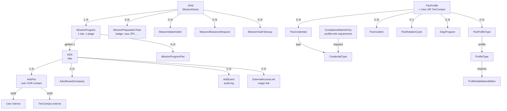
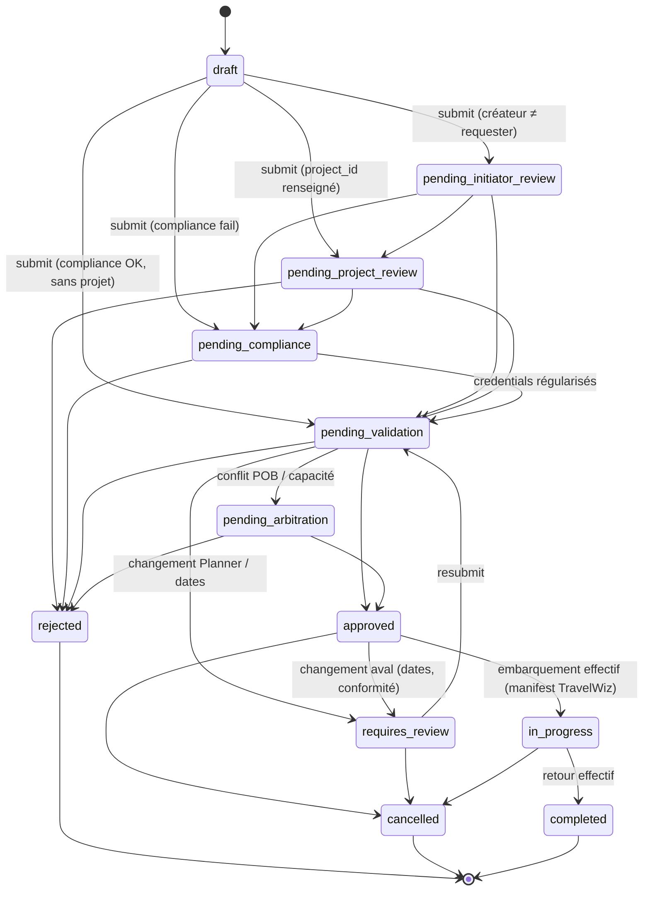
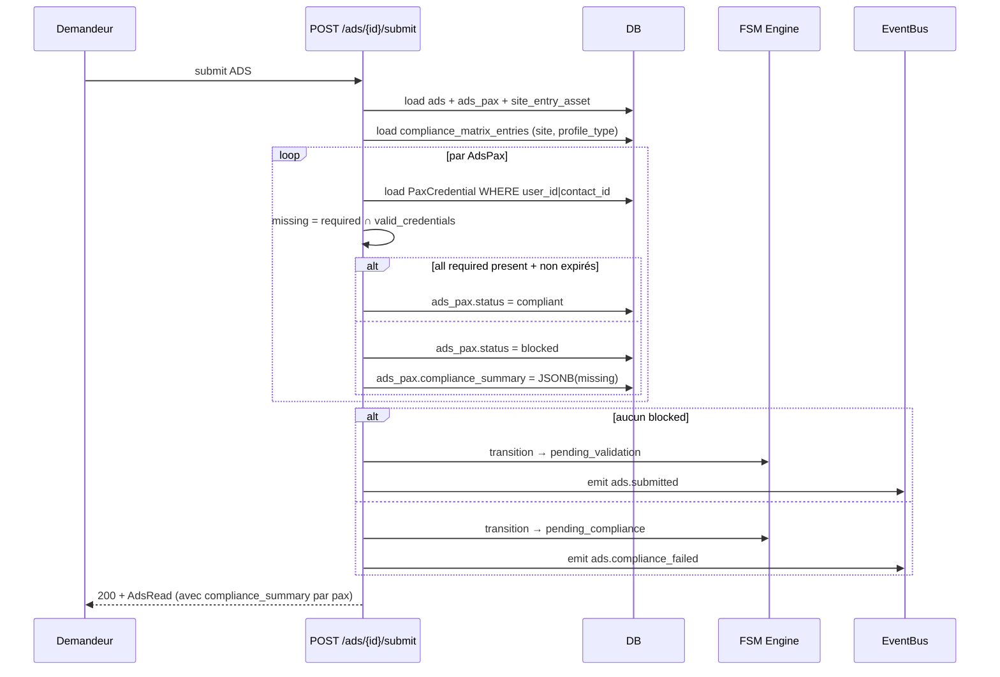
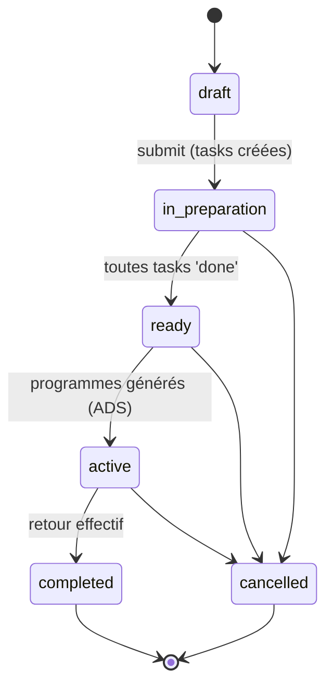
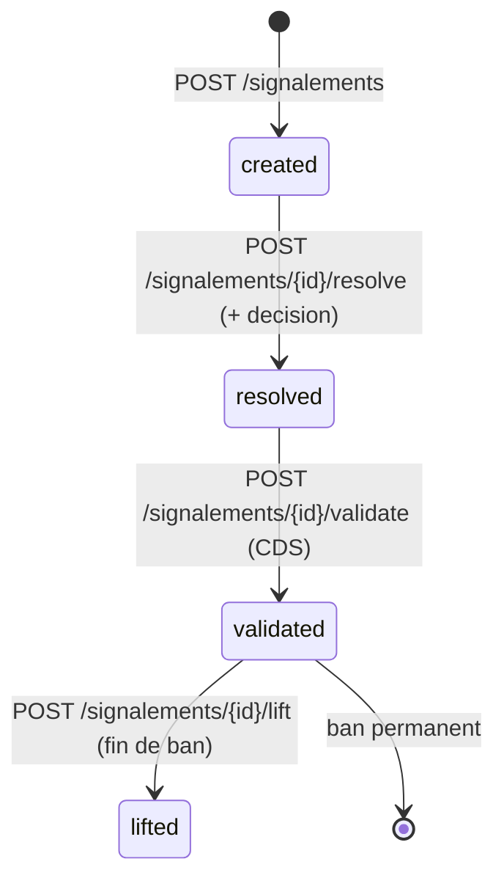

# PaxLog

!!! info "Source de cette page"

    Chaque affirmation est sourcée du code (chemin de fichier indiqué).
    Les workflows reflètent l'état réel du `MANIFEST` + des routes
    après les fixes de l'audit `2026-04-29` (commit
    [`11a978c4`](https://github.com/hmunyeku/OPSFLUX/commit/11a978c4)).
    Tout ce qui n'est pas vérifiable dans le code est marqué
    `TODO: vérifier`.

## Résumé en 30 secondes

PaxLog gère **les mouvements de personnel** vers et depuis les sites
opérationnels (offshore, sites pétroliers, chantiers isolés). Trois
objets-pivots :

- **ADS** (Avis De Séjour) — workflow d'autorisation pour qu'une
  personne se rende sur un site donné
- **AVM** (Avis de Mission) — dossier mission orchestrant toute la
  préparation logistique (visas, EPI, badges, allocations)
- **Profil PAX** — fiche personne (interne ou externe) avec
  habilitations, formations, identifiants légaux

L'AVM est le **conteneur** d'une mission ; il génère N **programmes**,
chaque programme génère 1 **ADS**. Le couplage ADS → TravelWiz crée
ensuite le manifeste passager du voyage qui transporte les PAX.

Stack : 22 modèles SQLAlchemy ([`app/models/paxlog.py`](https://github.com/hmunyeku/OPSFLUX/blob/main/app/models/paxlog.py)),
~50 endpoints API ([`app/api/routes/modules/paxlog/`](https://github.com/hmunyeku/OPSFLUX/blob/main/app/api/routes/modules/paxlog)),
9 onglets frontend ([`apps/main/src/pages/paxlog/`](https://github.com/hmunyeku/OPSFLUX/blob/main/apps/main/src/pages/paxlog)),
47 permissions, 8 événements émis, intégrations Planner / TravelWiz /
Conformité / Imputations.

---

## 1. À quoi ça sert

**Problème métier** : un opérateur industriel (oil & gas, maritime,
construction) doit faire venir des intervenants — internes ou
sous-traitants — sur des sites éloignés ou sécurisés. Chaque
intervention a des contraintes croisées :

- **Conformité** — la personne a-t-elle les habilitations valides
  (BST, induction, visite médicale, ATEX, IRATA, …) requises pour
  ce site et ce poste ?
- **Capacité POB** — la couchette est-elle disponible ce jour-là sur
  le site (nuit non disponible = ADS en file d'attente) ?
- **Logistique** — qui paye (imputation cost center / projet),
  comment voyager, badges, visas, EPI, allocations de déplacement ?
- **Traçabilité réglementaire** — qui était sur le site quand, sous
  quelle responsabilité, avec quelle décision écrite ?

PaxLog matérialise ce parcours, génère les références (ADS-2026-0042),
contrôle automatiquement la conformité, route les approbations vers
les bons acteurs, enclenche la chaîne TravelWiz pour le transport.

**Pour qui** :

| Rôle utilisateur | Permissions clés (depuis [`app/modules/paxlog/__init__.py`](https://github.com/hmunyeku/OPSFLUX/blob/main/app/modules/paxlog/__init__.py)) |
|---|---|
| **Demandeur** (chef projet, chef chantier, RH, sous-traitant) | `paxlog.ads.create`, `paxlog.ads.update`, `paxlog.avm.create` |
| **Valideur conformité** (CDS / HSE) | `paxlog.compliance.read`, `paxlog.ads.read_all`, `paxlog.ads.approve` |
| **Valideur projet** (chef projet d'accueil) | `paxlog.ads.read_all`, `paxlog.ads.approve` (workflow auto-route quand `project_id` est renseigné) |
| **Validateur AVM** | `paxlog.avm.approve`, `paxlog.avm.complete` |
| **Gestionnaire PAX** (RH, secrétariat) | `paxlog.profile.read/create/update`, `paxlog.credential.create`, `paxlog.credential.validate` |
| **Gestionnaire rotations** | `paxlog.rotation.manage` |
| **Gestionnaire incidents** | `paxlog.incident.read/create/update/resolve` |

L'UI déduit le **profil dominant** automatiquement
([`PaxLogPage.tsx:62-65`](https://github.com/hmunyeku/OPSFLUX/blob/main/apps/main/src/pages/paxlog/PaxLogPage.tsx#L62)) :
- **`isAdmin`** — possède `*` ou `admin.system`
- **`isRequesterProfile`** — peut créer ADS/AVM mais pas voir
  profiles/compliance/rotations
- **`isValidatorProfile`** — peut approuver ADS/AVM ou lire la
  compliance

L'onglet "Accueil" change d'apparence selon le profil
([`tabs/RequesterHomeTab.tsx`](https://github.com/hmunyeku/OPSFLUX/blob/main/apps/main/src/pages/paxlog/tabs/RequesterHomeTab.tsx)
vs [`tabs/ValidatorHomeTab.tsx`](https://github.com/hmunyeku/OPSFLUX/blob/main/apps/main/src/pages/paxlog/tabs/ValidatorHomeTab.tsx)).

---

## 2. Concepts clés (vocabulaire)

| Terme | Modèle SQLAlchemy | Table | Description |
|---|---|---|---|
| **ADS** (Avis De Séjour) | `Ads` | `ads` | L'autorisation de séjour pour 1+ PAX sur un site. Référence `ADS-{YYYY}-{####}`. |
| **AdsPax** | `AdsPax` | `ads_pax` | Lien ADS ↔ PAX (user OU contact externe — XOR contraint en DB). Porte le statut conformité par PAX. |
| **AdsAllowedCompany** | `AdsAllowedCompany` | `ads_allowed_companies` | Liste blanche de sociétés autorisées sur l'ADS (cross-company workflow). |
| **AdsEvent** | `AdsEvent` | `ads_events` | Audit log des transitions de statut + actions clés. |
| **AVM** (Avis de Mission) | `MissionNotice` | `mission_notices` | Dossier mission complet — orchestre tasks, programs, stakeholders. Réf `MAN-{YYYY}-{####}`. |
| **MissionProgram** | `MissionProgram` | `mission_programs` | Une étape d'une mission (1 site, 1 plage de dates). Génère 1 ADS via `generated_ads_id`. |
| **MissionProgramPax** | `MissionProgramPax` | `mission_program_pax` | PAX assignés à un programme particulier d'une AVM. |
| **MissionPreparationTask** | `MissionPreparationTask` | `mission_preparation_tasks` | Tâche de préparation (badge, visa, EPI, formation). Statuts : todo, in_progress, blocked, done. |
| **MissionVisaFollowup** | `MissionVisaFollowup` | `mission_visa_followups` | Suivi visa par PAX et par destination. |
| **MissionAllowanceRequest** | `MissionAllowanceRequest` | `mission_allowance_requests` | Demande d'allocation de déplacement (per diem, transport, hébergement). |
| **MissionStakeholder** | `MissionStakeholder` | `mission_stakeholders` | Acteurs impliqués dans une AVM (chef de mission, contact terrain, etc.). |
| **PaxProfile** *(via `users`/`tier_contacts`)* | — | — | Une personne — soit `User` interne, soit `TierContact` externe. PaxLog ne crée pas son propre modèle PAX ; il lit les utilisateurs OpsFlux + les contacts du module Tiers. |
| **PaxGroup** | `PaxGroup` | `pax_groups` | Regroupement de PAX (équipe, société, projet). Cible possible des incidents collectifs. |
| **CredentialType** | `CredentialType` | `credential_types` | Type de qualification (BST, IRATA, ATEX, …). Géré au niveau entity. |
| **PaxCredential** | `PaxCredential` | `pax_credentials` | Instance d'une qualif sur une personne (date de validité, justificatif). |
| **ComplianceMatrixEntry** | `ComplianceMatrixEntry` | `compliance_matrix_entries` | "Pour ce poste sur ce site, tel credential est obligatoire/recommandé". |
| **ProfileType** | `ProfileType` | `profile_types` | Catégorie métier (BOSCO, CARISTE, GRUTIER, HSE, ELEC, …). Taxonomie configurable. |
| **PaxProfileType** | `PaxProfileType` | `pax_profile_types` | Lien PAX ↔ profile_type avec `is_primary`. Une personne peut cumuler plusieurs profils. |
| **ProfileHabilitationMatrix** | `ProfileHabilitationMatrix` | `profile_habilitation_matrix` | Habilitations attendues par profile_type — alimente le seed de la matrice de conformité. |
| **PaxRotationCycle** | `PaxRotationCycle` | `pax_rotation_cycles` | Cycle off/on (ex. 28-jour offshore : 28 j sur site, 28 j off). Sert à anticiper les ADS futures. |
| **StayProgram** | `StayProgram` | `stay_programs` | Programme de séjour intra-champ (ADS multi-sites pour une même personne). |
| **PaxIncident** | `PaxIncident` | `pax_incidents` | Signalement HSE / discipline / sécurité avec décision possible (avertissement, exclusion, blacklist temp/permanent). |
| **PaxCompanyGroup** | `PaxCompanyGroup` | `pax_company_groups` | Regroupement de sociétés sous-traitantes (utile pour les bans collectifs). |
| **ExternalAccessLink** | `ExternalAccessLink` | `external_access_links` | Lien magique signé pour qu'un PAX externe complète son dossier (cf. portail `ext.opsflux.io`). |

> Toutes ces entités vivent dans [`app/models/paxlog.py`](https://github.com/hmunyeku/OPSFLUX/blob/main/app/models/paxlog.py)
> (≈930 lignes). Les contraintes `CHECK` SQL définies y déterminent
> la liste autoritaire des statuts et catégories.

---

## 3. Architecture data



**Lecture rapide** :

- Un PAX peut être **interne** (User OpsFlux) ou **externe**
  (TierContact). Le XOR est imposé par
  [`AdsPax`](https://github.com/hmunyeku/OPSFLUX/blob/main/app/models/paxlog.py#L286)
  (CHECK `(user_id IS NOT NULL AND contact_id IS NULL) OR (user_id IS NULL AND contact_id IS NOT NULL)`).
- Une **ADS** transporte 1..N PAX vers 1 site (`site_entry_asset_id`
  référence `ar_installations.id`).
- Une **AVM** organise 1..N **programmes**, chacun générant 1 ADS
  ([`mission_programs.generated_ads_id`](https://github.com/hmunyeku/OPSFLUX/blob/main/app/models/paxlog.py#L472)).
- La **conformité** est calculée à la soumission de l'ADS : pour
  chaque PAX, l'API croise ses `PaxCredential` valides avec la
  `ComplianceMatrixEntry` du site → statut `compliant`/`blocked` au
  niveau `AdsPax`.

---

## 4. Workflow ADS — états et transitions

### États (CHECK constraint, [`app/models/paxlog.py:178-182`](https://github.com/hmunyeku/OPSFLUX/blob/main/app/models/paxlog.py#L178))

```
draft, submitted, pending_initiator_review, pending_project_review,
pending_compliance, pending_validation, approved, rejected, cancelled,
requires_review, pending_arbitration, in_progress, completed
```

### Diagramme



### Endpoints qui pilotent les transitions

| Action UI | Endpoint | Source |
|---|---|---|
| Créer brouillon | `POST /api/v1/pax/ads` | [`paxlog/__init__.py:3539`](https://github.com/hmunyeku/OPSFLUX/blob/main/app/api/routes/modules/paxlog/__init__.py#L3539) |
| Soumettre | `POST /api/v1/pax/ads/{id}/submit` | [`paxlog/__init__.py:3930`](https://github.com/hmunyeku/OPSFLUX/blob/main/app/api/routes/modules/paxlog/__init__.py#L3930) |
| Approuver | `POST /api/v1/pax/ads/{id}/approve` | [`paxlog/__init__.py:4291`](https://github.com/hmunyeku/OPSFLUX/blob/main/app/api/routes/modules/paxlog/__init__.py#L4291) |
| Rejeter | `POST /api/v1/pax/ads/{id}/reject` | [`paxlog/__init__.py:4718`](https://github.com/hmunyeku/OPSFLUX/blob/main/app/api/routes/modules/paxlog/__init__.py#L4718) |
| Demander révision | `POST /api/v1/pax/ads/{id}/request-review` | [`paxlog/__init__.py:4851`](https://github.com/hmunyeku/OPSFLUX/blob/main/app/api/routes/modules/paxlog/__init__.py#L4851) |
| Annuler | `POST /api/v1/pax/ads/{id}/cancel` | [`paxlog/__init__.py:4932`](https://github.com/hmunyeku/OPSFLUX/blob/main/app/api/routes/modules/paxlog/__init__.py#L4932) |
| Démarrer (in_progress) | `POST /api/v1/pax/ads/{id}/start-progress` | [`paxlog/__init__.py:5075`](https://github.com/hmunyeku/OPSFLUX/blob/main/app/api/routes/modules/paxlog/__init__.py#L5075) |
| Manuel — départ | `POST /api/v1/pax/ads/{id}/manual-departure` | [`paxlog/__init__.py:5029`](https://github.com/hmunyeku/OPSFLUX/blob/main/app/api/routes/modules/paxlog/__init__.py#L5029) |
| Compléter | `POST /api/v1/pax/ads/{id}/complete` | [`paxlog/__init__.py:5152`](https://github.com/hmunyeku/OPSFLUX/blob/main/app/api/routes/modules/paxlog/__init__.py#L5152) |
| Re-soumettre | `POST /api/v1/pax/ads/{id}/resubmit` | [`paxlog/__init__.py:5226`](https://github.com/hmunyeku/OPSFLUX/blob/main/app/api/routes/modules/paxlog/__init__.py#L5226) |
| Décision par PAX | `POST /api/v1/pax/ads/{id}/pax/{entry_id}/decision` | [`paxlog/__init__.py:5436`](https://github.com/hmunyeku/OPSFLUX/blob/main/app/api/routes/modules/paxlog/__init__.py#L5436) |

Le workflow réel est **piloté par le FSM Engine**
([`app/services/workflow/`](https://github.com/hmunyeku/OPSFLUX/blob/main/app/services/workflow))
+ definitions par défaut seedées via `_default_workflow_definitions()`
([`app/services/core/seed_service.py:30`](https://github.com/hmunyeku/OPSFLUX/blob/main/app/services/core/seed_service.py#L30)).
Les routes appellent `_resolve_ads_auto_transition()` qui détermine
l'état suivant selon le contexte (présence d'un projet, échec
conformité, créateur ≠ requester).

### Compliance check à la soumission

Pour chaque PAX listé dans l'ADS, à `submit` :



> **Détail vérifié** : la docstring du handler ligne 3942 dit
> "If any PAX has missing/expired mandatory credentials → pending_compliance".
> Le statut `pending_compliance` permet aux PAX d'être **régularisés**
> (ajout/upload de credentials manquants) sans rejeter l'ADS — c'est
> un état "en attente de papiers" pas un rejet.

### POB / Waitlist

À l'**approbation**, l'API contrôle la POB (places couchage) du site
sur la plage de dates. Si dépassement :

- Les PAX en surnombre passent en `waitlisted` ([`paxlog/__init__.py:4251`](https://github.com/hmunyeku/OPSFLUX/blob/main/app/api/routes/modules/paxlog/__init__.py#L4251) émet `ads.waitlisted`)
- L'onglet **Waitlist** ([`tabs/WaitlistTab.tsx`](https://github.com/hmunyeku/OPSFLUX/blob/main/apps/main/src/pages/paxlog/tabs/WaitlistTab.tsx))
  liste les PAX en attente avec leur `priority_score`
- Endpoint admin : `POST /api/v1/pax/ads-waitlist/{entry_id}/priority`
  ([`paxlog/__init__.py:3457`](https://github.com/hmunyeku/OPSFLUX/blob/main/app/api/routes/modules/paxlog/__init__.py#L3457))
- Promotion auto : quand de la place se libère (cancel d'une autre
  ADS, no_show), l'event handler
  [`module_handlers.py:1951`](https://github.com/hmunyeku/OPSFLUX/blob/main/app/event_handlers/module_handlers.py#L1951)
  promeut les PAX waitlisted par ordre de priorité et émet
  `paxlog.waitlist_promoted`.

---

## 5. Workflow AVM — états et transitions

### États ([`app/models/paxlog.py:397-400`](https://github.com/hmunyeku/OPSFLUX/blob/main/app/models/paxlog.py#L397))

```
draft, in_preparation, active, ready, completed, cancelled
```

### Diagramme



> **Note** : `active` n'est pas un état terminal — l'AVM y reste
> tant que les ADS générées ne sont pas toutes `completed`. Le module
> handler [`event_handlers/module_handlers.py:657`](https://github.com/hmunyeku/OPSFLUX/blob/main/app/event_handlers/module_handlers.py#L657)
> propage `ads.completed` vers la cascade : si toutes les ADS d'une
> AVM sont completed, l'AVM est automatiquement marquée `completed`.
> [TODO: vérifier le détail de cette cascade automatique dans le code.]

### Endpoints AVM ([`avm.py`](https://github.com/hmunyeku/OPSFLUX/blob/main/app/api/routes/modules/paxlog/avm.py))

| Action | Endpoint | Ligne |
|---|---|---|
| Lister | `GET /api/v1/pax/avm` | [413](https://github.com/hmunyeku/OPSFLUX/blob/main/app/api/routes/modules/paxlog/avm.py#L413) |
| Créer | `POST /api/v1/pax/avm` | [500](https://github.com/hmunyeku/OPSFLUX/blob/main/app/api/routes/modules/paxlog/avm.py#L500) |
| PDF | `GET /api/v1/pax/avm/{id}/pdf` | [651](https://github.com/hmunyeku/OPSFLUX/blob/main/app/api/routes/modules/paxlog/avm.py#L651) |
| Modifier | `PUT /api/v1/pax/avm/{id}` | [702](https://github.com/hmunyeku/OPSFLUX/blob/main/app/api/routes/modules/paxlog/avm.py#L702) |
| Soumettre | `POST /api/v1/pax/avm/{id}/submit` | [752](https://github.com/hmunyeku/OPSFLUX/blob/main/app/api/routes/modules/paxlog/avm.py#L752) |
| Approuver | `POST /api/v1/pax/avm/{id}/approve` | [795](https://github.com/hmunyeku/OPSFLUX/blob/main/app/api/routes/modules/paxlog/avm.py#L795) |
| Compléter | `POST /api/v1/pax/avm/{id}/complete` | [820](https://github.com/hmunyeku/OPSFLUX/blob/main/app/api/routes/modules/paxlog/avm.py#L820) |
| Annuler | `POST /api/v1/pax/avm/{id}/cancel` | [845](https://github.com/hmunyeku/OPSFLUX/blob/main/app/api/routes/modules/paxlog/avm.py#L845) |
| Modifier après approve | `POST /api/v1/pax/avm/{id}/modify` | [1009](https://github.com/hmunyeku/OPSFLUX/blob/main/app/api/routes/modules/paxlog/avm.py#L1009) |
| Update tâche prépa | `PATCH /api/v1/pax/avm/{id}/preparation-tasks/{task_id}` | [1175](https://github.com/hmunyeku/OPSFLUX/blob/main/app/api/routes/modules/paxlog/avm.py#L1175) |

### Préparation : tasks de mission

Quand une AVM est créée, l'utilisateur ajoute des **MissionPreparationTask**
correspondant aux items configurés sur la mission (badges, EPI, visa,
formation). Chaque task a son propre cycle : `todo → in_progress → done`
(ou `blocked`). L'AVM ne peut passer en `ready` que quand toutes les
tasks obligatoires sont `done`.

Type de task ([`pax_preparation_task_type` dictionnaire](#)) :
badge, formation, visa, epi, induction, allowance, transport, autre.

---

## 6. Step-by-step utilisateur

### 6.1 — Demandeur : créer et suivre une ADS

#### Pré-requis

- Permission `paxlog.ads.create` (sinon le bouton "Nouvelle ADS"
  n'apparaît pas — [`PaxLogPage.tsx:104`](https://github.com/hmunyeku/OPSFLUX/blob/main/apps/main/src/pages/paxlog/PaxLogPage.tsx#L104))
- Connaître le **site de destination** (asset/installation enregistrée
  dans Asset Registry)
- Connaître les **PAX** à embarquer — soit des Users OpsFlux, soit
  des contacts externes du module Tiers

#### Procédure

1. **Aller dans `/paxlog`** → onglet **`ADS`**
2. Cliquer **`+ Nouvelle ADS`** (toolbar en haut)
3. Le panneau **`CreateAdsPanel`** s'ouvre à droite
   ([`panels/CreateAdsPanel.tsx`](https://github.com/hmunyeku/OPSFLUX/blob/main/apps/main/src/pages/paxlog/panels/CreateAdsPanel.tsx))
4. Renseigner :
   - **Type** : `individual` (1 PAX) ou `team` (équipe complète)
   - **Site d'entrée** (`site_entry_asset_id`) — picker installations
   - **Catégorie de visite** : project_work, maintenance, inspection,
     visit, permanent_ops, other
     - Si `project_work` → un picker projet apparaît, l'ADS est routée
       vers le chef projet pour pre-validation
   - **Plage de dates** (start_date, end_date) — contrainte DB
     `end_date >= start_date`
   - **Justification** (`visit_purpose`) — texte libre obligatoire
   - **Transport** outbound/return (mode, base de départ) — optionnel
     mais recommandé
   - **Aller-retour sans nuitée** ? — flag `is_round_trip_no_overnight`,
     compte dans le forecast PAX du jour mais ne consomme pas de POB
     nuitée
   - **PAX à embarquer** — picker User ou TierContact, ajout multiple
   - **Sociétés autorisées** (cross-company) — optionnel, restreint
     les contacts externes éligibles
5. **Enregistrer** → ADS créée en `draft`, référence générée
   automatiquement (format depuis `reference_template:ADS` dans
   Settings, défaut `ADS-{YYYY}-{####}`)
6. Cliquer **`Soumettre`** → l'ADS part en validation. Selon le contexte :
   - Créateur ≠ requester → `pending_initiator_review` (le requester
     valide d'abord que l'ADS est faite en son nom)
   - Catégorie `project_work` avec `project_id` → `pending_project_review`
   - Sinon → check conformité immédiat → `pending_compliance` ou
     `pending_validation`
7. **Suivre** : onglet `ADS` → filtrer par "mes ADS" / par statut.
   L'icône statut renseigne l'étape ([`shared.tsx:25-39`](https://github.com/hmunyeku/OPSFLUX/blob/main/apps/main/src/pages/paxlog/shared.tsx#L25))
8. **Si `pending_compliance`** : l'onglet `Compliance` montre quels
   credentials manquent/expirent. Le PAX (s'il a accès) ou un
   gestionnaire RH doit les ajouter.
9. **Approbation** : l'ADS passe à `approved`, événement `ads.approved`
   émis → TravelWiz ajoute automatiquement les PAX au manifest du
   voyage couvrant la plage de dates ([`event_handlers/travelwiz_handlers.py`](https://github.com/hmunyeku/OPSFLUX/blob/main/app/event_handlers/travelwiz_handlers.py))
10. **Embarquement** : un opérateur héliport scanne le QR code de
    l'ADS via `AdsBoardingScanPage` (ou la captain UI). Statut PAX
    passe à `current_onboard=true`. Quand toute l'équipe est
    onboard → ADS `in_progress`.
11. **Retour** : `complete` une fois le débarquement scanné →
    statut `completed`, événement `ads.completed`.

#### Cas d'erreur fréquents

- **Bouton soumettre disabled** : un champ obligatoire manque (mainly
  `visit_purpose` ou `site_entry_asset_id`).
- **400 "Impossible de soumettre"** : statut courant pas dans
  `(draft, requires_review)` ([`paxlog/__init__.py:3961`](https://github.com/hmunyeku/OPSFLUX/blob/main/app/api/routes/modules/paxlog/__init__.py#L3961)).
  Re-créer un brouillon ou demander un `requires_review` au valideur.
- **403** sur certaines actions : tu n'es ni `requester_id` ni
  `created_by`, et tu n'as pas `paxlog.ads.read_all` /
  `paxlog.ads.approve`. C'est `_can_manage_ads()` qui filtre.

### 6.2 — Valideur : traiter la file de validation

1. Aller dans **`/paxlog`** → l'onglet d'accueil affiche par défaut
   la **`ValidatorHomeTab`** si tu as les permissions de validation
   ([`PaxLogPage.tsx:65`](https://github.com/hmunyeku/OPSFLUX/blob/main/apps/main/src/pages/paxlog/PaxLogPage.tsx#L65))
2. **Liste prioritaire** :
   - ADS-validation queue : `GET /api/v1/pax/ads-validation-queue`
     ([`paxlog/__init__.py:3165`](https://github.com/hmunyeku/OPSFLUX/blob/main/app/api/routes/modules/paxlog/__init__.py#L3165))
     — toutes les ADS dans un statut `pending_*`, triées par date
     d'embarquement la plus proche
   - Filtres : statut, site, demandeur, date
3. Cliquer une ADS → panneau **`AdsDetailPanel`**
   ([`panels/AdsDetailPanel.tsx`](https://github.com/hmunyeku/OPSFLUX/blob/main/apps/main/src/pages/paxlog/panels/AdsDetailPanel.tsx))
   avec onglets : Détails, PAX & Conformité, Imputations, Audit log,
   Documents
4. **Décider PAX par PAX** : le tableau PAX permet de
   `approve` / `reject` chaque ligne via
   `POST /api/v1/pax/ads/{id}/pax/{entry_id}/decision`
   ([`paxlog/__init__.py:5436`](https://github.com/hmunyeku/OPSFLUX/blob/main/app/api/routes/modules/paxlog/__init__.py#L5436)).
   Utile pour approuver l'équipe principale tout en rejetant un
   PAX dont la formation BST a expiré.
5. **Approuver toute l'ADS** : bouton "Approuver" → `POST /ads/{id}/approve`
   - Vérifie POB du site sur la plage
   - Si dépassement → certains PAX en `waitlisted` (l'UI affiche un
     warning)
   - Émet `ads.approved` → TravelWiz crée/complète le manifest
6. **Rejeter** : bouton "Rejeter" → modale demandant
   `rejection_reason` obligatoire (validé côté API). Émet
   `ads.rejected` → notification au demandeur.
7. **Renvoyer pour révision** : `request-review` → l'ADS passe en
   `requires_review` côté demandeur, qui peut éditer puis re-soumettre.

### 6.3 — Gestionnaire PAX (RH / secrétariat)

#### Créer un profil PAX

1. **`/paxlog`** → onglet **`Profiles`** (visible si `paxlog.profile.read`)
2. **`+ Nouveau profil`** → `CreateProfilePanel` ([`panels/CreateProfilePanel.tsx`](https://github.com/hmunyeku/OPSFLUX/blob/main/apps/main/src/pages/paxlog/panels/CreateProfilePanel.tsx))
3. Le panneau distingue :
   - **PAX interne** → crée un User OpsFlux avec `user_type=pax`
   - **PAX externe** → crée un TierContact rattaché à une société
4. Anti-doublon : `POST /api/v1/pax/profiles/check-duplicates`
   ([`paxlog/__init__.py:2497`](https://github.com/hmunyeku/OPSFLUX/blob/main/app/api/routes/modules/paxlog/__init__.py#L2497))
   compare nom/prénom/email/téléphone/identifiant légal avant de
   créer.
5. Une fois créé : ajouter les credentials (formations, visites
   médicales, certifications). Le composant `PaxCredentialManager`
   liste les types disponibles via `GET /credential-types`
   ([`paxlog/__init__.py:2744`](https://github.com/hmunyeku/OPSFLUX/blob/main/app/api/routes/modules/paxlog/__init__.py#L2744)).

#### Profil dynamique (profile types)

L'UI permet de tagger un PAX avec un ou plusieurs **profile types**
(BOSCO, CARISTE, …) — onglet `Profile types` du `ProfileDetailPanel`.
La matrice habilitation auto-suggère les credentials manquants
selon les profils du PAX (`POST /api/v1/pax/pax/{id}/profile-types/{pt_id}`,
[`profile_types.py:138`](https://github.com/hmunyeku/OPSFLUX/blob/main/app/api/routes/modules/paxlog/profile_types.py#L138)).

#### Compliance dashboard

L'onglet **`Compliance`** ([`tabs/ComplianceTab.tsx`](https://github.com/hmunyeku/OPSFLUX/blob/main/apps/main/src/pages/paxlog/tabs/ComplianceTab.tsx))
expose deux endpoints data :

- `GET /api/v1/pax/compliance/expiring`
  ([`compliance_dashboard.py:41`](https://github.com/hmunyeku/OPSFLUX/blob/main/app/api/routes/modules/paxlog/compliance_dashboard.py#L41))
  — credentials qui expirent dans < N jours (param `days`, défaut 90)
- `GET /api/v1/pax/compliance/stats`
  ([`compliance_dashboard.py:147`](https://github.com/hmunyeku/OPSFLUX/blob/main/app/api/routes/modules/paxlog/compliance_dashboard.py#L147))
  — KPIs globaux (total PAX, % conformes, expirés, manquants)

### 6.4 — Gestionnaire rotations

L'onglet **`Rotations`** ([`tabs/RotationsTab.tsx`](https://github.com/hmunyeku/OPSFLUX/blob/main/apps/main/src/pages/paxlog/tabs/RotationsTab.tsx))
gère les cycles offshore. Création :

1. Bouton `+ Nouvelle rotation` → `CreateRotationPanel`
2. Type de cycle : 28-28 (28 j on, 28 j off — standard offshore),
   14-14, 21-21, custom
3. Date de référence + nombre de PAX
4. Le système calcule les ADS futures (auto-pré-création possible
   selon le projet — TODO: vérifier ce comportement dans le code)

Endpoints : `GET/POST/PATCH/DELETE /api/v1/pax/rotation-cycles`
([`rotations.py`](https://github.com/hmunyeku/OPSFLUX/blob/main/app/api/routes/modules/paxlog/rotations.py)).

### 6.5 — Gestionnaire incidents (HSE / discipline)

L'onglet **`Signalements`** distingue **incident PAX** (objet
historique) et **signalement** enrichi avec workflow :

- Incident simple : `PaxIncident` avec severity et description
- Signalement : ajoute `category` (hse/discipline/access/security)
  + `decision` (avertissement / exclusion / blacklist temp / blacklist permanent)
  + `decision_duration_days` + `evidence_urls`

Workflow signalement :



Sources : [`signalements.py:40-279`](https://github.com/hmunyeku/OPSFLUX/blob/main/app/api/routes/modules/paxlog/signalements.py).

> ⚠ Quand un PAX est en `permanent_ban` ou `temp_ban` actif, ses
> ADS sont rejetées automatiquement à la soumission. Vérification
> faite dans `_check_pax_ban_status()` lors du compliance check.
> [TODO: vérifier la fonction exacte dans paxlog/__init__.py.]

---

## 7. Permissions matrix

47 permissions définies dans le `MANIFEST`
([`app/modules/paxlog/__init__.py:9-54`](https://github.com/hmunyeku/OPSFLUX/blob/main/app/modules/paxlog/__init__.py#L9)).

### Visibilité des onglets vs permissions ([`PaxLogPage.tsx:67-80`](https://github.com/hmunyeku/OPSFLUX/blob/main/apps/main/src/pages/paxlog/PaxLogPage.tsx#L67))

| Onglet | Visible si l'utilisateur a |
|---|---|
| `dashboard` | Toujours visible |
| `ads` | `paxlog.ads.read` OU `.create` OU `.update` OU `.approve` |
| `waitlist` | `paxlog.ads.approve` |
| `avm` | `paxlog.avm.create` OU `.update` OU `.approve` OU `.complete` |
| `profiles` | `paxlog.profile.read` |
| `compliance` | `paxlog.compliance.read` |
| `signalements` | `paxlog.incident.read` |
| `rotations` | `paxlog.rotation.manage` |

### Liste exhaustive des permissions

```
paxlog.profile.{read,create,update,delete}
paxlog.credential.{read,create,update,delete,validate}
paxlog.credential_type.{read,create,update,delete}
paxlog.compliance.{read,manage}
paxlog.ads.{read,read_all,create,update,delete,submit,cancel,approve,pax.manage}
paxlog.avm.{read,read_all,create,update,submit,approve,complete,cancel}
paxlog.stay.{create,approve}
paxlog.rotation.manage
paxlog.profile_type.manage
paxlog.credtype.manage
paxlog.incident.{read,create,update,delete,resolve}
paxlog.import
paxlog.export
```

### Distinction `read` vs `read_all`

- `paxlog.ads.read` → l'utilisateur voit les ADS dont il est
  `requester_id`, `created_by`, ou listé dans `ads_pax`
- `paxlog.ads.read_all` → l'utilisateur voit **toutes** les ADS
  de l'entity (typiquement CDS, HSE, valideurs)

Logique : [`_can_manage_ads()` dans paxlog/__init__.py](https://github.com/hmunyeku/OPSFLUX/blob/main/app/api/routes/modules/paxlog/__init__.py).

---

## 8. Événements émis et consommés

### Émis par PaxLog

Listés via grep `event_type=` dans [`app/api/routes/modules/paxlog/`](https://github.com/hmunyeku/OPSFLUX/blob/main/app/api/routes/modules/paxlog) +
[`app/event_handlers/paxlog_handlers.py`](https://github.com/hmunyeku/OPSFLUX/blob/main/app/event_handlers/paxlog_handlers.py).

| Événement | Source ligne | Quand | Payload |
|---|---|---|---|
| `ads.submitted` | [paxlog/__init__.py:4220](https://github.com/hmunyeku/OPSFLUX/blob/main/app/api/routes/modules/paxlog/__init__.py#L4220) | Soumission validée | `ads_id, reference, requester_id, site_id` |
| `ads.compliance_failed` | [paxlog/__init__.py:4271](https://github.com/hmunyeku/OPSFLUX/blob/main/app/api/routes/modules/paxlog/__init__.py#L4271) | Compliance check échoue | `ads_id, blocked_pax: [{pax_id, missing_credentials}]` |
| `ads.waitlisted` | [paxlog/__init__.py:4251](https://github.com/hmunyeku/OPSFLUX/blob/main/app/api/routes/modules/paxlog/__init__.py#L4251) | POB dépassé | `ads_id, waitlisted_pax_ids` |
| `ads.approved` | [paxlog/__init__.py:4698](https://github.com/hmunyeku/OPSFLUX/blob/main/app/api/routes/modules/paxlog/__init__.py#L4698) | Approbation finale | `ads_id, reference, approved_pax: [...]` |
| `ads.rejected` | [paxlog/__init__.py:4837](https://github.com/hmunyeku/OPSFLUX/blob/main/app/api/routes/modules/paxlog/__init__.py#L4837) | Rejet | `ads_id, rejection_reason` |
| `ads.cancelled` | [paxlog/__init__.py:5014](https://github.com/hmunyeku/OPSFLUX/blob/main/app/api/routes/modules/paxlog/__init__.py#L5014) | Annulation | `ads_id, cancellation_reason` |
| `ads.requires_review` | [paxlog/__init__.py:4918](https://github.com/hmunyeku/OPSFLUX/blob/main/app/api/routes/modules/paxlog/__init__.py#L4918) | Demande de révision | `ads_id, review_reason` |
| `ads.in_progress` | [paxlog/__init__.py:5141](https://github.com/hmunyeku/OPSFLUX/blob/main/app/api/routes/modules/paxlog/__init__.py#L5141) | Embarquement effectif | `ads_id, departed_at` |
| `ads.completed` | [event_handlers/module_handlers.py:657](https://github.com/hmunyeku/OPSFLUX/blob/main/app/event_handlers/module_handlers.py#L657) | Retour effectif | `ads_id, completed_at` |
| `ads.stay_change_requested` | [paxlog/__init__.py:3912](https://github.com/hmunyeku/OPSFLUX/blob/main/app/api/routes/modules/paxlog/__init__.py#L3912) | Demande de changement de séjour | `ads_id, requested_change` |
| `paxlog.waitlist_promoted` | [paxlog/__init__.py:1582](https://github.com/hmunyeku/OPSFLUX/blob/main/app/api/routes/modules/paxlog/__init__.py#L1582) | Promotion auto depuis waitlist | `ads_id, promoted_pax_ids` |

### Consommés par PaxLog

[`app/event_handlers/paxlog_handlers.py:824`](https://github.com/hmunyeku/OPSFLUX/blob/main/app/event_handlers/paxlog_handlers.py#L824)
souscrit à :

- `ads.submitted` — notification email au requester + valideurs
- `ads.rejected` — notification au demandeur avec raison
- `ads.compliance_failed` — notification gestionnaire RH avec liste
  credentials manquants
- `ads.cancelled` — notification + libération POB

### Cross-module

[`module_handlers.py:1951`](https://github.com/hmunyeku/OPSFLUX/blob/main/app/event_handlers/module_handlers.py#L1951)
fait souscrire **TravelWiz**, **Planner**, **Conformité** à des
événements ADS pour cascader des effets :

- `ads.approved` → TravelWiz ajoute les PAX au manifest du voyage
- `ads.completed` → Planner activity passe à `completed` si liée
- `ads.cancelled` → Planner forecast recalculé

> **Bug historique fixé** : [audit 2026-04-29 #1](../AUDIT_PAXLOG_PACKLOG_TRAVELWIZ_FONCTIONNEL_2026-04-29.md#1--p0--adsapproved-ne-déclenche-plus-le-manifest-travelwiz)
> — la souscription `paxlog.ads.approved` ne matchait pas l'émission
> `ads.approved`. Fix : double subscribe (commit
> [`11a978c4`](https://github.com/hmunyeku/OPSFLUX/commit/11a978c4)).

---

## 9. Pièges & FAQ

### Pourquoi mon ADS reste en `pending_compliance` alors que tous les credentials sont valides ?

Cause fréquente : la **compliance matrix** du site exige un
credential que tu n'as pas associé au PAX. Aller voir
**Compliance → Site → Profile** : la liste des credentials marqués
`mandatory` doit être complète sur le PAX (statut `valid` + non
expirés à la `start_date` de l'ADS).

### Pourquoi le bouton "Approuver" est grisé même avec `paxlog.ads.approve` ?

L'API filtre côté serveur via `_can_manage_ads()`. Si tu n'as pas
`paxlog.ads.read_all`, tu ne peux approuver que les ADS où tu es
listé comme **valideur explicite** ou **chef projet** (quand
`project_id` est renseigné). Demande la perm `read_all` à un
super-admin.

### Pourquoi mes PAX externes (TierContact) n'apparaissent pas dans le picker ?

L'`AdsAllowedCompany` doit être renseignée. Le picker filtre les
TierContacts dont la société est dans la liste blanche de l'ADS.
Si la liste est vide, **toutes** les sociétés sont éligibles —
mais l'UI peut être configurée pour exiger au moins une société.

### Le PDF de l'ADS retourne 404, c'est normal ?

Oui, c'est le comportement attendu si le template PDF n'a jamais
été créé pour cette entity. Avant le fix
[`2726101e`](https://github.com/hmunyeku/OPSFLUX/commit/2726101e)
ça retournait 500. Aller dans Settings → Templates → PDF et créer
un template `paxlog.ads.confirmation` avec le slug par défaut.

### Pourquoi mon AVM reste en `in_preparation` alors que mes tasks sont toutes "done" ?

Vérifier que **toutes** les tasks **obligatoires** sont done.
Les tasks marquées `is_optional=true` n'entrent pas dans le calcul
de readiness. La transition vers `ready` est manuelle :
`POST /api/v1/pax/avm/{id}/submit`.

### `ads.approved` ne déclenche pas la création du manifest TravelWiz

Bug fixé dans [`11a978c4`](https://github.com/hmunyeku/OPSFLUX/commit/11a978c4)
(audit du 2026-04-29). Si tu vois encore le souci sur une instance
> 2026-04-30, vérifier que :

1. Le voyage TravelWiz couvrant la plage `start_date / end_date`
   existe (sinon TravelWiz n'a rien où ajouter le PAX)
2. Le PAX est bien dans `ads_pax` avec statut final `approved`
3. Le handler [`travelwiz_handlers.py:907`](https://github.com/hmunyeku/OPSFLUX/blob/main/app/event_handlers/travelwiz_handlers.py)
   subscribe bien aux DEUX noms (`ads.approved` ET `paxlog.ads.approved`)

### Performance : le tableau ADS rame avec > 5000 lignes

L'endpoint `GET /ads` paginate ([`paxlog/__init__.py:3059`](https://github.com/hmunyeku/OPSFLUX/blob/main/app/api/routes/modules/paxlog/__init__.py#L3059)) ;
le client fait 50 lignes par défaut. Vérifier `pageSize` dans
les params de l'URL.
Index existants ([`app/models/paxlog.py:170-175`](https://github.com/hmunyeku/OPSFLUX/blob/main/app/models/paxlog.py#L170)) :
`(entity_id)`, `(entity_id, status)`, `(site_entry_asset_id)`,
`(start_date, end_date)`, `(requester_id)`, `(created_by)`. Si
filtre custom hors index → `EXPLAIN ANALYZE` pour vérifier.

### J'ai fait une décision PAX par erreur, comment l'annuler ?

`POST /api/v1/pax/ads/{id}/pax/{entry_id}/decision` accepte les
allers-retours `approved ↔ rejected ↔ pending_check` tant que l'ADS
elle-même est dans un statut `pending_*`. Une fois l'ADS
`approved` globalement, les décisions individuelles sont gelées.

---

## 10. Liens

### Spécification & analyse

- **Spec architecturale** : [`rebuilt/modules/PAXLOG.md`](../rebuilt/modules/PAXLOG.md)
- **Recette fonctionnelle** : [`rebuilt/33_PAXLOG_FUNCTIONAL_RECIPE.md`](../rebuilt/33_PAXLOG_FUNCTIONAL_RECIPE.md)
- **Audit couverture** : [`rebuilt/34_PAXLOG_COVERAGE_AUDIT.md`](../rebuilt/34_PAXLOG_COVERAGE_AUDIT.md)
- **Analyse fonctionnelle** : [`check/CDC_05_PAXLOG.md`](../check/CDC_05_PAXLOG.md)

### Workflows détaillés

- [`rebuilt/20_WORKFLOW_ADS.md`](../rebuilt/20_WORKFLOW_ADS.md) — workflow ADS niveau métier
- [`rebuilt/21_WORKFLOW_AVM.md`](../rebuilt/21_WORKFLOW_AVM.md) — workflow AVM
- [`check/16_ADS_CONTACT_WORKFLOW_EXPLAINED.md`](../check/16_ADS_CONTACT_WORKFLOW_EXPLAINED.md) — workflow contact externe
- [`check/17_AVM_WORKFLOW_EXPLAINED.md`](../check/17_AVM_WORKFLOW_EXPLAINED.md)
- [`check/18_PAXLOG_AVM_ADS_TRAVELWIZ_STATE_MACHINE.md`](../check/18_PAXLOG_AVM_ADS_TRAVELWIZ_STATE_MACHINE.md) — état complet de la state machine cross-module

### Audits

- [`AUDIT_PAXLOG_PACKLOG_2026-04.md`](../AUDIT_PAXLOG_PACKLOG_2026-04.md)
- [`AUDIT_PAXLOG_PACKLOG_TRAVELWIZ_FONCTIONNEL_2026-04-29.md`](../AUDIT_PAXLOG_PACKLOG_TRAVELWIZ_FONCTIONNEL_2026-04-29.md) — 12 bugs P0-P3, tous corrigés
- [Spec dette technique](../rebuilt/39_TECH_DEBT_AUDIT_2026_04_10.md)

### Code

- [`app/modules/paxlog/__init__.py`](https://github.com/hmunyeku/OPSFLUX/blob/main/app/modules/paxlog/__init__.py) — manifest (47 perms)
- [`app/api/routes/modules/paxlog/`](https://github.com/hmunyeku/OPSFLUX/blob/main/app/api/routes/modules/paxlog) — 9 fichiers, ~50 endpoints
- [`app/models/paxlog.py`](https://github.com/hmunyeku/OPSFLUX/blob/main/app/models/paxlog.py) — 22 modèles SQLAlchemy
- [`app/services/modules/paxlog_service.py`](https://github.com/hmunyeku/OPSFLUX/blob/main/app/services/modules/paxlog_service.py) — services métier
- [`app/event_handlers/paxlog_handlers.py`](https://github.com/hmunyeku/OPSFLUX/blob/main/app/event_handlers/paxlog_handlers.py) — émetteur/consommateur events
- [`apps/main/src/pages/paxlog/`](https://github.com/hmunyeku/OPSFLUX/blob/main/apps/main/src/pages/paxlog) — UI (PaxLogPage + 9 tabs + 8 panels)
